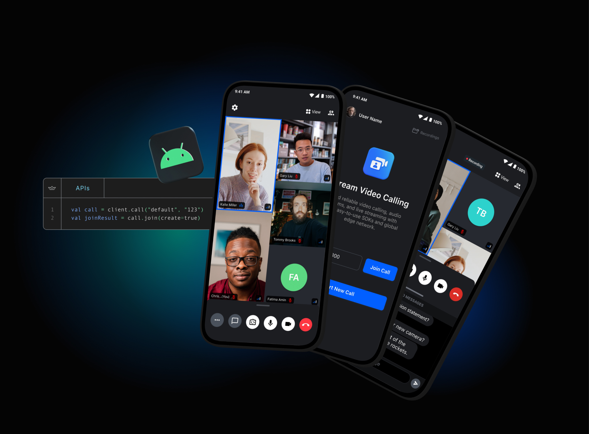

# Official Android SDK for [Stream Video](https://getstream.io/video/docs/)



<p align="center">
  <a href="https://github.com/GetStream/stream-video-android/actions/workflows/artifact-upload.yaml"></a>
  <a href="https://android-arsenal.com/api?level=24"></a>
  <a href="https://search.maven.org/search?q=stream-video-android"></a>
</p>

<p align="center">
  <a href="https://deepwiki.com/GetStream/stream-video-android"></a>
</p>

<div align="center">


</div>

This is the official Android SDK for [Stream Video](https://getstream.io/video?utm_source=Github&utm_medium=Github_Repo_Content_Ad&utm_content=Developer&utm_campaign=Github_Android_Video_SDK&utm_term=DevRelOss), a service for building video calls, audio rooms, and live-streaming applications. This library includes both a low-level video SDK and a set of reusable UI components.
Most users start with the Compose UI components and fall back to the lower-level API when they want to customize things.

<a href="https://getstream.io?utm_source=Github&utm_medium=Github_Repo_Content_Ad&utm_content=Developer&utm_campaign=Github_Android_Video_SDK&utm_term=DevRelOss">

</a>

## 🛥 What is Stream?

Stream allows developers to rapidly deploy scalable feeds, chat messaging and video with an industry leading 99.999% uptime SLA guarantee.

Stream provides UI components and state handling that make it easy to build video calling for your app. All calls run on Stream's network of edge servers around the world, ensuring optimal latency and reliability.

## 📕 Tutorials

With Stream's video components, you can use their SDK to build in-app video calling, audio rooms, audio calls, or live streaming. The best place to get started is with their tutorials:

- **[Video & Audio Calling Tutorial](https://getstream.io/video/docs/android/tutorials/video-calling?utm_source=Github&utm_medium=Github_Repo_Content_Ad&utm_content=Developer&utm_campaign=Github_Android_Video_SDK&utm_term=DevRelOss)**
- **[Audio Rooms Tutorial](https://getstream.io/video/docs/android/tutorials/audio-room?utm_source=Github&utm_medium=Github_Repo_Content_Ad&utm_content=Developer&utm_campaign=Github_Android_Video_SDK&utm_term=DevRelOss)**
- **[Livestreaming Tutorial](https://getstream.io/video/docs/android/tutorials/livestream?utm_source=Github&utm_medium=Github_Repo_Content_Ad&utm_content=Developer&utm_campaign=Github_Android_Video_SDK&utm_term=DevRelOss)**

If you're interested in customizing the UI components for the Video SDK, check out the **[UI Cookbook](https://getstream.io/video/docs/android/ui-cookbook/overview?utm_source=Github&utm_medium=Github_Repo_Content_Ad&utm_content=Developer&utm_campaign=Github_Android_Video_SDK&utm_term=DevRelOss)**.

## 📱 UI Components

Stream Video SDK provides production-ready UI components built with Jetpack Compose. All screenshots are generated using Paparazzi snapshot testing to ensure UI consistency.

<p align="center">


</p>

<p align="center">


</p>

## 👔 Sample Projects

You can find sample projects below that demonstrates use cases of Stream Video SDK for Android:

- [Demo App](https://github.com/GetStream/stream-video-android/tree/develop/demo-app): Demo App demonstrates Stream Video SDK for Android with modern Android tech stacks, such as Compose, Hilt, and Coroutines.
- [Android Video Samples](https://github.com/GetStream/Android-Video-Samples): Provides a collection of samples that utilize modern Android tech stacks and Stream Video SDK for Kotlin and Compose.
- [WhatsApp Clone Compose](https://github.com/getstream/whatsapp-clone-compose): WhatsApp clone project demonstrates modern Android development built with Jetpack Compose and Stream Chat/Video SDK for Compose.
- [Twitch Clone Compose](https://github.com/skydoves/twitch-clone-compose): Twitch clone project demonstrates modern Android development built with Jetpack Compose and Stream Chat/Video SDK for Compose.
- [Meeting Room Compose](https://github.com/GetStream/meeting-room-compose): A real-time meeting room app built with Jetpack Compose to demonstrate video communications.
- [Audio Only Demo](https://github.com/GetStream/audio-call-sample-android): A sample implementation of an audio-only caller application with Android Video SDK. 

## 👩‍💻 Free for Makers 👨‍💻

Stream is free for most side and hobby projects. To qualify, your project/company needs to have < 5 team members and < $10k in monthly revenue. Makers get $100 in monthly credit for video for free.
For more details, check out the [Maker Account](https://getstream.io/maker-account?utm_source=Github&utm_medium=Github_Repo_Content_Ad&utm_content=Developer&utm_campaign=Github_Android_Video_SDK&utm_term=DevRelOss).

## 💡 Key Features

### Core Video Capabilities
- **Video & Audio Calling**: 1:1 and group video/audio calls with automatic quality adaptation
- **Audio Rooms**: Clubhouse-style audio experiences with speaker management
- **Live Streaming**: RTMP/HLS broadcasting with real-time viewer engagement
- **Screen Sharing**: Share your screen with audio support from mobile and desktop

### Quality & Performance
- **Dynascale™**: Automatically adjusts resolution, FPS, and bitrate based on network conditions
- **Active Speaker Detection**: Highlights the current speaker in real-time
- **Picture-in-Picture**: Native Android PiP support for calls
- **Noise Cancellation**: AI-powered audio filtering for clear conversations
- **Blur & Virtual Backgrounds**: AI video filters for privacy and customization

### Developer Experience
- **Jetpack Compose UI**: Modern, customizable Compose components out of the box
- **XML Views**: Legacy XML view support for existing codebases
- **Kotlin Coroutines**: Async operations with structured concurrency
- **Type-Safe APIs**: Fully typed Kotlin APIs with comprehensive documentation
- **WebRTC Integration**: Built on Google's WebRTC with Stream's global edge network

### Call Management
- **Ringing & Notifications**: Push notifications and in-app ringing for incoming calls
- **Call Recording**: Server-side recording with transcription support
- **Closed Captions**: Real-time transcription and captioning
- **Reactions**: Send emoji reactions during calls
- **Custom Events**: Extensible event system for custom interactions

### Enterprise Features
- **Flexible Permissions**: Granular control over call features and participant capabilities
- **Backstage Mode**: Prepare before going live with hosts-only mode
- **Geofencing**: Route calls through specific regions for compliance
- **Security**: SOC2 certified, GDPR compliant, end-to-end encryption ready

## 🚀 Quick Start

### Installation

Add the SDK to your `build.gradle.kts`:

```kotlin
// Video SDK with Compose UI - check Maven Central badge above for latest version
implementation("io.getstream:stream-video-android-ui-compose:$stream_version")
```

### Initialize the SDK

```kotlin
class App : Application() {
    override fun onCreate() {
        super.onCreate()

        val client = StreamVideoBuilder(
            context = this,
            apiKey = "YOUR_API_KEY",
            user = User(
                id = "user-id",
                name = "User Name",
                image = "https://...",
            ),
            token = "USER_TOKEN",
        ).build()
    }
}
```

### Join a Video Call

```kotlin
@Composable
fun VideoCallScreen() {
    val call = StreamVideo.instance().call("default", "call-id")

    LaunchedEffect(Unit) {
        call.join(create = true)
    }

    CallContent(
        call = call,
        onCallAction = { action ->
            when (action) {
                is LeaveCall -> call.leave()
                is ToggleCamera -> call.camera.setEnabled(action.isEnabled)
                is ToggleMicrophone -> call.microphone.setEnabled(action.isEnabled)
            }
        }
    )
}
```

For detailed tutorials, visit our [documentation](https://getstream.io/video/docs/android/).

## 💼 We are hiring!

We've recently closed a [\$38 million Series B funding round](https://techcrunch.com/2021/03/04/stream-raises-38m-as-its-chat-and-activity-feed-apis-power-communications-for-1b-users/) and we keep actively growing.
Our APIs are used by more than a billion end-users, and you'll have a chance to make a huge impact on the product within a team of the strongest engineers all over the world.
Check out our current openings and apply via [Stream's website](https://getstream.io/team/#jobs).

## License

```
Copyright (c) 2014-2024 Stream.io Inc. All rights reserved.

Licensed under the Stream License;
you may not use this file except in compliance with the License.
You may obtain a copy of the License at

   https://github.com/GetStream/stream-video-android/blob/main/LICENSE

Unless required by applicable law or agreed to in writing, software
distributed under the License is distributed on an "AS IS" BASIS,
WITHOUT WARRANTIES OR CONDITIONS OF ANY KIND, either express or implied.
See the License for the specific language governing permissions and
limitations under the License.
```
