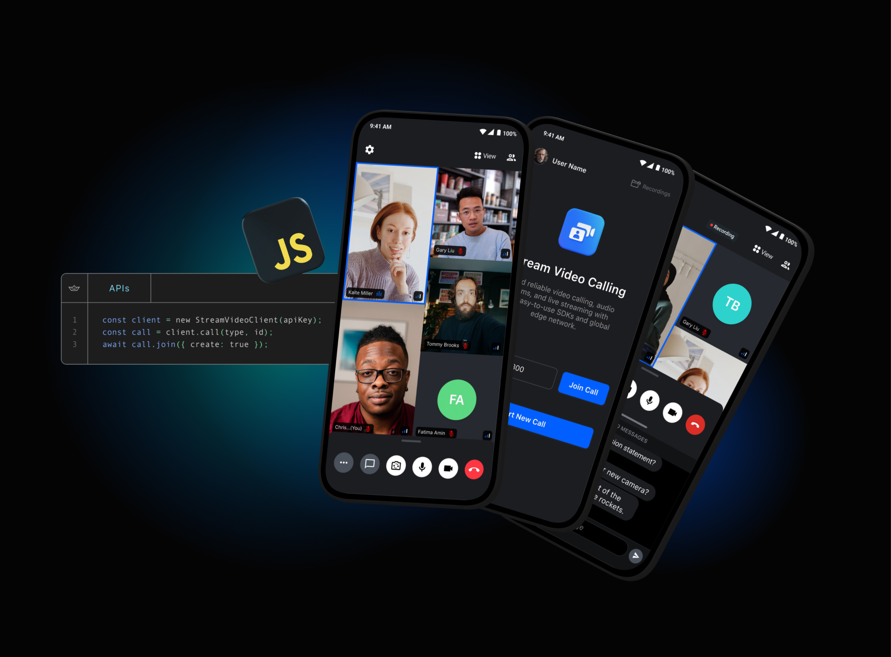

# Stream SDK for Node.js

## **Quick Links**

- [Register](https://getstream.io/chat/trial/) to get an API key for Stream
- [Docs](https://getstream.io/video/docs/api/)

## Package requirements

The package is tested against these environments:

- Node.js@18
- Node.js@20
- Node.js@22
- Bun@1

## What is Stream?

Stream allows developers to rapidly deploy scalable feeds, chat messaging and video with an industry leading 99.999% uptime SLA guarantee.

Stream provides UI components and state handling that make it easy to build video calling for your app. All calls run on Stream's network of edge servers around the world, ensuring optimal latency and reliability.

## 👩‍💻 Free for Makers 👨‍💻

Stream is free for most side and hobby projects. To qualify, your project/company needs to have < 5 team members and < $10k in monthly revenue. Makers get $100 in monthly credit for video for free.

## Repo Overview 😎

This repo contains the Node server-side SDK developed by the team and Stream community. For a feature overview please visit our [roadmap](https://github.com/GetStream/protocol/discussions/177).

## Contributing

- How can I submit a sample app?
  - Apps submissions are always welcomed! 🥳 Open a pr with a proper description and we'll review it as soon as possible
- Spot a bug 🕷 ?
  - We welcome code changes that improve the apps or fix a problem. Please make sure to follow all best practices and add tests if applicable before submitting a Pull Request on Github.
