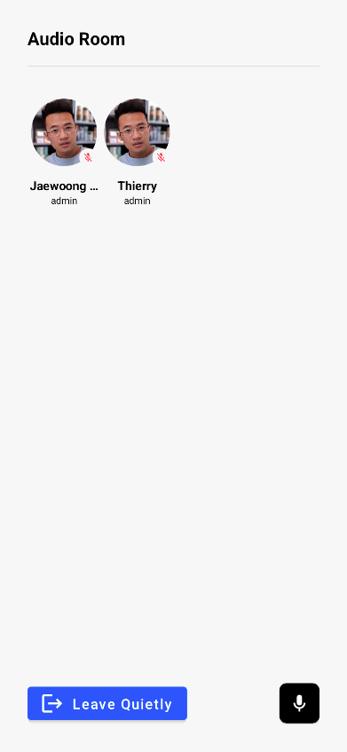
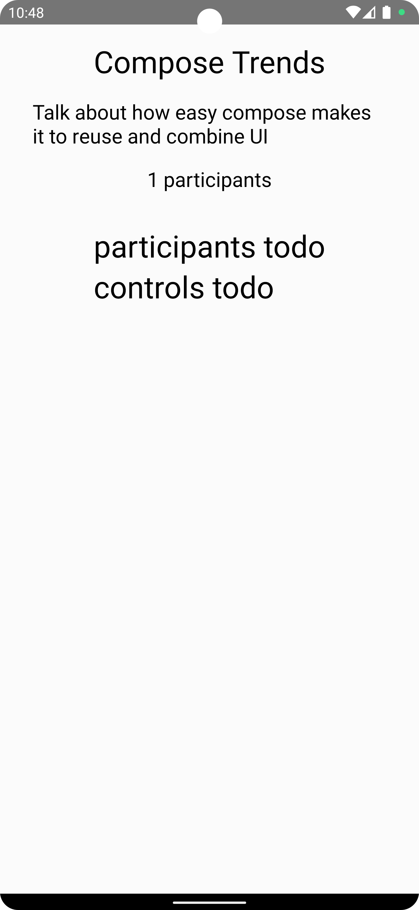
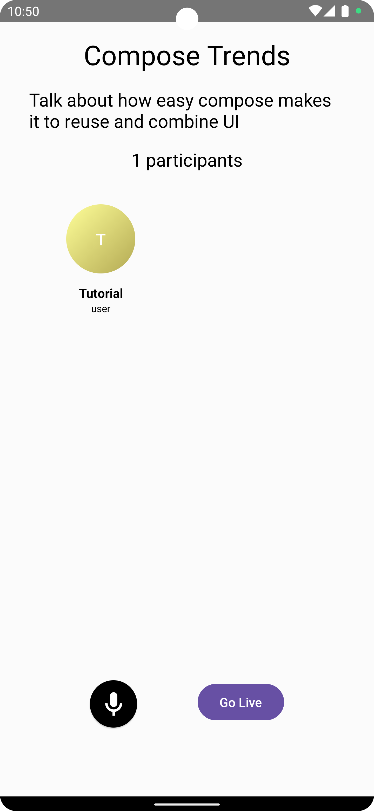

import { TokenSnippet } from '../../../shared/_tokenSnippet.jsx';

This tutorial will teach you how to build an audio room experience like Twitter Spaces or Clubhouse.
The end result will look like the image below and support the following features:

* Backstage mode. You can start the call with your co-hosts and chat a bit before going live.
* Calls run on Stream's global edge network for optimal latency and scalability.
* There is no cap to how many listeners you can have in a room.
* Listeners can raise their hand, and be invited to speak by the host.
* Audio tracks are sent multiple times for optimal reliability.



Time to get started building an audio-room for your app.

### Step 1 - Create a new project in Android Studio

Note that this tutorial was written using Android Studio Giraffe. Setup steps can vary slightly across Android Studio versions.
We recommend using Android Studio Giraffe or newer.

1. Create a new project
2. Select Phone & Tablet -> **Empty Activity**
3. Name your project **AudioRoom**.

### Step 2 - Install the SDK & Setup the client

**Add the Video Compose SDK** and [Jetpack Compose](https://developer.android.com/jetpack/compose) dependencies to your app's `build.gradle.kts` file found in `app/build.gradle.kts`.
If you're new to android, note that there are 2 `build.gradle` files, you want to open the `build.gradle` in the app folder.

```groovy
dependencies {
    // Stream Video Compose SDK
    implementation("io.getstream:stream-video-android-ui-compose:0.5.7")

    // Jetpack Compose (optional/ android studio typically adds them when you create a new project)
    implementation(platform("androidx.compose:compose-bom:2023.08.00"))
    implementation("androidx.activity:activity-compose:1.7.2")
    implementation("androidx.compose.ui:ui")
    implementation("androidx.compose.ui:ui-tooling")
    implementation("androidx.compose.runtime:runtime")
    implementation("androidx.compose.foundation:foundation")
    implementation("androidx.compose.material:material")
}
```

There are 2 versions of Stream's SDK.

- **Video Compose SDK**: `io.getstream:stream-video-android-ui-compose` dependency that includes the video core SDK + compose UI components.
- **Video Core SDK**: `io.getstream:stream-video-android-core` that only includes the core parts of the video SDK.

For this tutorial, we'll use the compose UI components.

### Step 3 - Create & Join a call

Open up `MainActivity.kt` and replace the **MainActivity** class with the following code:

```kotlin
class MainActivity : ComponentActivity() {
    override fun onCreate(savedInstanceState: Bundle?) {
        super.onCreate(savedInstanceState)

        val userToken = "REPLACE_WITH_TOKEN"
        val userId = "REPLACE_WITH_USER_ID"
        val callId = "REPLACE_WITH_CALL_ID"

        // step1 - create a user.
        val user = User(
            id = userId, // any string
            name = "Tutorial" // name and image are used in the UI
        )

        // step2 - initialize StreamVideo. For a production app we recommend adding the client to your Application class or di module.
        val client = StreamVideoBuilder(
            context = applicationContext,
            apiKey = "hd8szvscpxvd", // demo API key
            geo = GEO.GlobalEdgeNetwork,
            user = user,
            token = userToken,
        ).build()

        // step3 - join a call, which type is `audio_room` and id is `123`.
        val call = client.call("audio_room", callId)
        lifecycleScope.launch {
            val result = call.join(create = true, createOptions = CreateCallOptions(
                members = listOf(
                    MemberRequest(userId = userId, role="host", custom = emptyMap())
                ),
                custom = mapOf(
                    "title" to "Compose Trends",
                    "description" to "Talk about how easy compose makes it to reuse and combine UI"
                )
            ))
            result.onError {
                Toast.makeText(applicationContext, it.message, Toast.LENGTH_LONG).show()
            }
        }

        setContent {
            VideoTheme {
                val connection by call.state.connection.collectAsState()

                Column(horizontalAlignment = Alignment.CenterHorizontally, modifier = Modifier.padding(16.dp)) {
                    if (connection != RealtimeConnection.Connected) {
                        Text("loading", fontSize = 30.sp)
                    } else {
                        Text("ready to render an audio room", fontSize = 30.sp)
                    }
                }
            }
        }
    }
}
```

To keep the tutorial short and simple to follow we've added the client, state and UI straight into the **MainActivity** class.
For a real app, you'd typically want to use an [Application class](https://developer.android.com/reference/android/app/Application) for the client and a [ViewModel](https://developer.android.com/topic/libraries/architecture/viewmodel) for managing the state.

Let's review the example above and go over the details.

**Create a user**. First we create a user object.
You typically sync your users via a server side integration from your own backend.
Alternatively, you can also use guest or anonymous users.

```kotlin
val user = User(
    id = userId, // any string
    name = "Tutorial" // name and image are used in the UI
)
```

**Initialize the Stream Client**. Next we initialize the client by passing the API Key, user and user token.

```kotlin
 val client = StreamVideoBuilder(
    context = applicationContext,
    apiKey = "hd8szvscpxvd", // demo API key
    geo = GEO.GlobalEdgeNetwork,
    user = user,
    token = userToken,
).build()
```

**Create and Join Call**. After the user and client are created, we create a call like this:

```kotlin
val call = client.call("audio_room", callId)
lifecycleScope.launch {
    val result = call.join(
        create = true, createOptions = CreateCallOptions(
            members = listOf(
                MemberRequest(userId = userId, role = "host", custom = emptyMap())
            ),
            custom = mapOf(
                "title" to "Compose Trends",
                "description" to "Talk about how easy compose makes it to reuse and combine UI"
            )
        )
    )
    result.onError {
        Toast.makeText(applicationContext, it.message, Toast.LENGTH_LONG).show()
    }
}
```

* This joins and creates a call with the type: "audio_room" and the specified callId.
* You add yourself as a member with the "host" role. You can create custom roles and grant them permissions to fit your app.
* The `title` and `description` custom fields are set on the call object.
* Shows an error toast if you fail to join an audio room.

To actually run this sample, we need a valid user token. The user token is typically generated by your server side API.
When a user logs in to your app you return the user token that gives them access to the call.
To make this tutorial easier to follow we'll generate a user token for you:

Please update **REPLACE_WITH_USER_ID**, **REPLACE_WITH_TOKEN** and **REPLACE_WITH_CALL_ID** with the actual values shown below:

<TokenSnippet sampleApp='audio-rooms' />

With valid credentials in place, we can join the call.
When you run the app you'll see the following:


### Step 4 - Audio Room & Description

Now that we've successfully connected to the audio room. Let's setup a basic UI and description.
Replace the code in `setContent` with the following sample:

```kotlin
setContent {
    VideoTheme {
        val connection by call.state.connection.collectAsState()
        val activeSpeakers by call.state.activeSpeakers.collectAsState()
        val audioLevel = activeSpeakers.firstOrNull()?.audioLevel?.collectAsState()

        val color1 = Color.White.copy(alpha = 0.2f + (audioLevel?.value ?: 0f) * 0.8f)
        val color2 = Color.White.copy(alpha = 0.2f + (audioLevel?.value ?: 0f) * 0.8f)

        Column(
            horizontalAlignment = Alignment.CenterHorizontally,
            verticalArrangement = Arrangement.Top,
            modifier = Modifier
                .background(Brush.linearGradient(listOf(color1, color2)))
                .fillMaxSize()
                .fillMaxHeight()
                .padding(16.dp)
        ) {

            if (connection != RealtimeConnection.Connected) {
                Text("loading", fontSize = 30.sp)
            } else {
                AudioRoom(call = call)
            }
        }
    }
}
```

All state for a call is available in `call.state`. In the example above we're observing the connection state and the active speakers.
The [ParticipantState docs](../03-guides/03-call-and-participant-state.mdx) explain the available stateflow objects.

You'll see that the **AudioRoom** composable hasn't been implemented yet. In `MainActivity`, add the following `AudioRoom` composable:

```kotlin
@Composable
public fun AudioRoom(
    call: Call,
){
    val custom by call.state.custom.collectAsState()
    val title = custom["title"] as? String
    val description = custom["description"] as? String
    val participants by call.state.participants.collectAsState()
    val activeSpeakers by call.state.activeSpeakers.collectAsState()
    val activeSpeaker = activeSpeakers.firstOrNull()
    val sortedParticipants by call.state.sortedParticipants.collectAsState()

    val backstage by call.state.backstage.collectAsState()
    val isMicrophoneEnabled by call.microphone.isEnabled.collectAsState()

    Description(title, description, participants)

    activeSpeaker?.let {
        Text("${it.user.value.name} is speaking")
    }

    Column(
        modifier = Modifier
            .fillMaxHeight()
            .padding(0.dp, 32.dp, 0.dp, 0.dp)
    ) {
        Participants(
            modifier = Modifier.weight(4f),
            sortedParticipants = sortedParticipants
        )
        Controls(
            modifier = Modifier
                .weight(1f)
                .fillMaxWidth()
                .padding(16.dp), call = call,
            isMicrophoneEnabled = isMicrophoneEnabled,
            backstage = backstage,
            enableMicrophone = { call.microphone.setEnabled(it) }
        )
    }
}
```

The code above observes the participants, active speakers and backstage stateflow objects in `call.state`.

We still need to implement a **Controls**, **Participants**, and **Description** composable.
Let's add those next.

```kotlin
@Composable
public fun Description(
    title: String?,
    description: String?,
    participants: List<ParticipantState>
) {
    Text("$title", fontSize = 30.sp)
    Text("$description", fontSize = 20.sp, modifier = Modifier.padding(16.dp))
    Text("${participants.size} participants", fontSize = 20.sp)
}

@Composable
public fun Participants(
    modifier: Modifier = Modifier,
    sortedParticipants: List<ParticipantState>
) {
    Text("participants todo", fontSize = 30.sp)
}

@Composable
public fun Controls(
    modifier: Modifier = Modifier,
    call: Call,
    backstage: Boolean = false,
    isMicrophoneEnabled: Boolean = false,
    enableMicrophone: (Boolean) -> Unit = {}
) {
    Text("controls todo", fontSize = 30.sp)
}
```

That's it for the basics. Now when you run your app, you'll see the following UI:



The approach is the same for all components. We take the states of the call by observing `call.state` properties, such as `call.state.participants` and use it to power our UI.
The [ParticipantState docs](../03-guides/03-call-and-participant-state.mdx) exposes all the state objects we need for the name, avatar, audio levels, speaking, etc.

### Step 5 - Audio Room Controls & Permission

Any app that records the microphone needs to ask the user for permission. We'll do this now.

To capture the microphone output, we need to request [Android runtime permissions](https://source.android.com/docs/core/permissions/runtime_perms).
In `MainActivity.kt` just below `setContent` add the line `LaunchMicrophonePermissions(call = call)`:

```kotlin
setContent {
    LaunchMicrophonePermissions(call = call)
    ..
}
```

The launch call permissions will request permissions when you enter the app.
Review the [permissions docs](../05-ui-cookbook/08-permission-requests.mdx) to learn more about how you can easily request permissions.

Now let's have a look at the `Controls` composable. Replace the `Controls` composable with the following:

```kotlin
@Composable
public fun Controls(
    modifier: Modifier = Modifier,
    call: Call,
    backstage: Boolean = false,
    isMicrophoneEnabled: Boolean = false,
    enableMicrophone: (Boolean) -> Unit = {}
){
    val scope = rememberCoroutineScope()
    Row(
        modifier = modifier,
        horizontalArrangement = Arrangement.SpaceEvenly
    ) {
        ToggleMicrophoneAction(
            modifier = Modifier.size(52.dp),
            isMicrophoneEnabled = isMicrophoneEnabled,
            onCallAction = { enableMicrophone(it.isEnabled) }
        )

        Button(
            onClick = {
                scope.launch {
                    if (backstage) call.goLive() else call.stopLive()
                }
            }
        ) {
            Text(text = if (backstage) "Go Live" else "End")
        }
    }
}
```

Now when you run the app, you'll see a button to disable/enable the microphone and to start or end the broadcast.

To make this a little more interactive, let's join the audio room from your browser.

<TokenSnippet sampleApp='audio-rooms' displayStyle='join' />

At first you won't be allowed to join the room since it's not live yet.
By default the audio_room call type has backstage mode enabled. This makes it easy to try out your room and talk to your co-hosts before going live.
You can enable/disable the usage of backstage mode in the dashboard.

Let's go live and join the call:

* Click go live on Android
* On web join the room
* You'll see the participant count increase to 2

### Step 6 - Participants UI

Time to build a pretty UI for the participants. Replace the `Participants` composable with the following:

```kotlin
@Composable
public fun Participants(
    modifier: Modifier = Modifier,
    sortedParticipants: List<ParticipantState>
){
    LazyVerticalGrid(
        modifier = modifier,
        columns = GridCells.Adaptive(minSize = 128.dp)
    ) {
        items(items = sortedParticipants, key = { it.sessionId }) { participant ->
            ParticipantAvatar(participant)
        }
    }
}
```

The `Participants` composable is responsible for rendering all participants in the audio room as a grid list.
Now we'll add a pretty **ParticipantAvatar** composable, which represents a user in the audio room:

```kotlin
@Composable
public fun ParticipantAvatar(
    participant: ParticipantState,
    modifier: Modifier = Modifier
) {
    val user by participant.user.collectAsState()
    val nameOrId by participant.userNameOrId.collectAsState()
    val isSpeaking by participant.speaking.collectAsState()
    val audioEnabled by participant.audioEnabled.collectAsState()

    Column(
        modifier = modifier,
        horizontalAlignment = Alignment.CenterHorizontally,
        verticalArrangement = Arrangement.Center
    ) {

        Box(modifier = Modifier.size(VideoTheme.dimens.audioAvatarSize)) {
            UserAvatar(
                user = user,
                modifier = Modifier
                    .fillMaxSize()
                    .padding(VideoTheme.dimens.audioAvatarPadding)
            )

            if (isSpeaking) {
                Box(
                    modifier = Modifier
                        .fillMaxSize()
                        .border(BorderStroke(2.dp, Color.Gray), CircleShape)
                )
            } else if (!audioEnabled) {
                Box(
                    modifier = Modifier
                        .fillMaxSize()
                        .padding(VideoTheme.dimens.audioAvatarPadding)
                ) {
                    Box(
                        modifier = Modifier
                            .clip(CircleShape)
                            .background(VideoTheme.colors.appBackground)
                            .size(VideoTheme.dimens.audioRoomMicSize)
                    ) {
                        Icon(
                            modifier = Modifier
                                .fillMaxSize()
                                .padding(VideoTheme.dimens.audioRoomMicPadding),
                            painter = painterResource(id = io.getstream.video.android.ui.common.R.drawable.stream_video_ic_mic_off),
                            tint = VideoTheme.colors.errorAccent,
                            contentDescription = null
                        )
                    }
                }
            }
        }

        Spacer(modifier = Modifier.height(8.dp))

        Text(
            modifier = Modifier.fillMaxWidth(),
            text = nameOrId,
            fontSize = 14.sp,
            fontWeight = FontWeight.Bold,
            color = VideoTheme.colors.textHighEmphasis,
            textAlign = TextAlign.Center,
        )

        Text(
            modifier = Modifier.fillMaxWidth(),
            text = user.role,
            fontSize = 11.sp,
            color = VideoTheme.colors.textHighEmphasis,
            textAlign = TextAlign.Center,
        )
    }
}
```

The `ParticipantAvatar` composable represents each participant in the audio room, displays the initial of the user and the status of the microphone.
Now when you run the app, you'll see a pretty UI for the participants.



In the above example, we use the following state flow objects:

```kotlin
val user by participant.user.collectAsState()
val nameOrId by participant.userNameOrId.collectAsState()
val isSpeaking by participant.speaking.collectAsState()
val audioEnabled by participant.audioEnabled.collectAsState()
```

The [ParticipantState docs](../03-guides/03-call-and-participant-state.mdx) include all the other attributes that are also available.
For audio rooms, `participant.audioLevel` and `participant.audioLevels` can be convenient to implement an audio visualizer.

### Other built-in features

There are a few more exciting features that you can use to build audio rooms:

- ** Requesting Permissions **: Participants can ask the host for permission to speak, share video etc
- ** Query Calls **: You can query calls to easily show upcoming calls, calls that recently finished etc
- ** Call Previews **: Before you join the call you can observe it and show a preview. IE John, Sarah and 3 others are on this call.
- ** Reactions & Custom events **: Reactions and custom events are supported
- ** Recording & Broadcasting **: You can record your calls, or broadcast them to HLS
- ** Chat **: Stream's chat SDKs are fully featured and you can integrate them in the call
- ** Moderation **: Moderation capabilities are built-in to the product
- ** Transcriptions **: Transcriptions aren't available yet, but are coming soon

### Recap

It was fun to see just how quickly you can build an audio-room for your app.
Please do let us know if you ran into any issues.
Our team is also happy to review your UI designs and offer recommendations on how to achieve it with Stream.

To recap what we've learned:

* You setup a call: (val call = client.call("audio_room", "222"))
* The call type "audio_room" controls which features are enabled and how permissions are setup
* The audio_room by default enables "backstage" mode, and only allows admins to join before the call goes live
* When you join a call, realtime communication is setup for audio & video calling: (call.join())
* Stateflow objects in `call.state` and `call.state.participants` make it easy to build your own UI

Calls run on Stream's global edge network of video servers.
Being closer to your users improves the latency and reliability of calls.
For audio rooms we use Opus RED and Opus DTX for optimal audio quality.

The SDKs enable you to build audio rooms, video calling and livestreaming in days.

We hope you've enjoyed this tutorial, and please do feel free to reach out if you have any suggestions or questions.
