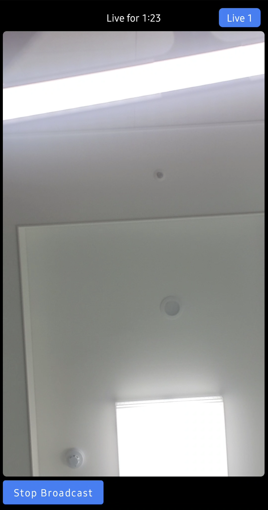

import { TokenSnippet } from '../../../shared/_tokenSnippet.jsx';

In this tutorial we'll quickly build a low-latency in-app livestreaming experience.
The livestream is broadcasted using Stream's edge network of servers around the world.
We'll cover the following topics:

* Ultra low latency streaming
* Multiple streams & co-hosts
* RTMP in and WebRTC input
* Exporting to HLS
* Reactions, custom events and chat
* Recording & Transcriptions

Let's get started, if you have any questions or feedback be sure to let us know via the feedback button.

### Step 1 - Create a new project in Android Studio

Note that this tutorial was written using **Android Studio Giraffe**. Setup steps can vary slightly across Android Studio versions.
We recommend using [Android Studio Giraffe or newer](https://developer.android.com/studio/releases).

1. Create a new project
2. Select Phone & Tablet -> **Empty Activity**
3. Name your project **Livestream**.

### Step 2 - Install the SDK & Setup the client

**Add the Video Compose SDK** and [Jetpack Compose](https://developer.android.com/jetpack/compose) dependencies to your app's `build.gradle.kts` file found in `app/build.gradle.kts`.
If you're new to android, note that there are 2 `build.gradle` files, you want to open the `build.gradle` in the app folder.

```kotlin
dependencies {
    // Stream Video Compose SDK
    implementation("io.getstream:stream-video-android-ui-compose:1.0.8")

    // Jetpack Compose (optional/ android studio typically adds them when you create a new project)
    implementation(platform("androidx.compose:compose-bom:2023.08.00"))
    implementation("androidx.activity:activity-compose:1.7.2")
    implementation("androidx.compose.ui:ui")
    implementation("androidx.compose.ui:ui-tooling")
    implementation("androidx.compose.runtime:runtime")
    implementation("androidx.compose.foundation:foundation")
    implementation("androidx.compose.material:material")
}
```

There are 2 versions of Stream's SDK.

- **Video Compose SDK**: `io.getstream:stream-video-android-ui-compose` dependency that includes the video core SDK + compose UI components.
- **Video Core SDK**: `io.getstream:stream-video-android-core` that only includes the core parts of the video SDK.

This tutorial demonstrates the Compose Video SDK, but you have the option to use the core library without Compose based on your preference.

### Step 3 - Broadcast a livestream from your phone

The following code shows how to publish from your phone's camera.
Let's open `MainActivity.kt` and replace the `MainActivity` class with the following code:

```kotlin
class MainActivity : ComponentActivity() {
    override fun onCreate(savedInstanceState: Bundle?) {
        super.onCreate(savedInstanceState)

        val userToken = "REPLACE_WITH_TOKEN"
        val userId = "REPLACE_WITH_USER_ID"
        val callId = "REPLACE_WITH_CALL_ID"

        // create a user.
        val user = User(
            id = userId, // any string
            name = "Tutorial" // name and image are used in the UI
        )

        // for a production app we recommend adding the client to your Application class or di module.
        val client = StreamVideoBuilder(
            context = applicationContext,
            apiKey = "hd8szvscpxvd", // demo API key
            geo = GEO.GlobalEdgeNetwork,
            user = user,
            token = userToken,
        ).build()

        // join a call, which type is `livestream`
        val call = client.call("livestream", callId)
        lifecycleScope.launch {
            // join the call
            val result = call.join(create = true)
            result.onError {
                Toast.makeText(applicationContext, "uh oh $it", Toast.LENGTH_SHORT).show()
            }
        }

        setContent {
            // request the Android runtime permissions for the camera and microphone
            LaunchCallPermissions(call = call)

            VideoTheme {
                Text("TODO: render video")
            }
        }
    }
}
```

You'll notice that these first 3 lines need their values replaced.

```kotlin
val userToken = "REPLACE_WITH_TOKEN"
val userId = "REPLACE_WITH_USER_ID"
val callId = "REPLACE_WITH_CALL_ID"
```

Replace them now with the values shown below:

<TokenSnippet sampleApp='livestream' displayStyle='credentials' />

When you run the app now you'll see a text message saying: "TODO: render video".
Before we get around to rendering the video let's review the code above.

In the first step we setup the user:

```kotlin
val user = User(
    id = userId, // any string
    name = "Tutorial" // name and image are used in the UI
)
```

If you don't have an authenticated user you can also use a guest or anonymous user.
For most apps it's convenient to match your own system of users to grant and remove permissions.

Next we create the client:

```kotlin
val client = StreamVideoBuilder(
    context = applicationContext,
    apiKey = "mmhfdzb5evj2", // demo API key
    geo = GEO.GlobalEdgeNetwork,
    user = user,
    token = userToken,
).build()
```

You'll see the `userToken` variable. Your backend typically generates the user token on signup or login.

The most important step to review is how we create the call.
Stream uses the same call object for livestreaming, audio rooms and video calling.
Have a look at the code snippet below:

```kotlin
val call = client.call("livestream", callId)
lifecycleScope.launch {
    // join the call
    val result = call.join(create = true)
    result.onError {
        Toast.makeText(applicationContext, "uh oh $it", Toast.LENGTH_SHORT).show()
    }
}
```

To create the first call object, specify the call type as **livestream** and provide a unique **callId**. The **livestream** call type comes with default settings that are usually suitable for livestreams, but you can customize features, permissions, and settings in the dashboard. Additionally, the dashboard allows you to create new call types as required.

Finally, using `call.join(create = true)` will not only create the call object on our servers but also initiate the real-time transport for audio and video. This allows for seamless and immediate engagement in the livestream.

Note that you can also add members to a call and assign them different roles. For more information, see the [call creation docs](../03-guides/02-joining-creating-calls.mdx)

### Step 4 - Rendering the video

In this step we're going to build a UI for showing your local video with a button to start the livestream.
This example uses Compose, but you could also use our XML VideoRenderer.

In `MainActivity.kt` replace the `VideoTheme` with the following code:

```kotlin
VideoTheme {
    val connection by call.state.connection.collectAsState()
    val totalParticipants by call.state.totalParticipants.collectAsState()
    val backstage by call.state.backstage.collectAsState()
    val localParticipant by call.state.localParticipant.collectAsState()
    val video = localParticipant?.video?.collectAsState()?.value
    val duration by call.state.duration.collectAsState()

    androidx.compose.material.Scaffold(
        modifier = Modifier
            .fillMaxSize()
            .background(VideoTheme.colors.appBackground)
            .padding(6.dp),
        contentColor = VideoTheme.colors.appBackground,
        backgroundColor = VideoTheme.colors.appBackground,
        topBar = {
            if (connection == RealtimeConnection.Connected) {
                if (!backstage) {
                    Box(
                        modifier = Modifier
                            .fillMaxWidth()
                            .padding(6.dp)
                    ) {
                        Text(
                            modifier = Modifier
                                .align(Alignment.CenterEnd)
                                .background(
                                    color = VideoTheme.colors.primaryAccent,
                                    shape = RoundedCornerShape(6.dp)
                                )
                                .padding(horizontal = 12.dp, vertical = 4.dp),
                            text = "Live $total",
                            color = Color.White
                        )

                        Text(
                            modifier = Modifier.align(Alignment.Center),
                            text = "Live for $duration",
                            color = VideoTheme.colors.textHighEmphasis
                        )
                    }
                }
            }
        },
        bottomBar = {
            androidx.compose.material.Button(
                colors = ButtonDefaults.buttonColors(
                    contentColor = VideoTheme.colors.primaryAccent,
                    backgroundColor = VideoTheme.colors.primaryAccent
                ),
                onClick = {
                    lifecycleScope.launch {
                        if (backstage) call.goLive() else call.stopLive()
                    }
                }
            ) {
                Text(
                    text = if (backstage) "Go Live" else "Stop Broadcast",
                    color = Color.White
                )
            }
        }
    ) {
        VideoRenderer(
            modifier = Modifier
                .fillMaxSize()
                .padding(it)
                .clip(RoundedCornerShape(6.dp)),
            call = call,
            video = video,
            videoFallbackContent = {
                Text(text = "Video rendering failed")
            }
        )
    }
}
```

Upon running your app, you will be greeted with an interface that looks like this:



Stream uses a technology called SFU cascading to replicate your livestream over different servers around the world.
This makes it possible to reach a large audience in realtime.

Now let's press **Go live** in the android app and click the link below to watch the video in your browser.

<TokenSnippet sampleApp='livestream' displayStyle='join' />

#### State & Participants

Let's take a moment to review the Compose code above. `Call.state` exposes all the stateflow objects you need.
The [participant state docs](../03-guides/03-call-and-participant-state.mdx) show all the available fields.

In this example we use:

* `call.state.connection`: to show if we're connected to the realtime video. you can use this for implementing a loading interface
* `call.state.backstage`: a boolean that returns if the call is in backstage mode or not
* `call.state.duration`: how long the call has been running
* `call.state.totalParticipants`: the number of participants watching the livestream
* `call.state.participants`: the list of participants

The `call.state.participants` can optionally contain more information about who's watching the stream.
If you have multiple people broadcasting video this also contain the video tracks.

* `participant.user`: the user's name, image and custom data
* `participant.video`: the video for this user
* `participant.roles`: the roles for the participant. it enables you to have co-hosts etc

There are many possibilities and the [participant state docs](../03-guides/03-call-and-participant-state.mdx) explain this in more detail.

#### Creating a UI to watch a livestream

The livestream layout is built using standard Jetpack Compose. The [VideoRenderer](../04-ui-components/02-video-renderer.mdx) component is provided by Stream.
**VideoRenderer** renders the video and a fallback. You can use it for rendering the local and remote video.

If you want to learn more about building an advanced UI for watching a livestream, check out [Cookbook: Watching a livestream](../05-ui-cookbook/16-watching-livestream.mdx).

#### Backstage mode

In the example above you might have noticed the `call.goLive()` method and the `call.state.backstage` stateflow.
The backstage functionality is enabled by default on the livestream call type.
It makes it easy to build a flow where you and your co-hosts can setup your camera and equipment before going live.
Only after you call `call.goLive()` will regular users be allowed to join the livestream.

This is convenient for many livestreaming and audio-room use cases. If you want calls to start immediately when you join them that's also possible.
Simply go the Stream dashboard, click the livestream call type and disable the backstage mode.

### Step 4 - (Optional) Publishing RTMP using OBS

The example above showed how to publish your phone's camera to the livestream.
Almost all livestream software and hardware supports RTMPS.
[OBS](https://obsproject.com/) is one of the most popular livestreaming software packages and we'll use it to explain how to import RTMPS.

A. Log the URL & Stream Key

```kotlin
val rtmp = call.state.ingress.rtmp
Log.i("Tutorial", "RTMP url and streamingKey: $rtmp")
```

B. Open OBS and go to settings -> stream

- Select "custom" service
- Server: equal to the server URL from the log
- Stream key: equal to the stream key from the log

Press start streaming in OBS. The RTMP stream will now show up in your call just like a regular video participant.
Now that we've learned to publish using WebRTC or RTMP let's talk about watching the livestream.

### Step 5 - Viewing a livestream (WebRTC)

Watching a livestream is even easier than broadcasting.

Compared to the current code in in `MainActivity.kt` you:

* Don't need to request permissions or enable the camera
* Don't render the local video, but instead render the remote video
* Typically include some small UI elements like viewer count, a button to mute etc

### Step 6 - (Optional) Viewing a livestream with HLS

Another way to watch a livestream is using HLS. HLS tends to have a 10 to 20 seconds delay, while the above WebRTC approach is realtime.
The benefit that HLS offers is better buffering under poor network conditions.
So HLS can be a good option when:

* A 10-20 second delay is acceptable
* Your users want to watch the Stream in poor network conditions

Let's show how to broadcast your call to HLS:

```kotlin
call.startHLS()
val hlsUrl = call.state.egress.value?.hls?.playlistUrl
Log.i("Tutorial", "HLS url = $hlsUrl")
```

You can play the HLS video feed using any HLS capable video player, such as [ExoPlayer](https://github.com/google/ExoPlayer).

### 7 - Advanced Features

This tutorial covered broadcasting and watching a livestream.
It also went into more details about HLS & RTMP-in.

There are several advanced features that can improve the livestreaming experience:

* ** [Co-hosts](../03-guides/02-joining-creating-calls.mdx) ** You can add members to your livestream with elevated permissions. So you can have co-hosts, moderators etc.
* ** [Custom events](../03-guides/10-reactions-and-custom-events.mdx) ** You can use custom events on the call to share any additional data. Think about showing the score for a game, or any other realtime use case.
* ** [Reactions & Chat](../03-guides/10-reactions-and-custom-events.mdx) ** Users can react to the livestream, and you can add chat. This makes for a more engaging experience.
* ** [Notifications](../06-advanced/01-ringing.mdx) ** You can notify users via push notifications when the livestream starts
* ** [Recording](../06-advanced/09-recording.mdx) ** The call recording functionality allows you to record the call with various options and layouts

### Recap

It was fun to see just how quickly you can build in-app low latency livestreaming.
Please do let us know if you ran into any issues.
Our team is also happy to review your UI designs and offer recommendations on how to achieve it with Stream.

To recap what we've learned:

* WebRTC is optimal for latency, HLS is slower but buffers better for users with poor connections
* You setup a call: (val call = client.call("livestream", callId))
* The call type "livestream" controls which features are enabled and how permissions are setup
* The livestream by default enables "backstage" mode. This allows you and your co-hosts to setup your mic and camera before allowing people in
* When you join a call, realtime communication is setup for audio & video: (call.join())
* Stateflow objects in call.state and call.state.participants make it easy to build your own UI
* For a livestream the most important one is call.state.

Calls run on Stream's global edge network of video servers.
Being closer to your users improves the latency and reliability of calls.
The SDKs enable you to build livestreaming, audio rooms and video calling in days.

We hope you've enjoyed this tutorial and please do feel free to reach out if you have any suggestions or questions.