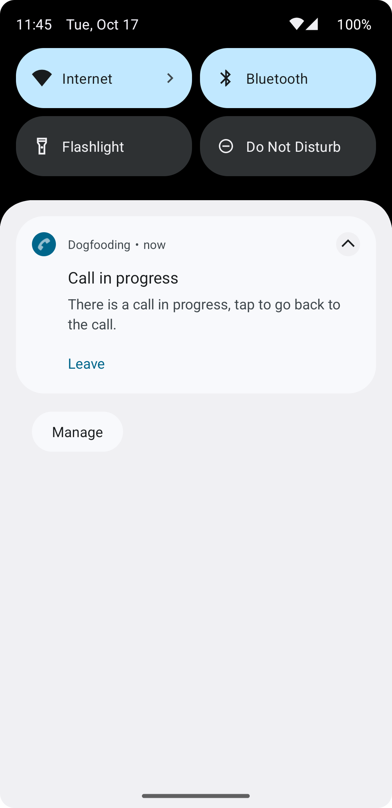

Ensuring uninterrupted video and audio calls is vital. 
Our SDK's default feature keeps calls active in the background, allowing users to multitask seamlessly.
On this page you will learn how to tailor this feature to your needs.

# Out of the box

By default, our SDK ensures continuous calls by initiating a [foreground service](https://developer.android.com/guide/components/foreground-services).
This service keeps the process active and the call running, even if the application's UI is no longer visible.
The SDK already provides the required declarations in the manifest.

Our foreground service displays a notification indicating an ongoing call. 
This notification allows users to either exit the call or seamlessly return to it. 
It appears during active calls and vanishes when the user leaves the call.



## Customizing the notification

Easily customize notification text by overriding predefined strings, tailoring the messaging to your preferences.

```xml
<strings>
    <string name="stream_video_ongoing_call_notification_channel_id" translatable="false">ongoing_calls</string>
    <string name="stream_video_ongoing_call_notification_channel_title">Ongoing calls</string>
    <string name="stream_video_ongoing_call_notification_channel_description">Ongoing call alerts</string>
    <string name="stream_video_ongoing_call_notification_title">Call in progress</string>
    <string name="stream_video_ongoing_call_notification_description">There is a call in progress, tap to go back to the call.</string>
    <string name="stream_video_call_notification_action_leave">Leave</string>
</strings>
```
For additional customization options and tailored behavior, please refer to our comprehensive [push notification setup](../06-advanced/02-push-notifications/02-setup.mdx) guide.

## Disable the foreground service & hide the notification
You can entirely deactivate this functionality by setting the `runForegroundServiceForCalls` flag to false during the [initialization process](../01-basics/03-quickstart.mdx).

```kotlin {7}
val client = StreamVideoBuilder(
     context = context,
     apiKey = apiKey,
     geo = GEO.GlobalEdgeNetwork,
     user = user,
     token = token,
     runForegroundServiceForCalls = false
).build()
```


