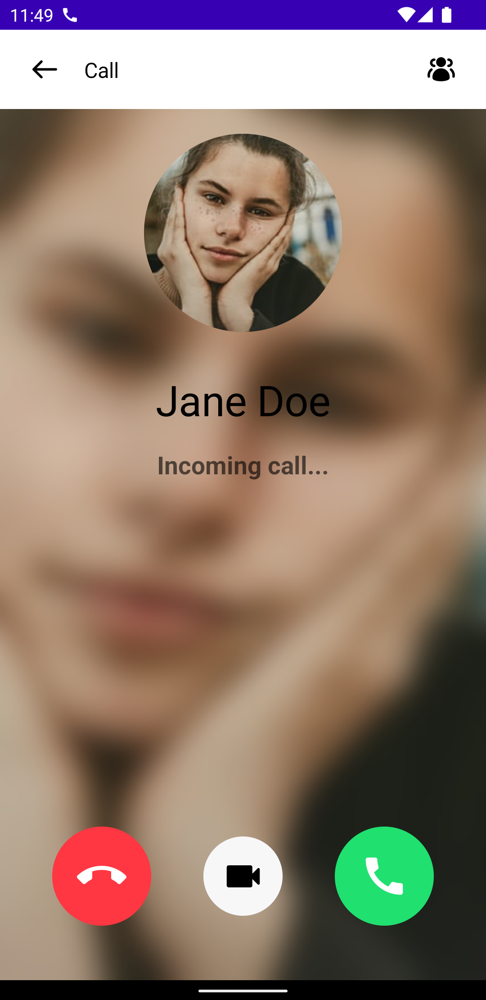
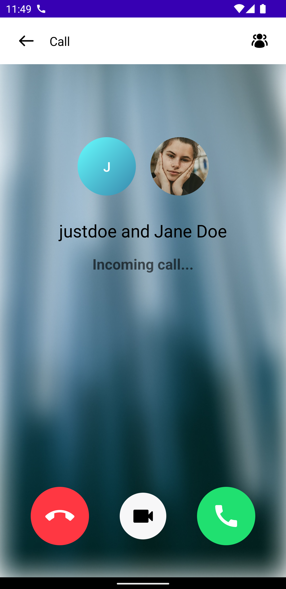
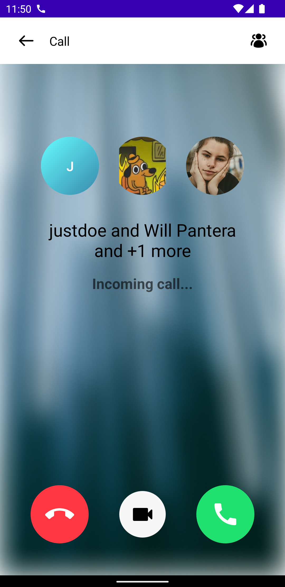

# IncomingCallContent

The `IncomingCallContent` lets you easily build UI when you're being called or ringed by other people in an app. It's used to show more information about the participants and the call itself, as well as give you the option to reject or accept the call. We provide two versions of the `IncomingCallContent`:

* **Bound**: This version binds itself to a `CallViewModel` and loads all the required data. It also connects the action handlers for video and rejecting or accepting a call.
* **Stateless**: This is a stateless version of the `IncomingCallContent`, which doesn't depend on a `ViewModel` and instead depends on pure state from external sources to render its UI.

> **Note**: If you want to learn more about our component types, make sure to read through our [Compose Components Overview](../../01-overview.mdx).

Based on the state, the `IncomingCallContent` provides a list of participants, with their avatars and names, or a background with the avatar of the person you're being called by, if it's a 1:1 conversation.

Let's see how to show the `IncomingCallContent` UI.

## Usage

To use the **bound** `IncomingCallContent`, add it to your UI within `setContent()`:

```kotlin
override fun onCreate(savedInstanceState: Bundle?) {
    super.onCreate(savedInstanceState)
    setContent {
        VideoTheme {
            IncomingCallContent(viewModel = callViewModel, onBackPressed = { rejectCall() }) // here
        }
    }
}

private fun rejectCall() {
    // TODO - reject call
}
```

This is a very basic example, which rejects the call when the user presses the back button. Additionally, you pass in the `CallViewModel`, as explained above, to bind all the state and event handling to our SDK internals.

Alternatively, you could've used the stateless component variant, that takes in a `CallType`, a list of `Participant`s and if the video is enabled or not instead of the `CallViewModel`. You could get this information through custom logic, but you could also read it from our `ViewModel` and apply transformations before rendering it on the UI.

Both of the components will handle showing an incoming call screen in different states depending on the number of participants and their information, such as if they have an avatar.

| One to one                                                   | Group                                                        | Group plus                                                   |
| ------------------------------------------------------------ | ------------------------------------------------------------ | ------------------------------------------------------------ |
|  |  |  |

Let's see how to override the action handlers.

## Handling Actions

If you want to override how the actions are handled, you have the following options:

```kotlin
@Composable
public fun IncomingCall(
  	..., // State
    onBackPressed: () -> Unit,
    onCallAction: (CallAction) -> Unit,
)
```

* `onBackPressed`: Handler when the user triggers the back action. Useful to either cancel the call or put it in the background.
* `onCallAction`: Handler when the user clicks on any of the visible actions, that allow them to enable and disable video and reject or accept the call.

To override these action handlers, simply pass in custom logic when using the component:

```kotlin
override fun onCreate(savedInstanceState: Bundle?) {
    super.onCreate(savedInstanceState)
    setContent {
        VideoTheme {
            IncomingCallContent(
              viewModel = callViewModel,
              onBackPressed = { rejectCall() },
              onCallAction = { action -> handleAction(action) }
            ) // here
        }
    }
}

private fun rejectCall() {
    // TODO - reject call
}

private fun handleAction(action: CallAction) {
    // TODO - handle actions
}
```

Using this you can build custom behavior that shows the user more options or information when triggering the actions.

## Customization

The `IncomingCallContent` is very simple and doesn't offer any customization other than the root `Modifier`. We strongly suggest building custom Incoming UI if your app requires something that's different from our default.