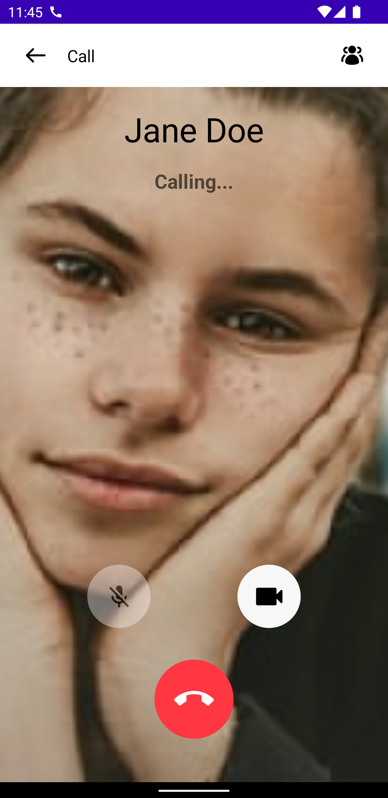
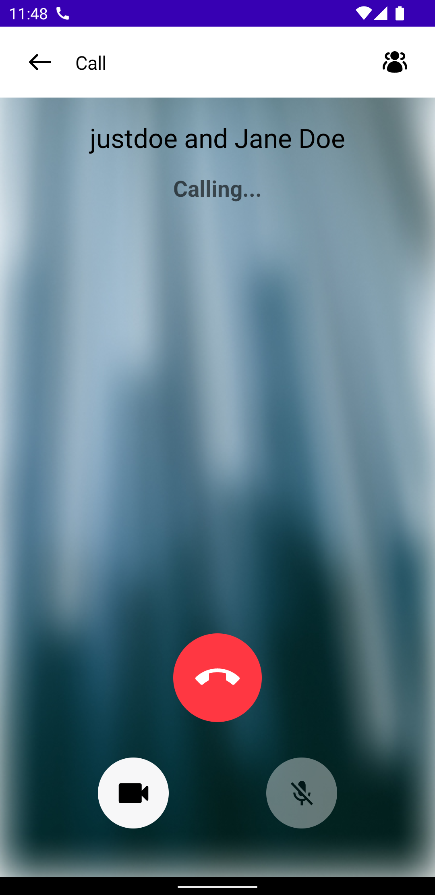
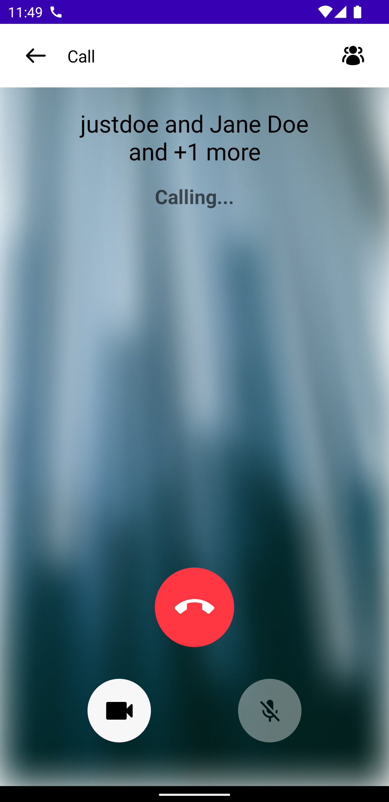

# OutgoingCall

To show an outgoing call UI on the screen there are two options. The first one is `OutgoingCallContent`, which is a bound component. By default its state and handlers will depend on the `CallViewModel` which can be overridden.

```kotlin
@Composable
public fun OutgoingCallContent(
    viewModel: CallViewModel,
    modifier: Modifier = Modifier,
    onBackPressed: () -> Unit,
    onCallAction: (CallAction) -> Unit = viewModel::onCallAction,
)
```

The second option is the `OutgoingCall`, which is a stateless component. It allows you to provide and control the state directly.

```kotlin
@Composable
public fun OutgoingCall(
    callType: CallType,
    participants: List<CallUser>,
    callMediaState: CallMediaState,
    modifier: Modifier = Modifier,
    onBackPressed: () -> Unit,
    onCallAction: (CallAction) -> Unit,
)
```

Both allow you to override:

* **onBackPressed**: Handler that notifies of the back pressed actions to show the participants list or go back if it is not open.
<!-- TODO link call actions -->
* **onCallAction**: Handler that notifies that user performed some kind of a `CallAction`.

The difference is that the stateless components enables you to define the states which will be shown on the screen:

* **callType**: Whether the call is video or audio. `CallType.VIDEO` specifies both audio and video whereas `CallType.AUDIO` will be just an audio call without the video capabilities.
* **participants**: The list of `CallUser`s which are participating in the call.
* **callMediaState**: The state which contains whether the camera, microphone or speaker are off or on.

Both of the components will handle showing an outgoing call screen in different states depending on the number of participants.

| One to one | Group | Group plus |
| --- | --- | --- |
|  |  |  |