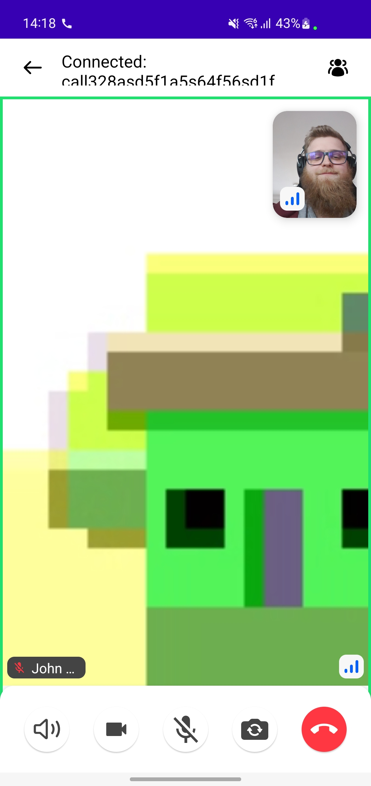
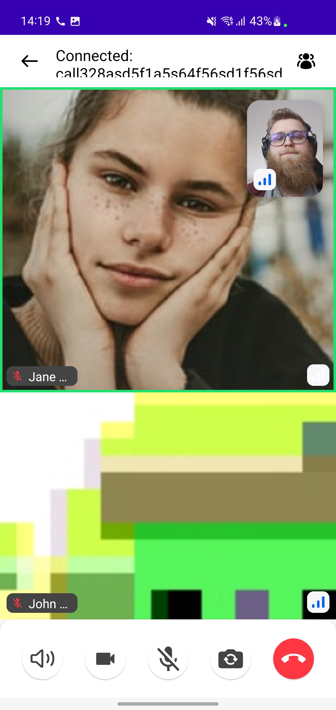

## ActiveCall

Finally, `ActiveCallContent` shows the participants video or screenshare and call media state after the user has joined or accepted the call. Here is the component definition:

```kotlin
@Composable
public fun ActiveCallContent(
    callViewModel: CallViewModel,
    modifier: Modifier = Modifier,
    onBackPressed: () -> Unit = { callViewModel.onCallAction(LeaveCall) },
    onCallAction: (CallAction) -> Unit = callViewModel::onCallAction,
    pictureInPictureContent: @Composable (Call) -> Unit = { DefaultPictureInPictureContent(it) }
)
```

It also allows you to override some of the handlers and content:

* **onBackPressed**: Handler that notifies of the back pressed actions to show the participants list or go back if it is not open.
* **onCallAction**: Handler that notifies that user performed some kind of a `CallAction`.
* **pictureInPictureContent**: Represents the content that will be shown in picture in picture mode.

It consists of the next elements:
* [**`CallParticipants`**](../call-participants): shows the current participants in the call.
* [**`CallControls`**](../call-controls): exposes the media controls to the user, to toggle microphone/camera/speakerphone off/on and to leave the call.

| One to one | Group |
| --- | --- |
|  |  |

`ActiveCallContent` also takes care of the orientation changes and adapts the UI accordingly.

| Landscape |
| --- | --- |
|  |

Aside from the standard participant video stream we support screensharing and have components that display the content focusing on it.

| Portrait | Landscape |
| --- | --- |
|  |  |