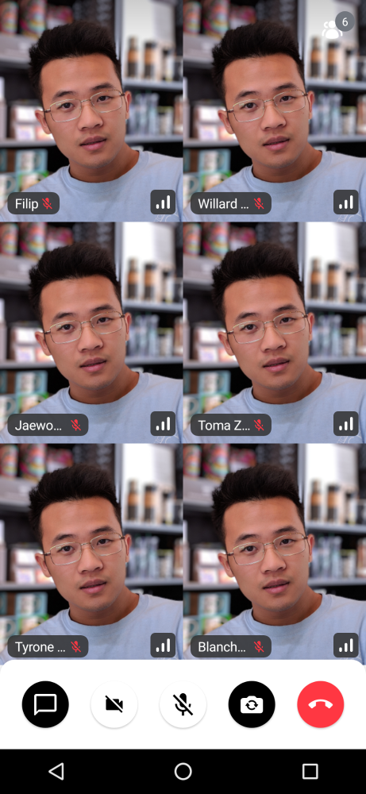

# Overview

This library aims to make it as easy as possible to build your own video calling, audio rooms and livestreams.
We support a low level client, guides on building your own UI and several pre-build UI components.
If you quickly want to add calling to your app you can do that in just hours with these UI components.

### Rendering a single video

If you only want to render a participant's video:

```
ParticipantVideoRenderer(
    call = call,
    participant = participant,
)
```

You will see the basic live video rendering:


### Participant Card

If you want to render a participant's video together with:

* A label/name for the participant
* Network quality indicator
* Mute/unmute indicator
* Fallback for when video is muted
* Speaking indicator

Use this component:

```
CallSingleVideoRenderer(
    call = call,
    participant = participant,
    labelPosition = Alignment.BottomStart
)
```

You will see the result below:


### Video Call UI

We also support the full UI component, which consists of:

- **AppBar**: Content is shown that calls information or additional actions.
- **Video**: A call video that renders the full participants of the call.
- **Controls**: Content is shown that allows users to trigger different actions to control a joined call.

The following example renders a full video calling interface:

```Kotlin
VideoTheme {
    CallContent(
        modifier = modifier,
        callViewModel = callViewModel,
        onBackPressed = onBackPressed,
        onCallAction = onCallAction,
        callControlsContent = callControlsContent,
        pictureInPictureContent = pictureInPictureContent
    )
}
```

You will see the result below:



### Ringing (incoming/outgoing calls)

You can implement incoming/outgoing respectively screens depending on the call state with `RingingCallContent` composable:

```Kotlin
VideoTheme {
    RingingCallContent(
        callViewModel = callViewModel,
        callType = CallType.VIDEO,
        onAcceptedCallContent = {
            // do something when a call is accepted
        },
    )
}
```

## UI Component Customization

The UI components are highly customizable.

* You can change the theme
* You can swap components with your own variations
* Or you can build UI components from scratch


