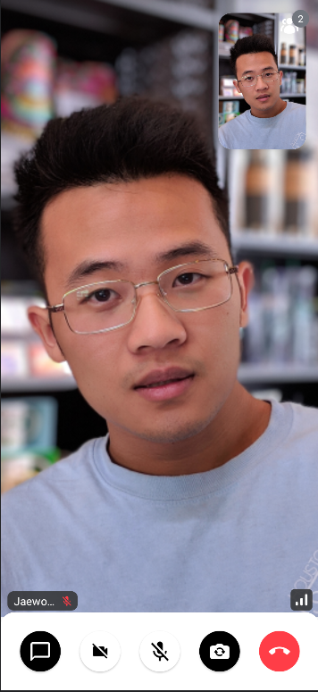

# CallContainer

The easiest way to set up a screen that renders a video call, incoming, outgoing and active call screens which contain the current participants video feeds and the call controls is to use the `CallContainer`.

`CallContainer` sets up the following functionality by connecting multiple components:

* [**`CallAppBar`**](05-call-app-bar.mdx): Displays a call information or an additional actions, such as the number of participants,
* [**`CallControls`**](04-call-controls.mdx): Allows a user to trigger different actions to control a joining call, such as enabling a camera/audio and flipping a camera.
* [**`CallContent`**](03-call-content.mdx): Content is shown by rendering video/audio when we're connected to a call successfully.
* [**`RingingCall`**](02-ringing-call.mdx): When the user calls other people or is called by another person, it shows other participants' avatars and controls for switching audio/video and canceling the call.

This section will cover components at the highest top of the hierarchy, enabling you to implement a Video Call app quickly.
These components abstract the logic needed to write a functioning video call experience, which makes them less open to customization.

## Usage

`CallContainer` is at the top of the hierarchy. It is a bound component that automatically renders live videos, Incoming/Outgoing and Active call components depending on call states.

```kotlin
override fun onCreate(savedInstanceState: Bundle?) {
    super.onCreate(savedInstanceState)
    setContent {
        VideoTheme {
            CallContainer(
                modifier = Modifier.fillMaxSize(),
                callViewModel = callViewModel,
                callType = CallType.VIDEO,
                onBackPressed = { finish() },
            )
        }
    }
}
```

:::note
Please ensure that you were already initialized StreamVideo with the `StreamVideoBuilder(..).build()` method before using the `CallViewModel`.
:::

Using this UI component and our `CallViewModel`, will show the following UI based on call states.



If you want to customize the behavior for your use case, you can override the action handlers.

## Handling Actions

When it comes to actions the `CallContainer` exposes, you're able to override the following:

* **onBackPressed**: Back pressed actions to go back when accessing different Call menus or trigger Picture-In-Picture mode.
* **onCallAction**: Handler that notifies that user performed some kind of a `CallAction`, to trigger enable or disable video and audio states, leaving the call and more.

These actions are defined by default, but you can override them by simply passing a custom handler when calling the component:

```kotlin
override fun onCreate(savedInstanceState: Bundle?) {
    super.onCreate(savedInstanceState)
    setContent {
        VideoTheme {
            CallContainer(
                modifier = Modifier.fillMaxSize(),
                callViewModel = callViewModel,
                callType = CallType.VIDEO,
                onCallAction = {
                    // TODO - handle call actions
                },
                onBackPressed = {
                    // TODO - handle the back button is pressed
                },
            )
        }
    }
}
```

You can also pass the actions to the [CallViewModel](../05-view-model.mdx) to handle the default actions we define in our UI, but you can handle any custom actions here, if you've built some custom UI.

When it comes to custom UI, the `CallContainer` exposes some Slot APIs for you to consume.

## Customization

`CallContainer` is our main **Screen component** and as such offers limited customization through itself. While you can customize all the `VideoTheme` properties, to style the UI, change colors, sizes, paddings, text styles and more, you can still override some Slot APIs to customize specific UI within this component.

More specifically, the `CallContainer` exposes the following Slots:

```kotlin
@Composable
public fun CallContainer(
    ...
    callAppBarContent: @Composable () -> Unit = {
        CallAppBar(
            modifier = Modifier.testTag("call_appbar"),
            call = callViewModel.call,
            leadingContent = null,
            onBackPressed = onBackPressed,
            onCallAction = onCallAction
        )
    },
    callControlsContent: @Composable (call: Call) -> Unit = {
        CallControls(
            modifier = Modifier.testTag("call_controls"),
            callViewModel = callViewModel,
            onCallAction = onCallAction,
        )
    },
    pictureInPictureContent: @Composable (Call) -> Unit = { DefaultPictureInPictureContent(it) }, // 2
    callContent: @Composable (call: Call) -> Unit = {
        DefaultCallContent(
            modifier = modifier.testTag("call_content"),
            callViewModel = callViewModel,
            onBackPressed = onBackPressed,
            onCallAction = onCallAction,
            callAppBarContent = callAppBarContent,
            callControlsContent = callControlsContent,
            pictureInPictureContent = pictureInPictureContent
        )
    },
    ringingCallContent: @Composable (call: Call) -> Unit = {
        RingingCallContent(
            modifier = modifier.testTag("ringing_call_content"),
            callType = callType,
            callViewModel = callViewModel,
            onBackPressed = onBackPressed,
            onCallAction = onCallAction,
            onAcceptedCallContent = { callContent.invoke(it) }
        )
    },
)
```

* **callAppBarContent**: Represents the content that handle a back button and shows the call information, such as the status, the number of participants.
* **callControlsContent**: Represents the content that features various controls and actions in a call, such as audio and video handles and leaving a call.
* **pictureInPictureContent**: Represents the content that will be shown in Picture-In-Picture mode.
* **ringingCallContent**: Represents the incoming/outgoing content shown respectively when the active user is being ringed or ringing other users.
* **callContent**: Represents the active call content, when the user fully joins and connects to a call.

Using any of these slots, you can fully replace the content that's shown in different states and you can build these components to be rendered differently, as the state updates.
