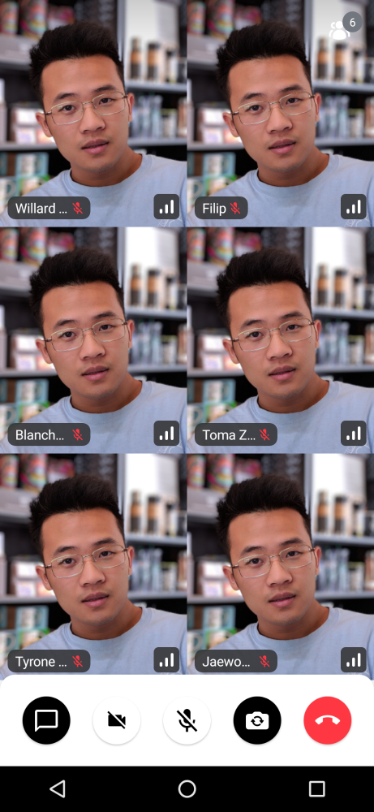

# CallContent

The `CallContent` is the highest-level UI component that allows you to build your own call screen with full UI elements. So you don't need to take care much about each feature that you need to build a video call screen with this component.

Basically what you can do with the `CallContent` is:

- A full call screen with multiple UI elements, such as the app bar, participants grid, and control action buttons.
- Supports orientation changes for landscape orientation.
- [Handles the state and actions](03-call-controls.mdx) of enabling and disabling camera, microphone, and speakerphone.
- Renders [Screensharing](06-screen-share-content.mdx).
- Handles [Android permissions](../../05-ui-cookbook/08-permission-requests.mdx) related to the camera and microphone.
- Manages media lifecycles (pause/resume the camera and microphone).
- Supports [picture-in-picture](../../06-advanced/03-enable-picture-in-picture.mdx) easily.
- Display participant information, such as audio levels, name, microphone states, and reactions.
- [Styling a video renderer](../../05-ui-cookbook/04-video-renderer.mdx).

Based on the call state, the `CallContent` provides a list or grid of participants, with their avatars and names, or a video if they're publishing, with more information for each participant, like their connection quality and audio levels.

Let's see how to show the `CallContent` UI.

> **Note**: If you want to learn more about our component types, make sure to read through our [Compose Components Overview](../01-overview.mdx).

## Build a Call Screen With CallContent

To use the **bound** `CallContent`, add it to your UI within `VideoTheme`:

```kotlin
override fun onCreate(savedInstanceState: Bundle?) {
    super.onCreate(savedInstanceState)
    setContent {
        VideoTheme {
            CallContent(call = call) // here
        }
    }
}
```

This is a very basic example, which will show the default call UI which transforms its layout based on the number of participants and their published or unpublished tracks.

Both of the components will handle showing a complex and rich UI with many features, right out of the box. Aside from the standard participant video stream we support screensharing and have components that display the content focusing on it. 

Aside from the standard participant video stream we support screensharing and have components that display the content focusing on it.

| Regular | Screen Sharing                                               |
| ------- | ------------------------------------------------------------ |
|  |  |

The `CallContent` UI also handles orientation changes internally, so both of these features are supported in landscape orientation.

| Landscape - Regular and Screen Sharing                       |
| ------------------------------------------------------------ |
|  |
|  |

This component is very rich, so you might want to customize how the actions are handled. Let's do that next.

## Handling Actions

`CallContent` supports these main action handlers:

```kotlin
@Composable
public fun CallContent(
    ..., // other params
    onBackPressed: () -> Unit = { .. },
    onCallAction: (CallAction) -> Unit = { .. },
)
```

* `onBackPressed`: Handler when the user taps on the back button. Used by default to handle picture in picture mode and different menus that can be shown based on other user actions.
* `onCallAction`: Handler when the user triggers any of the available actions around audio, video, speakerphone, participants and more. The events come from the [Control Actions](03-call-controls.mdx) by default.

These can be easily customized when calling the UI component in your code:

```kotlin
VideoTheme {
    CallContent(
      call = call,
      onBackPressed = { .. },
      onCallAction = { .. }
    )
}
```

Using these handlers you can override some of the default behavior like what happens when the user taps on the **Leave Call** button, if any dialogs are shown and so on.

Next, once you have the behavior down, you can explore customizing the UI of the component.

## Customization

The following parameters are available on the `CallContent`:

```
| Attribute | Description |
| --- | --- |
| `call` | The call includes states and will be rendered with participants. |
| `modifier` | The standard Jetpack Compose modifier used to style things like the component size, background, shape and similar. |
| `onBackPressed` | Handler when the user taps on the back button. |
| `permissions` | Android permissions that should be required to render a video call properly. |
| `onCallAction` | Handler when the user triggers a Call Control Action. |
| `appBarContent` | Content is shown that calls information or additional actions. |
| `style` | Defined properties for styling a single video call track. |
| `videoRenderer` | A single video renderer renders each individual participant. |
| `videoContent` | Content is shown that renders all participants' videos. |
| `controlsContent` | Content is shown that allows users to trigger different actions to control a joined call. |
| `enableInPictureInPicture` | If the user has engaged in Picture-In-Picture mode. |
| `pictureInPictureContent` | Content shown when the user enters Picture in Picture mode, if it's been enabled in the app. |

:::note
You can find out the parameters details in the [CallContent docs](https://getstream.github.io/stream-video-android/stream-video-android-compose/io.getstream.video.android.compose.ui.components.call.activecall/-call-content.html).
:::

If you're looking for guides on how to override and customize this UI, we have various [UI Cookbook](../../05-ui-cookbook/01-overview.mdx) recipes for you and we cover a portion of customization within the [Video Android SDK Tutorial](../../02-tutorials/01-video-calling.mdx).
