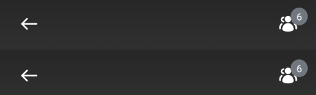
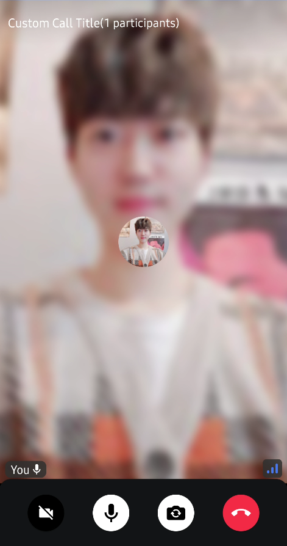

# CallAppBar

The `CallAppBar` represents the header component that gives the user more information when in a call, while adding a few actions they can trigger while the call is active. The header is useful for showing the call name or title, as well as the state, such as if the user is fully connected to the call or not.

Let's see how to use the component.

## Usage

To use the component, simply embed it within the rest of your custom UI:

```kotlin
@Composable
fun MyCustomUi() {
    Column(modifier = Modifier.fillMaxSize()) {
        CallAppBar(
            call = call,
            onBackPressed = { handleBack() }
        )
        // ... The rest of your UI
    }
}
```

The component doesn't have any mandatory parameters, since its behavior and UI is fairly simple. However, we recommend overriding the `onBackPressed` handler for the back button.

Using the component like this, without any further customization, will provide the following UI:



It shows a small back button, a title while the call is reconnecting and an icon that lets you explore participants. While this UI is rendered by default, the action handling needs to be provided by you, since we cannot handle that state out of the box.

Let's see how to do so.

## Handling Actions

The `CallAppBar` component exposes the following actions:

```kotlin
@Composable
public fun CallAppBar(
    .., // UI and state
    onBackPressed: () -> Unit = {},
    onCallAction: (CallAction) -> Unit = {},
)
```

* `onBackPressed`: Handler when the user taps on the back arrow, useful for finishing the call or triggering the Picture-In-Picture mode.
* `onCallAction`: Handler when the user triggers the `ShowCallParticipantInfo` action at the trailing part of the component.

You can override these parameters by passing in a custom lambda function that describes the behavior.

Behavior customization is only one part, let's see how to customize the UI.

## Customization

Within UI customization, the component provides the following:

```kotlin
@Composable
public fun CallAppBar(
    call: Call,
    modifier: Modifier = Modifier,
    title: String = stringResource(id = R.string.default_app_bar_title),
    leadingContent: (@Composable RowScope.() -> Unit)? = {
        DefaultCallAppBarLeadingContent(onBackPressed)
    },
    centerContent: (@Composable (RowScope.() -> Unit))? = {
        DefaultCallAppBarCenterContent(call, title)
    },
    trailingContent: (@Composable RowScope.() -> Unit)? = {
        DefaultCallAppBarTrailingContent(
            call = call,
            onCallAction = onCallAction
        )
    }
)
```

* `modifier`: Useful for additional styling, like applying borders or adding extra gesture handling.
* `title`: The text shown in the component. Can be anything custom, that describes the state of the call. The default title is empty, and it shows only the reconnecting state.
* `leadingContent`: Represents the default leading content, which is the back button. You can override this to remove the back button or add a different action.
* `centerContent`: Represents the default center content, which is the call title. You can override this to add more details, like a subtitle, number of participants and much more.
* `trailingContent`: Represents the default trailing content, which is the "Call Info" menu button. You can override this slot to remove the default button or to provide custom actions.

Here's an example of a custom `CallAppBar`:

```kotlin
@Composable
private fun CustomCallAppBar() {
    VideoTheme {
        val participants by it.state.participants.collectAsState()
        CallAppBar(
            call = call,
            leadingContent = {}, // remove back arrow icon
            centerContent = {
                Row(
                    modifier = Modifier.weight(1f),
                    verticalAlignment = Alignment.CenterVertically,
                ) {
                    Text(
                        text = "Custom Call Title", // Call name
                        style = VideoTheme.typography.title3Bold,
                        color = Color.White,
                        fontSize = 16.sp
                    )

                    Text(
                        text = "(${participants.size} participants)", // fetch from the state
                        color = Color.White,
                        style = VideoTheme.typography.body
                    )
                }
            },
            trailingContent = {}, // remove trailing icon
        )
    }
}
```

You can provide custom UI for the `centerContent` that overrides the basic title to add a subtitle and remove the `leadingContent` or `trailingContent` by passing in an empty lambda.

Using this approach you'd get the following UI:



It was very simple to customize, while still having the same behavior.

If you use [CallContent](03-call-content.mdx), you can simply customize them by passing your custom `CallAppBar`:

```kotlin
CallContent(
    appBarContent = { call ->
        CallAppBar(
            call = call,
            ..
        )
    }
)
```