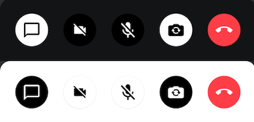
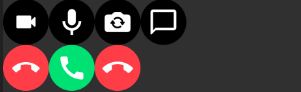

# Control Actions

The `ControlActions` component lets you display any number of controls on the UI, that trigger different actions within a call. We provide default actions, such as changing the audio and video mute state or turning on the speakerphone and leaving the call.

On top of these actions, you can provide a custom set of actions through the API.

What you can do with the `ControlActions` are:

- Toggling your audio/microphone/camera
- Flipping your camera
- Leaving/canceling/declining a call
- And more with customized call actions

Let's see how to use it.

## Build With Control Actions

The `ControlActions` component is very independent, so you can simply use it everywhere you need it and you want to control the actions. This example shows how to build a simple version of the `CallContent` component using `ControlActions` inside the `Scaffold`:

```kotlin
@Composable
private fun MyCallContent() {
    VideoTheme {
        Scaffold(
            modifier = modifier,
            contentColor = VideoTheme.colors.appBackground,
            topBar = { CallAppBar(call = call) },
            bottomBar = {
                ControlActions(
                    modifier = Modifier.fillMaxSize(),
                    call = call,
                    onCallAction = { /* Handle call actions here */ }
                )
            }
        ) { paddings ->
            ParticipantsGrid(
                modifier = Modifier.fillMaxSize().padding(paddings),
                call = call,
            )
        }
}
```

After running the code, you'll see the result below:


Inside the `onCallAction` lambda, you'll be able to receive our pre-defined call actions, such as `ToggleCamera`, `FlipCamera`, and `LeaveCall`. For more details, see the [CallAction docs](https://getstream.github.io/stream-video-android/stream-video-android-core/io.getstream.video.android.core.call.state/-call-action/index.html).

The `ControlActions` component also covers both portrait and landscape orientation. This means that the actions you pass in will be rendered either in a `Row` of items, horizontally placed, when in portrait, or a `Column`, when in the landscape.  If you use [CallContent](03-call-content.mdx), the layout of `ControlActions` will be configured automatically by observing configuration changes.

Now that you've seen how to integrate the component and hook it up with the call and state, let's explore customizing the action handlers.

## Handling Actions

`ControlActions` expose the following ways to customize action handling:

```kotlin
@Composable
public fun ControlActions(
    .., // State and UI
    actions: List<(@Composable () -> Unit)> = buildDefaultCallControlActions(
        call = call,
        onCallAction = onCallAction
    ),
    onCallAction: (CallAction) -> Unit
)
```

* `actions`: While technically a part of the **component state**, it's still good to think about actions as a part of action handling. We provide a set of default action buttons, so you can selectively use them by your taste or you can build your own custom action buttons.
* `onCallAction`: Handler when the user taps on any of the rendered `actions`. Using this handler, you can build logic for custom actions, or for some of the default provided actions, to customize the behavior.

If you want to customize the actions and how they're used, you can do something like this:

```kotlin
val isCameraEnabled by call.camera.isEnabled.collectAsState()
val isMicrophoneEnabled by call.microphone.isEnabled.collectAsState()

ControlActions(
    call = call,
    actions = listOf(
        {
            ToggleCameraAction(
                modifier = Modifier.size(60.dp),
                isCameraEnabled = isCameraEnabled,
                onCallAction = { call.camera.setEnabled(it.isEnabled) }
            )
        },
        {
            ToggleMicrophoneAction(
                modifier = Modifier.size(60.dp),
                isMicrophoneEnabled = isMicrophoneEnabled,
                onCallAction = { call.microphone.setEnabled(it.isEnabled) }
            )
        },
    )
)
```

1. By creating a custom list of Composable, which consist of call control action buttons, you define which actions you want. You could do something like removing the video/camera controls and building an audio-only use case, replacing the flip camera action with a settings wheel for more user input or even adding a Chat icon to support custom Chat UI.
2. Within `ControlActions`, you can override the `onCallAction` parameter to provide a custom handler when the user taps on any of the rendered buttons.
3. You can list out any logic here for any of your custom actions, as well as the default ones that we provide.



There are a couple of our predefined call control actions:

- `ToggleCameraAction`: Used to toggle a camera in a video call.
- `ToggleMicrophoneAction`: Used to toggle a microphone in a video call.
- `FlipCameraAction`: Used to flip a camera in a video call.
- `LeaveCallAction`: Used to leave a call in the call screen.
- `AcceptCallAction`: Represents accepting a call. You usually use this on the ringing call screen.
- `CancelCallAction`: Represents canceling a call. You usually use this on the ringing call screen.
- `ChatDialogAction`: Used to display a chat dialog in the video call. You can use this when you need to integrate chat features in the video call.
- `CustomAction`: Custom action used to handle any custom behavior with the given `data` and `tag`.



You can create your own control action button and put it into the `actions` parameter and align them like the below:

```kotlin
@Composable
public fun MyCustomAction(
    modifier: Modifier = Modifier,
    enabled: Boolean = true,
    onCallAction: (CallAction) -> Unit
) {
    CallControlActionBackground(
        modifier = modifier,
        isEnabled = enabled,
    ) {
        Icon(
            modifier = Modifier
                .padding(13.dp)
                .clickable(enabled = enabled) { onCallAction(CustomAction) },
            tint = VideoTheme.colors.callActionIconEnabled,
            painter = painterResource(id = R.drawable.custom_icon),
            contentDescription = stringResource(R.string.call_controls_custom_action)
        )
    }
}
```

Now that you've seen how to customize the behavior of the controls, let's dive deeper into the UI.

## Customization

This is a very simple component so it doesn't have replaceable slots, but it still offers ways to customize its appearance.

* `modifier`: Allows you to customize the size, position, elevation, background and much more of the component. Using this in pair with `VideoTheme` and our [theming guide](../03-video-theme.mdx), you're able to customize the shape of the call controls as well as colors padding and more.
* `actions`: As previously mentioned, by changing the `actions`, you don't only change the possible behavior, but also the appearance. You can use our own predefined action buttons or add your own Composable and tweak orders.

In our [Video Android Tutorial](https://getstream.io/video/sdk/android/tutorial/video-calling/), we showcased how to build custom `ControlActions` to remove a leave call action button and only feature camera and audio buttons. The result ended up looking something like this:


This allows you to visually change the component, while only changing the actions that are rendered, which is quite useful.