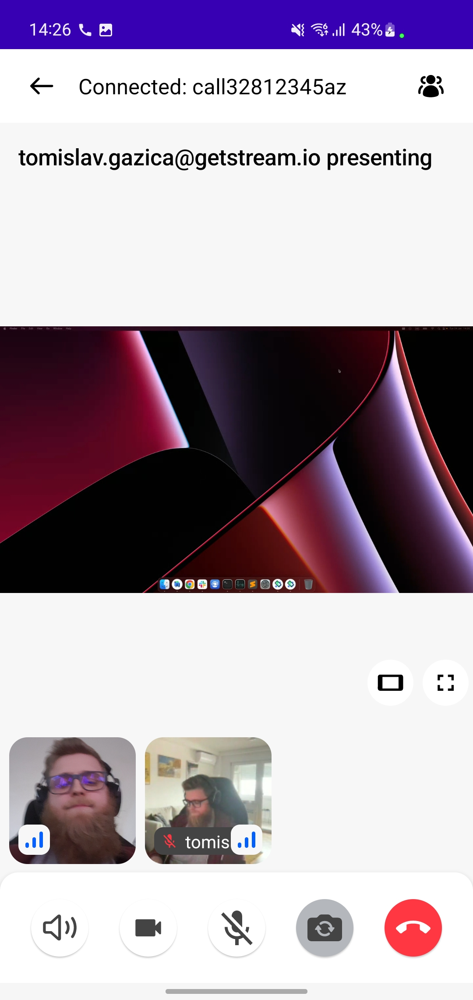
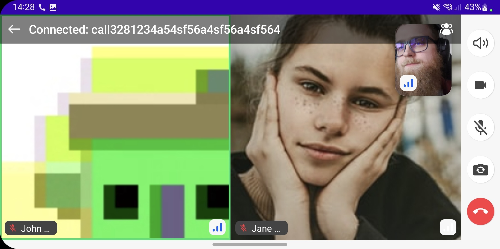
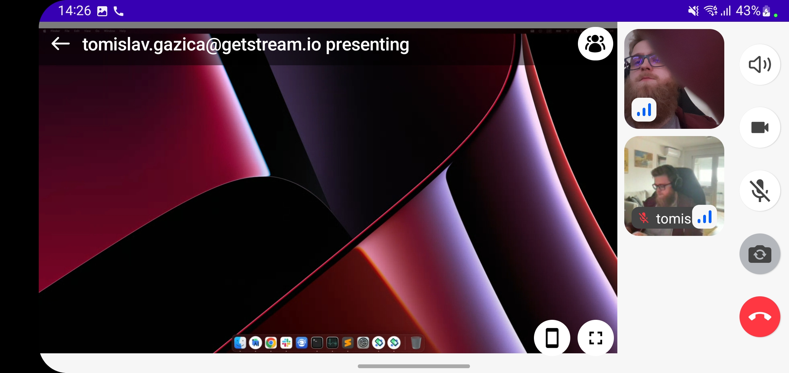

# CallContent

The `CallContent` lets you easily build UI when inside a call. It handles the state and actions of enabling and disabling audio, speakerphone or video, as well as information about the call participtants. Similar to `IncomingCallContent` and `OutgoingCallContent`, the `CallContent` provides two variants:

* **Bound**: This version binds itself to a `CallViewModel` and loads all the required data. It also connects the action handlers for video, audio, speakerphone, participants and more.
* **Stateless**: This is a stateless version of the `CallContent`, which doesn't depend on a `ViewModel` and instead depends on pure state from external sources to render its UI.

> **Note**: If you want to learn more about our component types, make sure to read through our [Compose Components Overview](../../01-overview.mdx).

Based on the state, the `CallContent` provides a list or grid of participants, with their avatars and names, or a video if they're publishing, with more information for each participant, like their connection quality and audio levels.

Let's see how to show the `CallContent` UI.

## Usage

To use the **bound** `CallContent`, add it to your UI within `setContent()`:

```kotlin
override fun onCreate(savedInstanceState: Bundle?) {
    super.onCreate(savedInstanceState)
    setContent {
        VideoTheme {
            CallContent(viewModel = callViewModel) // here
        }
    }
}
```

This is a very basic example, which will show the default call UI which transforms its layout based on the number of participants and their published or unpublished tracks.

Alternatively, you could've used the stateless component variant, that takes in a few parameters to represent the state, instead of the `CallViewModel`. You could get this information through custom logic, but you could also read it from our `ViewModel` and apply transformations before rendering it on the UI yourself.

Both of the components will handle showing a complex and rich UI with many features, right out of the box. Aside from the standard participant video stream we support screensharing and have components that display the content focusing on it. 

Aside from the standard participant video stream we support screensharing and have components that display the content focusing on it.

// TODO - update images with nicer photos for both cases

| Regular | Screen Sharing                                               |
| ------- | ------------------------------------------------------------ |
|  |  |

The `CallContent` UI also handles orientation changes, so both of these features are supported in landscape orientation.

| Landscape - Regular and Screen Sharing                       |
| ------------------------------------------------------------ |
|  |
|  |

This component is very rich, so you might want to customize how the actions are handled. Let's do that next.

## Handling Actions

Similar to `IncomingCallContent` and `OutgoingCallContent`, the `CallContent` supports these main action handlers:

```kotlin
@Composable
public fun CallContent(
    ..., // other params
    onBackPressed: () -> Unit = { ... },
    onCallAction: (CallAction) -> Unit = { ... },
)
```

* `onBackPressed`: Handler when the user taps on the back button. Used by default to handle picture in picture mode and different menus that can be shown based on other user actions.
* `onCallAction`: Handler when the user triggers any of the available actions around audio, video, speakerphone, participants and more.

These can be easily customized when calling the UI component in your code:

```kotlin
override fun onCreate(savedInstanceState: Bundle?) {
    super.onCreate(savedInstanceState)
    setContent {
        VideoTheme {
            CallContent( 
              viewModel = callViewModel,
              // here
              onBackPressed = { ... }, 
              onCallAction = { ... }
            ) 
        }
    }
}
```

Using these handlers you can override some of the default behavior like what happens when the user taps on the **Leave Call** button, if any dialogs are shown and so on.

Next, once you have the behavior down, you can explore customizing the UI of the component.

## Customization

The `CallContent` component has more options when it comes to customization. It exposes the following parameters that let you change its UI:

```kotlin
@Composable
public fun CallContent(
    modifier: Modifier = Modifier,
    callControlsContent: @Composable () -> Unit = { ... },
    pictureInPictureContent: @Composable (Call) -> Unit = { ... }
)
```

* `modifier`: The standard Jetpack Compose modifier used to style things like the component size, background, shape and similar.
* `callControlsContent`: Used to render the controls within the Call. These allow the user to tinker with audio, video, speakerphone, video orientation and more. You can use this slot to change which controls are shown to the user based on things like user permissions or the type of calls you're running.
* `pictureInPictureContent`: Used when the user enters PiP mode. This piece of content is shown within the PiP container and the slot allows you to customize what the user sees when they're in the background.

If you're looking for guides on how to override and customize this UI, we have various [UI Cookbook](../../../../06-ui-cookbook) recipes for you and we cover a portion of customization within the [Video Android SDK Tutorial](../../../../01-basics/01-tutorial.mdx).
