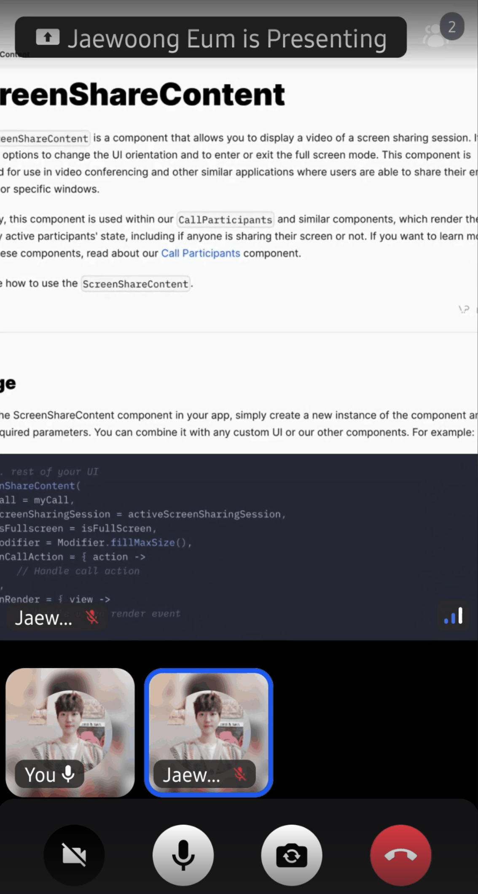

# ParticipantsScreenSharing

The `ParticipantsScreenSharing` is a Composable component that allows you to display a video of a screen sharing session. It also includes options to change the UI orientation and to enter or exit the full-screen mode. This component is designed for use in video conferencing and other similar applications where users are able to share their entire screens or specific windows.

Internally, this component renders a screen sharing session video as a primary screen and observes participants, which are rendered a list of videos.

Let's see how to use the `ParticipantsScreenSharing`.

## Usage

To use the `ParticipantsScreenSharing` component in your app, you should observe the screen sharing session from the call state and check whether the session exists. If a screen sharing session is valid, you can render the screen sharing session and all other participants with `ParticipantsScreenSharing` Composable. If not, you should render a regular video call with `ParticipantsRegularGrid`.

```kotlin
// observe a screen sharing session from the call state.
val session by call.state.screenSharingSession.collectAsState()

if (session != null) {
    ParticipantsScreenSharing(
       call = call,
       session = session!!,
       modifier = Modifier.fillMaxSize(),
    )
} else {
   // render a regular video call screen
   ParticipantsRegularGrid(
       call = call,
       modifier = modifier,
       onRender = onRender,
   )
}
```

There are a few state parameters you're providing here:

- `Call`: Represents the Call in which the screen sharing session is being shown. Usually the Call where the user is active.
- `session`: The session which contains a [ParticipantState](../05-participants/01-call-participant_state.mdx) to provide the screen share track and more details about the user.

Using this component, you'll likely see something similar to the following UI:



The `ParticipantsScreenSharing` Composable supports zoomable functions for the sharing session like the image below:


If you use `ParticipantsGrid`, it will render a screen sharing session video if there's a valid screen sharing session. If not, it will render a regular video call.

```kotlin
ParticipantsGrid(
    modifier = Modifier.fillMaxSize(),
    call = call,
)
```

Let's see how to customize this component.

## Customization

This is a very simple component so it doesn't have replaceable slots, but it still offers ways to customize its appearance.

- `modifier`: Modifier for styling.
- `isZoomable`: Decide to this screensharing video renderer is zoomable or not.
- `style`: Defined properties for styling a single video call track.
- `videoRenderer`: A single video renderer renders each individual participant.

If you're looking for guides on how to override and customize this UI, we have various [UI Cookbook](../../05-ui-cookbook/01-overview.mdx) recipes for you and we cover a portion of customization within the [Video Android SDK Tutorial](../../02-tutorials/01-video-calling.mdx).