# ParticipantsLayout

The `ParticipantsLayout` component is one of our most versatile and complex UI components, designed to render a list of participants in a call. It handles different UI layouts based on the number of participants and different screen orientations. Additionally, it can also render screen sharing content when there is an active session.

Before jumping into how to use the component and how to customize it, let's review what some of these features mean.

What you can do with the `ParticipantsLayout` are:

- Displays a list of the remote/local participants.
- There are two available layouts, Grid and [Spotlight](04-participants-spotlight.mdx)
- There is also a dynamic option where the layout will switch automatically based on any pinned participants.
- All the layout variants are supported in portrait and in landscape mode
- Renders [Screensharing](../04-call/05-screen-share-content.mdx) on demand, regardless of selected layout.

### Flexible Layout

The `ParticipantsLayout` changes the UI layout based on the number of participants. In calls with fewer than four people, the local participant video is rendered in a floating item, using the [FloatingParticipantVideo](03-floating-participant-video.mdx). In calls with six or more people, it's rendered with other participants in a grid.

Additionally, the participants are rendered in the following way:

* **One participant**: Rendered as the only single item in the layout, taking up the full component space.
* **Two participants** (1 remote + local): The remote participant is rendered within the full component space while the local participant is a floating item.
* **Three to four participants** (2-3 remote + local): Remote participants are in a vertical split-screen, while the local participant is a floating item.
* **Five or more** (4 remote + local): Participants are rendered as a grid of items, in a paginated way. Up to 6 participants per page, with the sorted participant.

Sorted participants gives you the list of participants sorted by:
* anyone who is pinned
* if you are screensharing

If the participants are not visible on the screen they are also sorted by:
* is dominant speaker
* has video enabled
* has audio enabled
* all other video participants by when they joined

### Orientation 

The component handles both Landscape and Portrait orientations by rendering different UI. In Portrait mode, the video layout is optimized for standard mobile device rendering, while the landscape mode offers more screen real estate to render video by adding a transparent app bar and pushing the call controls to the side. This is helpful when you need to pay attention to details of the video content of other participants.

Additionally, both of these orientations work for screen sharing and adjust the UI accordingly.

| Portrait ParticipantsLayout | Landscape ParticipantsLayout |
| ------- | ------------------------------------------------------------ |
| 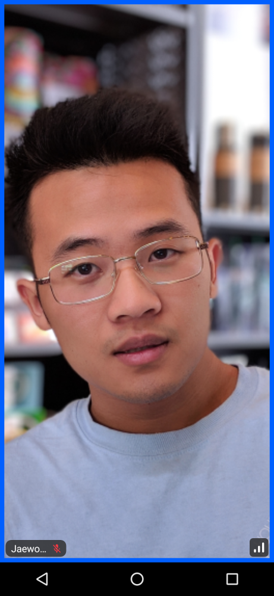 | 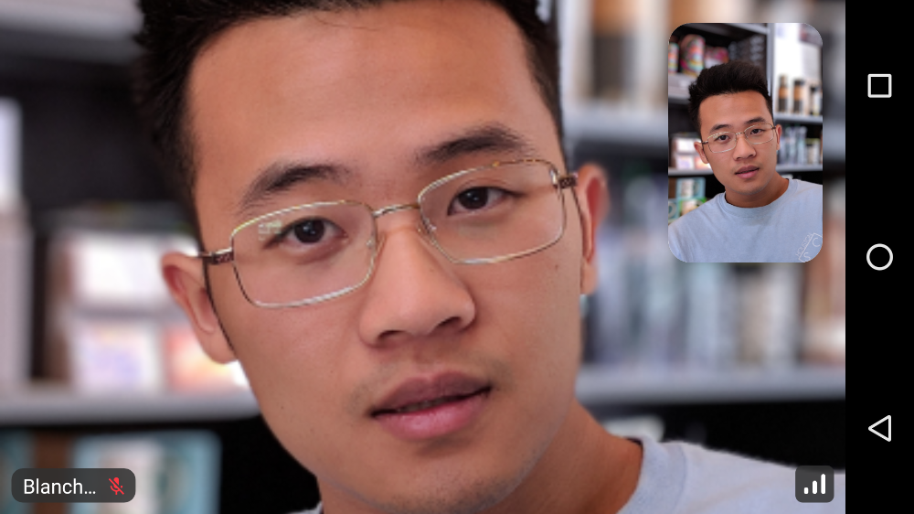 |

### Screen Sharing

The component can render screen sharing content if there's an active session. If a session exists, it will be non-null when fetching its state. The way the component renders screen sharing is by maximizing the screen real estate that it provides for the screen share video.

Users can then focus on the shared content more or choose to enter the full screen mode, while the participants grid becomes a horizontal or vertical list, for portrait and landscape, respectively.

| Portrait Screensharing | Landscape Screensharing |
| ------- | ------------------------------------------------------------ |
| 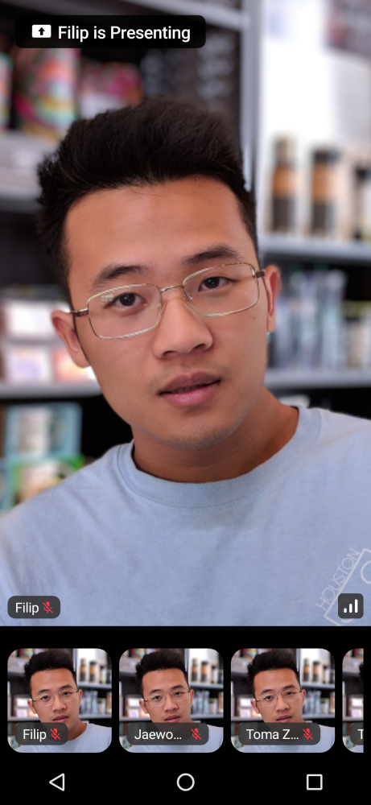 | 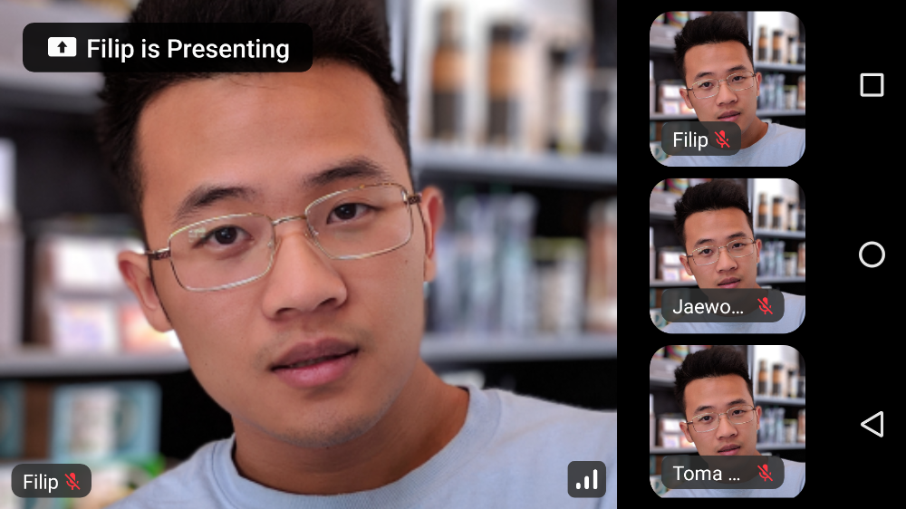 |

Now that you've learned a lot about the `ParticipantsLayout` internal works, let's see how to use the component to add it to your UI.

## Usage

To use the component in your UI, once you have the required state, you can render `CallParticipants` like so:

```kotlin
@Composable
public fun MyParticipantsLayoutScreen() {
    Scaffold(
        topBar = { /* Custom top bar */ },
    ) { padding ->
        ParticipantsLayout(
            modifier = Modifier.fillMaxSize(),
            call = call
        )
    }
}
```

Since there are many different states and layouts this component can render by default, here's a select few.

| 1 Participant                                                | 2 Participants                                               | 3 Participants                                               | 4 Participants                                              | 5 Participants                                              | 6+ Participants                                              |
| ------------------------------------------------------------ | ------------------------------------------------------------ | ------------------------------------------------------------ | ------------------------------------------------------------ | ------------------------------------------------------------ | ------------------------------------------------------------ |
|  | 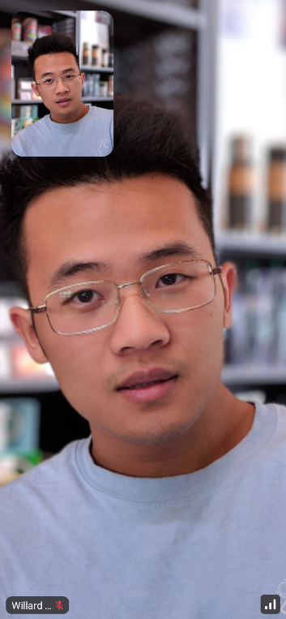 | 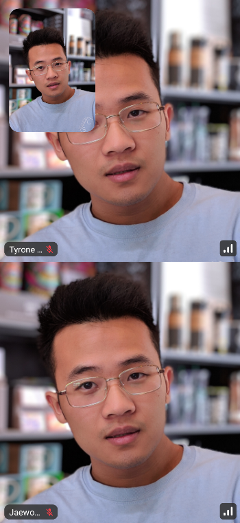 | 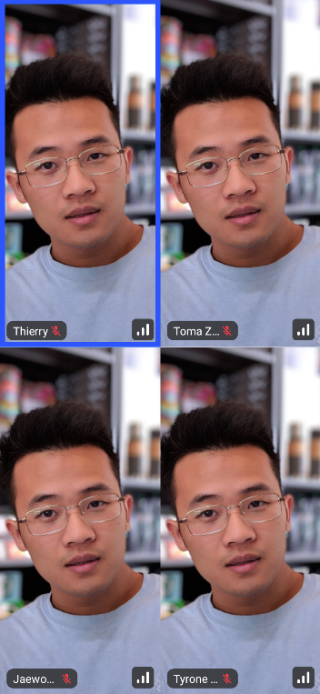 | 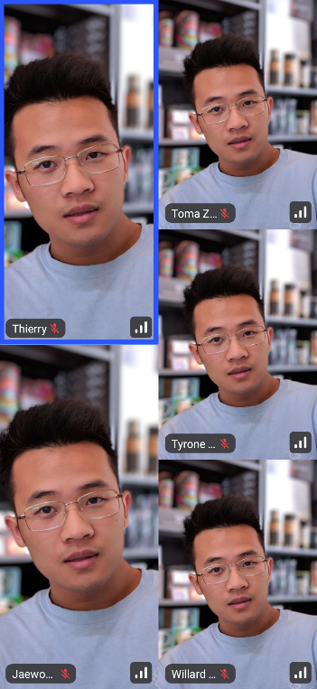 | 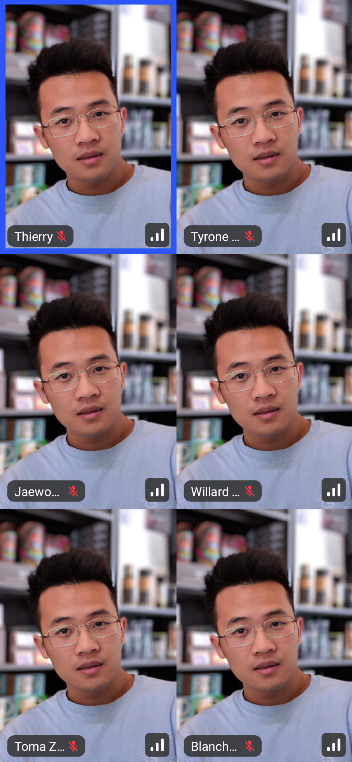 |

These states represent the standard UI, when there is no screen sharing happening. Similar state can be observed when using the application in landscape orientation.

| Landscape alternatives                                       |
| ------------------------------------------------------------ |
| 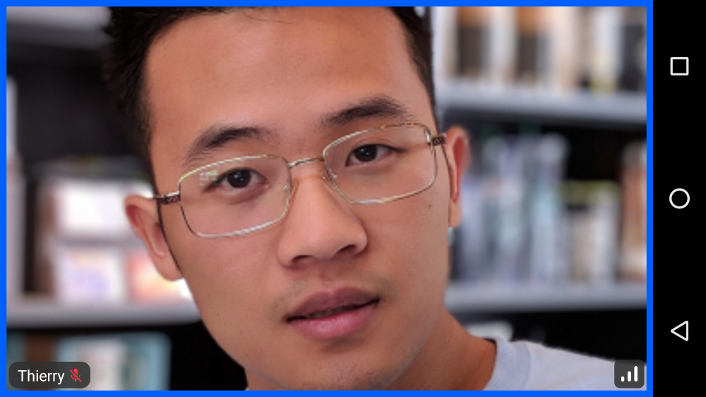 |
| 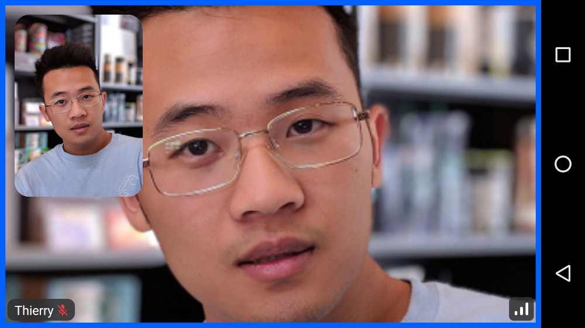 |
|  |
| 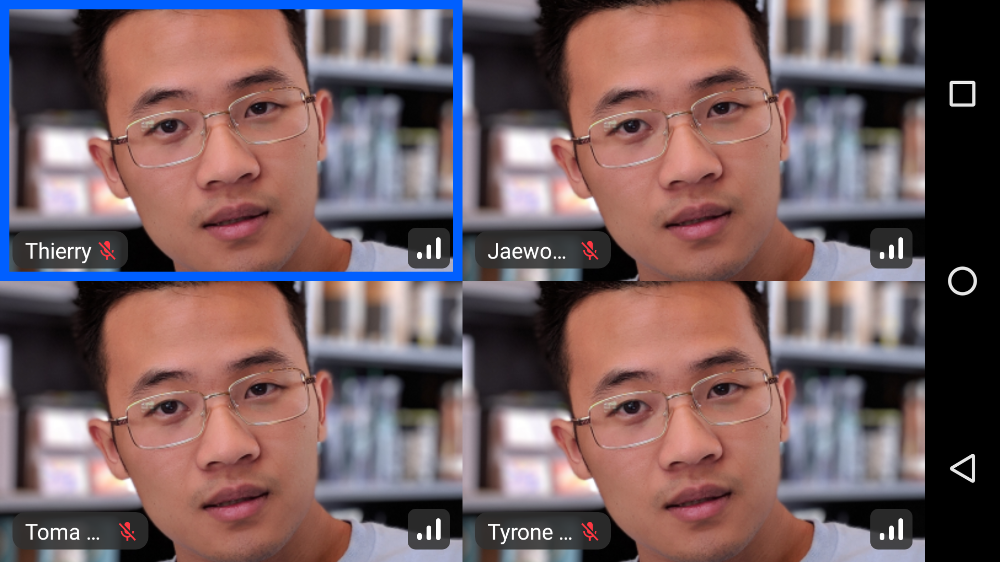 |
|  |
| 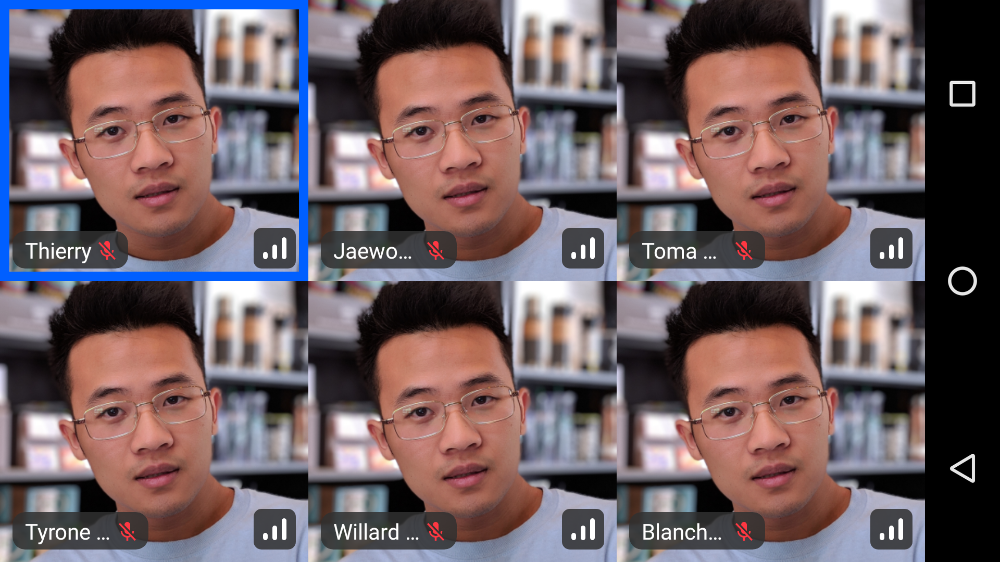 |

And finally, if there is any screen sharing, you can expect the following UI:


You can see the participants are rendered in a horizontal `Row` that's scrollable. Additionally, the screen sharing UI is taking up the maximum amount of space to make it as clear as possible.

This UI also works for Landscape:


This component is truly versatile and lets you cover almost every use case for video calls, supporting smaller, group based calls, 1:1 calls, large meetings, screen sharing and much more.

Let's see how to handle the actions that are available within the component.

## Customization

In terms of UI customization, you can very easily customize each participant video in the grid:

```kotlin
@Composable
public fun ParticipantsLayout(
    modifier: Modifier = Modifier.fillMaxSize(),
    call = call,
    style = RegularVideoRendererStyle(
      isShowingParticipantLabel = true,
      labelPosition = Alignment.TopStart,
      isShowingConnectionQualityIndicator = true,
      reactionDuration = 500,
      reactionPosition = Alignment.Center
    )
)
```

With these options, you have more than enough space to customize how the component looks and behaves.

You can also custom the entire video renderer by implementing your own video renderer:

```kotlin
ParticipantsLayout(
    call = call,
    modifier = Modifier.fillMaxSize(),
    videoRenderer = { modifier, call, participant, style ->
        ParticipantVideo(
            modifier = modifier,
            call = call,
            participant = participant,
            style = style,
            labelContent = {
                val fakeAudio by fakeAudioState().collectAsState()
                ParticipantLabel(
                    participant = participant,
                    soundIndicatorContent = {
                        AudioVolumeIndicator(fakeAudio)
                    }
                )
            }
        )
    },
  ..
)
```

If you want to learn more about styling video renderer, check out [UI Cookbook - Video Renderer](../../05-ui-cookbook/04-video-renderer.mdx)