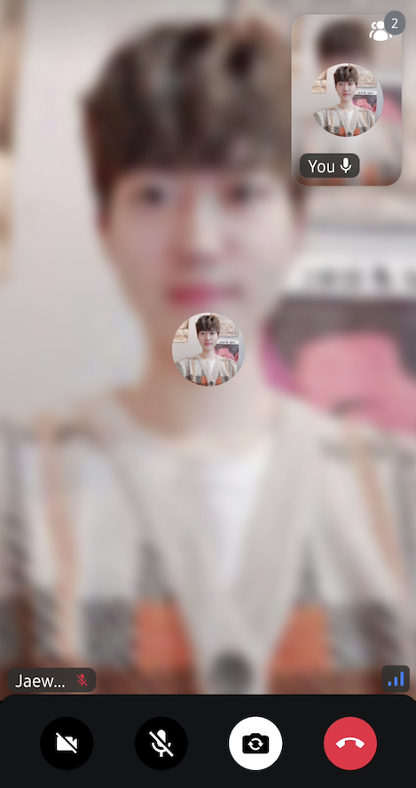

# FloatingParticipantVideo

The `FloatingParticipantVideo` can be used to display the video content of the local participant in a video call in a floating way. This means that the component can be moved around within its parent component bounds. The component can be used with any participant, but in our default components, it handles only the local participant.

Let's see how to use the component.

## Usage

To use the component, `FloatingParticipantVideo` must be placed in a `Box` that allows overlaid elements. Here's an example:

```kotlin
VideoTheme {
    // observe a local participant
    val me by call.state.me.collectAsState()
    var parentSize: IntSize by remember { mutableStateOf(IntSize(0, 0)) }

    Box(
        contentAlignment = Alignment.Center,
        modifier = Modifier
            .fillMaxSize()
            .background(VideoTheme.colors.appBackground)
            .onSizeChanged { parentSize = it }
    ) {
        // render remote participants
        ..

        // render a floating video UI for the local video participant
        if (me != null) {
            FloatingParticipantVideo(
                modifier = Modifier.align(Alignment.TopEnd),
                call = call,
                participant = me!!,
                parentBounds = parentSize
            )
        }
    }
}
```

In this example, the main point is that the `FloatingParticipantVideo` is overlaid on top of other UI elements. You should ensure that you do not render other UI elements over the `FloatingParticipantVideo` and hide it behind them.

The state the `FloatingParticipantVideo` requires is the following:

- `call`: Used to determine the rest of the information we represent in the UI, based on the call state.
- `participant`: The state of the call participant you want to render.
- `parentBounds`: Bounds of the parent, used to constrain the component to the parent bounds,

Once you have that provided, you'll see something similar to the following:



Notice the floating item at the top right corner. The `FloatingParticipantVideo` represents that container. Given that the container is fairly simple and very specific, it doesn't allow any action handling customization.

However, you can still customize the look and feel. Let's see how.

## Customization

When it comes to UI customization, the component exposes the following:

```kotlin
@Composable
public fun FloatingParticipantVideo(
    modifier: Modifier = Modifier,
    parentBounds: IntSize,
    alignment: Alignment = Alignment.TopEnd,
    style: VideoRendererStyle = RegularVideoRendererStyle(isShowingConnectionQualityIndicator = false),
    videoRenderer: @Composable (ParticipantState) -> Unit = {
        ParticipantVideo(
            modifier = Modifier
                .fillMaxSize()
                .clip(VideoTheme.shapes.floatingParticipant),
            call = call,
            participant = participant,
            style = style
        )
    }
)
```

As you can see the above example, you can customize the video style like the other components, such as `ParticipantVideo`. For more information, check out [../../05-ui-cookbook/04-video-renderer.mdx].

- `modifier`: Used for styling the component with more UI customization, such as adding a border, elevation and similar.
- `parentBounds`: Defines the start and end area of the parent component. This parameter is used to ensure that the `FloatingParticipantVideo` component is placed correctly within its parent when using the drag and drop gestures.
- `alignment`: Determines where the floating participant video will be placed.
- `style`: Represents a regular video call render styles.
- `videoRenderer`: A single video renderer renders each individual participant. If you want to use your own video renderer, you can implement your own composable with `videoRenderer`.

On top of that, there are a few properties exposed in the `VideoTheme` that you can use to change the look of `FloatingParticipantVideo`:

* `StreamDimens.floatingVideoPadding`: Padding that's applied to the component container.
* `StreamDimens.floatingVideoHeight`: The height of the container.
* `StreamDimens.floatingVideoWidth`: The width of the container.
* `StreamShapes.floatingParticipant`: The shape of the container.

Using these properties, you can apply customization to the component without having to build your own UI component that deals with all the gesture and rendering logic.
