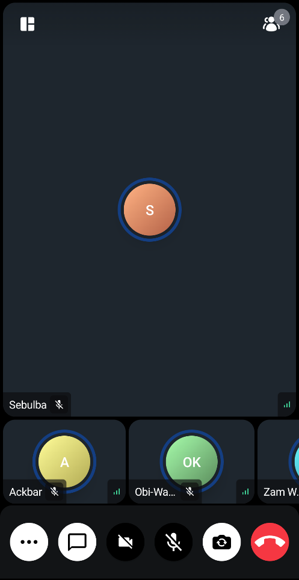
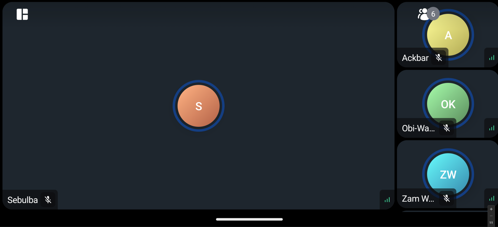

# ParticipantsSpotlight

The `ParticipantsSpotlight` is a Composable component that allows you to highlight one participant and this one participant takes much of the screen, while the rest are rendered
either as a horizontal or vertical list depending on orientation.

Let's see how to use the `ParticipantsSpotlight`.

## Usage

To use the `ParticipantsSpotlight` component in your app you can use it direcyly as a component or you can configure the [ParticipantsLayout](02-participants-grid.mdx) to display the spotlight.

### Use it directly
```kotlin
ParticipantsSpotlight(call = call)
```
The only mandatory parameter is `call` which represents the call for which the participants are being displayed.

### Use it via [ParticipantsLayout](02-participants-grid.mdx)

If you are using the `ParticipantsLayout` you can use an enum value `LayoutType` with one of three options.

Those are:
```kotlin
    //Automatically choose between Grid and Spotlight based on pinned participants and dominant speaker.
    DYNAMIC

    //Force a spotlight view, showing the dominant speaker or the first speaker in the list.
    SPOTLIGHT

    //Always show a grid layout, regardless of pinned participants.
    GRID
```

Here is how it looks in action:
```kotlin
ParticipantsLayout(
    layoutType = LayoutType.SPOTLIGHT,
    call = call
)
```

The [ParticipantsLayout](02-participants-grid.mdx) internally displays the `ParticipantSpotlight` in two cases. 
1. You have set the `layoutType` to `LayoutType.SPOTLIGHT` in which case a participant is always spotlighted. The participant shown in the spotlight is chosen based on the following order:
    1. is pinned
    2. is dominantSpeaker    
    3. is first in the participants list
2. You have set the `LayoutType` to `LayoutType.DYNAMIC` in which case if there is a "pinned" participant, the spotlight view will be chosen in favor of grid.

*Note*: `ParticipantLayout` will always prioritize screensharing regardless of the `LayoutType` if there is a [screensharing session](../04-call/05-screen-share-content.mdx).s


Using this component, you'll likely see something similar to the following UI:






Let's see how to customize this component.

## Customization

This is a very simple component so it doesn't have replaceable slots, but it still offers ways to customize its appearance.

- `modifier`: Modifier for styling.
- `isZoomable`: Decide if this spotlight video renderer is zoomable or not.
- `style`: Defined properties for styling a single video call track.
- `videoRenderer`: A single video renderer renders each individual participant.

If you're looking for guides on how to override and customize this UI, we have various [UI Cookbook](../../05-ui-cookbook/01-overview.mdx) recipes for you and we cover a portion of customization within the [Video Android SDK Tutorial](../../02-tutorials/01-video-calling.mdx).