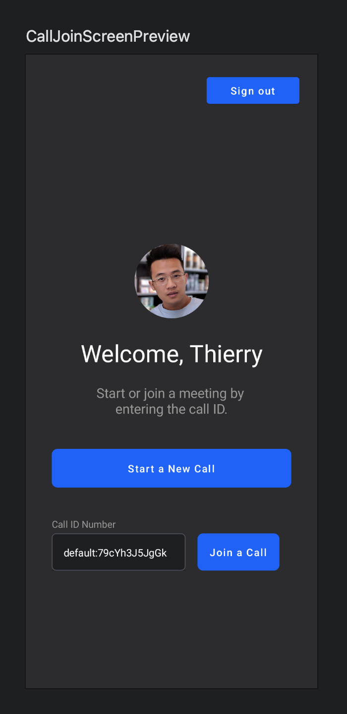
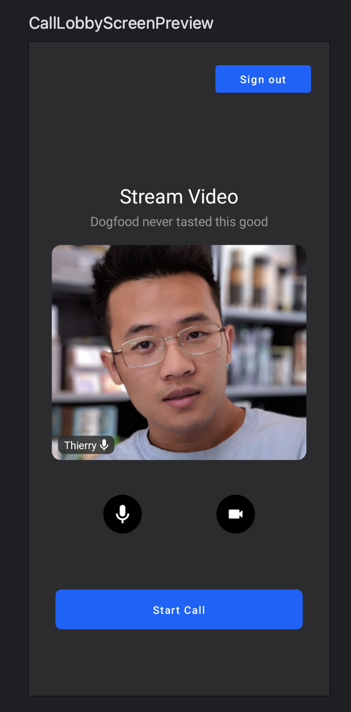
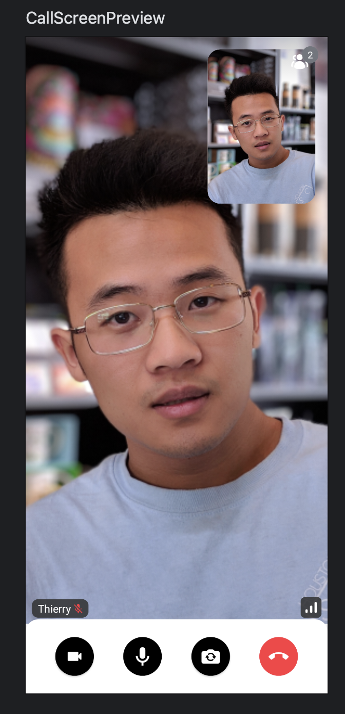
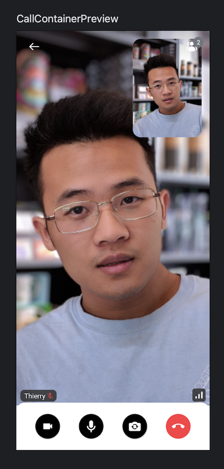
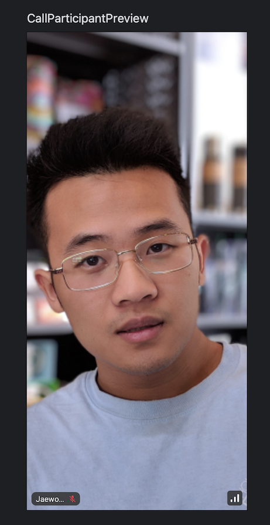

[Previewing your Composable functions](https://developer.android.com/jetpack/compose/tooling/previews) is a powerful feature of Android Studio.

Most of Stream Video SDK's UI components rely on `Call`, `ParticipantState` and other types which are difficult to mock.

So we provide a useful library called `stream-video-android-previewdata` that allows you to get mock instances of them and write your preview or test codes for Stream Video UI components easily.

You'll be able to build your own preview Composable functions like so:

| Dogfooding (Call Join)                                       | Dogfooding (Call Lobby)                                     | Dogfooding (Call)                                        |
| ------------------------------------------------------------ | ------------------------------------------------------------ | ------------------------------------------------------------ |
|  |  |  |

### Usage


To use this library, add the dependency below below to your module's `build.gradle` file:

```groovy
dependencies {
    implementation "io.getstream:stream-video-android-previewdata:$stream_version"
}
```

Now, you can implement your preview composable like the example below:

```kotlin
@Preview
@Composable
private fun CallContentPreview() {
    StreamPreviewDataUtils.initializeStreamVideo(LocalContext.current)
    VideoTheme {
        CallContent(
            modifier = Modifier.background(color = VideoTheme.colors.appBackground),
            call = previewCall,
        )
    }
}
```

After adding the above example to your project, you'll see the following previews in Android Studio:



You should follow the steps below to make your previews work well:

1. Initialize a mock `StreamVideo` with the following method: `StreamPreviewDataUtils.initializeStreamVideo`.
2. Wrap your composable with the `VideoTheme`.
3. Use the provided mock instances for Stream Video UI components.

This library provides the following mocks:

- **previewCall**: Mock a `Call` that contains few of mock users.
- **previewParticipant**: Mock a `ParticipantState` instance.
- **previewParticipantsList**: Mock a list of `ParticipantState` instances.
- **previewUsers**: Mock a list of `User` instances.
- **previewVideoMediaTrack**: Mock a new `MediaTrack` instance.

For example, you can build a preview Composable for `ParticipantVideo` as in the example below:

```kotlin
@Preview
@Composable
private fun ParticipantVideoPreview() {
    StreamPreviewDataUtils.initializeStreamVideo(LocalContext.current)
    VideoTheme {
        ParticipantVideoRenderer(
            call = previewCall,
            participant = previewParticipant,
        )
    }
}
```

After adding the above example to your project, you'll see the following previews in Android Studio:


