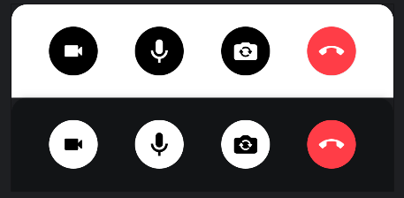
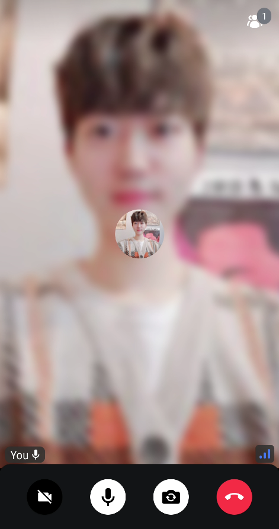
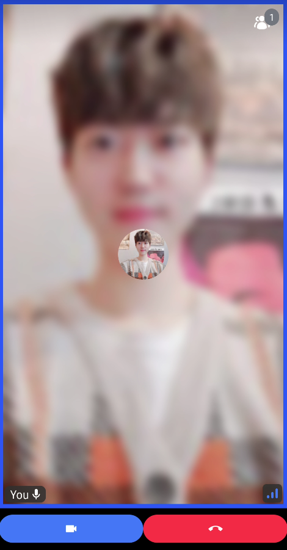
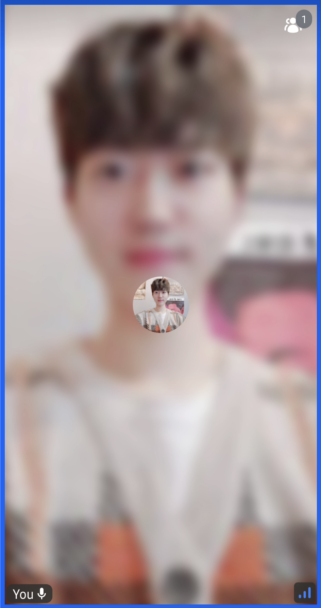

[Control Actions](../04-ui-components/04-call/03-call-controls.mdx) represents the set of controls the user can use to change their audio and video device state, or browse other types of settings, leave the call, or implement something custom.
Stream UI components, such as [CallContent](../04-ui-components/04-call/01-call-content.mdx), and [CallLobby](06-lobby-preview.mdx) provide default control actions like the below:



### Customization

You can simply custom the control actions buttons by building your own list of action buttons like the example below:

```kotlin
// observe the current devices states
val isCameraEnabled by call.camera.isEnabled.collectAsState()
val isMicrophoneEnabled by call.microphone.isEnabled.collectAsState()

// create your own control action buttons
val actions = listOf(
    {
        ToggleCameraAction(
            modifier = Modifier.size(52.dp),
            isCameraEnabled = isCameraEnabled,
            onCallAction = { call.camera.setEnabled(!it.isEnabled) }
        )
    },
    {
        ToggleMicrophoneAction(
            modifier = Modifier.size(52.dp),
            isMicrophoneEnabled = isMicrophoneEnabled,
            onCallAction = { call.microphone.setEnabled(!it.isEnabled)  }
        )
    },
    {
        FlipCameraAction(
            modifier = Modifier.size(52.dp),
            onCallAction = { call.camera.flip() }
        )
    },
    {
        LeaveCallAction(
            modifier = Modifier.size(52.dp),
            onCallAction = { .. }
        )
    },
)
```

:::note
We provide some pre-built control action buttons, such as `ToggleCameraAction`, and `ToggleMicrophoneAction`. For more details, check out the [Control Actions](../04-ui-components/04-call/03-call-controls.mdx) page.
:::

Now, you can replace the default control actions with your own actions buttons like the sample below:

```kotlin
CallContent(
    modifier = Modifier.background(color = VideoTheme.colors.appBackground),
    controlsContent = {
        ControlActions(
            call = call,
            actions = actions
        )
    },
    ..
)
```

With the same approach, you can also change the control actions for `CallContent` and `CallLobby`:

```kotlin
// replace default call actions for CallContent
CallContent(
    controlsContent = {
        ControlActions(
            call = call,
            actions = actions
        )
    },
    ..
)

// replace default call actions for CallLobby
CallLobby(
    lobbyControlsContent = {
        ControlActions(
            call = call,
            actions = actions
        )
    },
    ..
)
```

If you build with your project with the custom control actions above, you will see the result below:



### Replacing the Control Actions

This example shows how to build your own call controls by implementing your own composable:

```kotlin
@Composable
fun MyControlActions() {
    Row(
        modifier = Modifier
            .fillMaxWidth()
            .height(60.dp)
            .padding(top = 10.dp),
        verticalAlignment = Alignment.CenterVertically,
        horizontalArrangement = Arrangement.Center
    ) {
        Icon(
            modifier = Modifier
                .height(40.dp)
                .weight(1f)
                .background(VideoTheme.colors.primaryAccent, CircleShape)
                .padding(10.dp)
                .clickable { /** toggle camera */ },
            painter = painterResource(id = R.drawable.ic_video),
            tint = Color.White,
            contentDescription = null
        )

        Icon(
            modifier = Modifier
                .height(40.dp)
                .weight(1f)
                .background(VideoTheme.colors.errorAccent, CircleShape)
                .padding(10.dp)
                .clickable { /** leave a call */ },
            painter = painterResource(id = R.drawable.ic_call_end),
            tint = Color.White,
            contentDescription = null
        )
    }
}
```

Next, you can replace the default control actions with your own composable function.

```kotlin
CallContent(
    modifier = Modifier.background(color = VideoTheme.colors.appBackground),
    controlsContent = { MyControlActions() },
    ..
)
```

Now, you will see the result below:



### Removing the control actions

If you want to remove the control actions and render video within full-size, you can just pass an empty lambda to the `controlsContent` parameter like the sample below:

```kotlin
CallContent(
    modifier = Modifier.background(color = VideoTheme.colors.appBackground),
    controlsContent = { },
    ..
)
```

After building the sample code, you'll see the result below:

