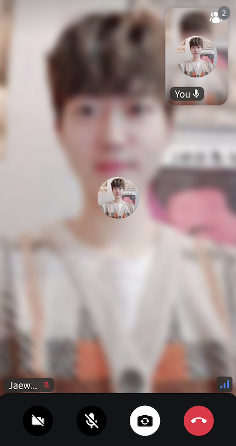
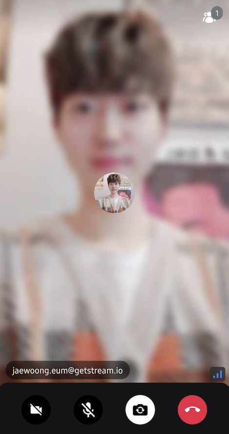

Stream's UI components provide a participant label, which displays participants' basic information, such as name, and the status of the microphone by default like the image below:



You can simply change the styles of the participant label by giving `RegularVideoRendererStyle` or `ScreenSharingVideoRendererStyle` to UI components, such as `CallContent`, `ParticipantsGrid`, and `ParticipantVideo`.

```kotlin
CallContent( // or ParticipantsGrid
  style = RegularVideoRendererStyle(
      isShowingParticipantLabel = true,
      labelPosition = Alignment.TopStart
  ),
  ..
)
```

If you build the above styles, you will see the result below:


### Customization

You can customize the participant label by implementing your own label composable function to the `ParticipantVideo` like the sample below:

```kotlin
CallContent(
    modifier = Modifier.background(color = VideoTheme.colors.appBackground),
    videoRenderer = { modifier, call, participant, style ->
        ParticipantVideo(
            modifier = modifier,
            call = call,
            participant = participant,
            style = style,
            labelContent = { participant ->
                Box(
                    modifier = Modifier
                        .padding(12.dp)
                        .align(Alignment.BottomStart)
                        .background(
                            Color.Black.copy(alpha = 0.5f),
                            RoundedCornerShape(16.dp)
                        )
                        .padding(horizontal = 12.dp, vertical = 6.dp)
                ) {
                    Text(
                        text = participant.initialUser.userNameOrId,
                        color = Color.White
                    )
                }
            }
        )
    },
    ..
```

If you build the example, you'll see the result below:


