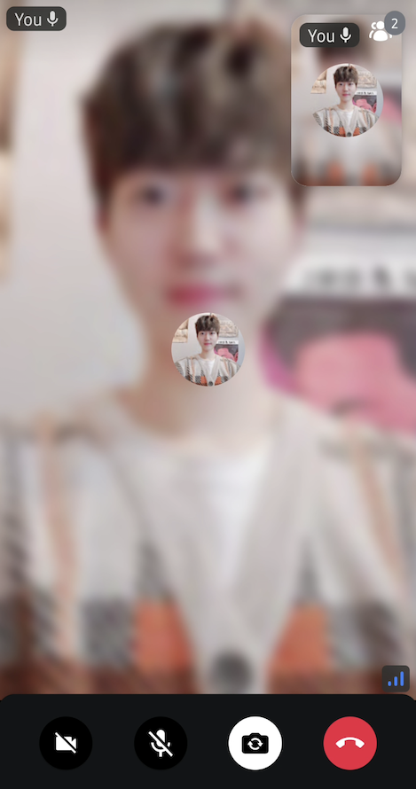
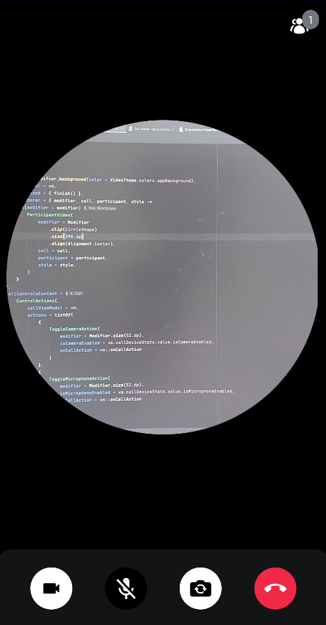

The video renderer is the most essential UI component in a video call screen, which renders participants in real-time. The most easiest way to style the video renderer is using `VideoRendererStyle`. `VideoRendererStyle` provides several properties to customize each component of the video renderer like the below:

- **isFocused**: Represents whether the participant is focused or not.
- **isScreenSharing**: Represents whether the video renderer is about screen sharing.
- **isShowingReactions**: Represents whether display reaction comes from the call state.
- **isShowingParticipantLabel**: Represents whether display the participant label that contains the name and microphone status of a participant.
- **isShowingConnectionQualityIndicator**: Represents whether displays the connection quality indicator.
- **labelPosition**: The position of the participant label  that contains the name and microphone status of a participant.

You can create an instance of the `VideoRendererStyle` with the two different styles, which have different default value.

- **RegularVideoRendererStyle**: A regular video renderer style, which displays the reactions, participant label, and connection quality indicator.
- **ScreenSharingVideoRendererStyle**: A screen sharing video renderer style, which displays the reactions, and participant label.

For example, if you want to change the position of the participant label to the top-start, you can simply change the `labelPosition` property in the `CallContainer`, `CallContent`, `ParticipantsGrid`, or `ParticipantVideo`.

```kotlin
CallContainer(
  style = RegularVideoRendererStyle(
      labelPosition = Alignment.TopStart
  ),
  ..
)
```

Then you will see the result below:



### Customization

You can also fully customize the video renderer by implementing your own composable function. Let's say you want to implement a round-shaped video like [Around](https://twitter.com/toheartrising/status/1402505178616504321). In this case, you can achieve it by implementing the `videoRenderer` parameter with the `CallContainer`, `CallContent`, or `ParticipantsGrid` components.

```kotlin
CallContainer(
    modifier = Modifier.background(color = VideoTheme.colors.appBackground),
    videoRenderer = { modifier, call, participant, style ->
        Box(modifier = modifier) {
            ParticipantVideo(
                modifier = modifier
                    .clip(CircleShape)
                    .size(390.dp)
                    .align(Alignment.Center),
                call = call,
                participant = participant,
                style = style,
            )
        }
    },
    ..
)
```

Then you will see the result below:



### Custom Video Layout

If you want to build your own lazy list or grid with the `ParticipantVideo` component, you can achieve it very simply like the sample below:

```kotlin
CallContainer(
    modifier = Modifier.background(color = VideoTheme.colors.appBackground),
    callContent = {
        CallContent(
            modifier = Modifier.fillMaxSize(),
            call = call,
            callDeviceState = callDeviceState,
            callVideoContent = {
                val participants by call.state.participants.collectAsState()

                LazyVerticalGrid(columns = GridCells.Fixed(2)) {
                    items(participants, key = { it.sessionId }) { participant ->
                        ParticipantVideo(
                            modifier = Modifier
                                .fillMaxWidth()
                                .height(220.dp),
                            call = call,
                            participant = participant
                        )
                    }
                }

            }
        )
    },
    ..
)
```

Now, you'll see the custom participant grids below:

