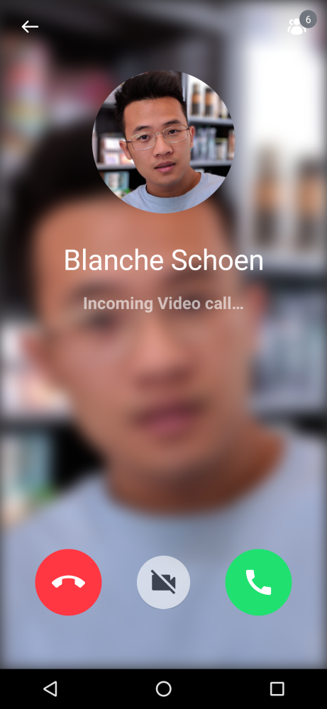
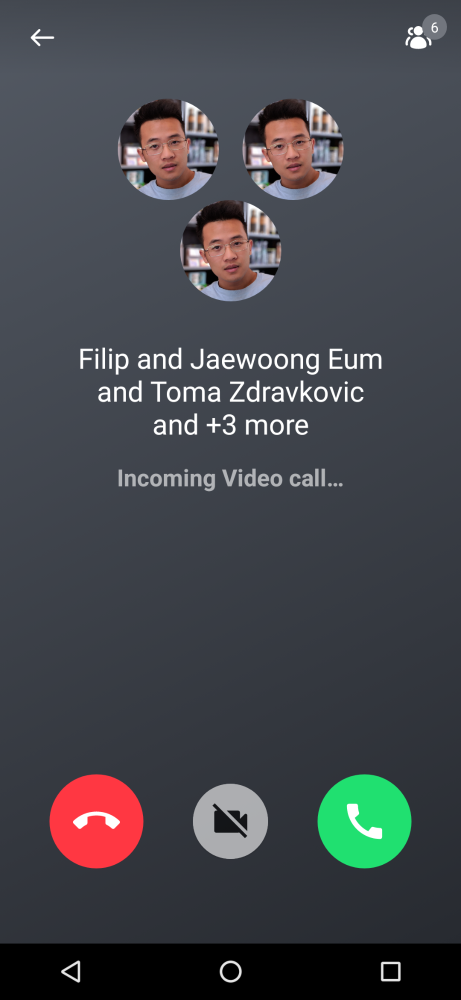
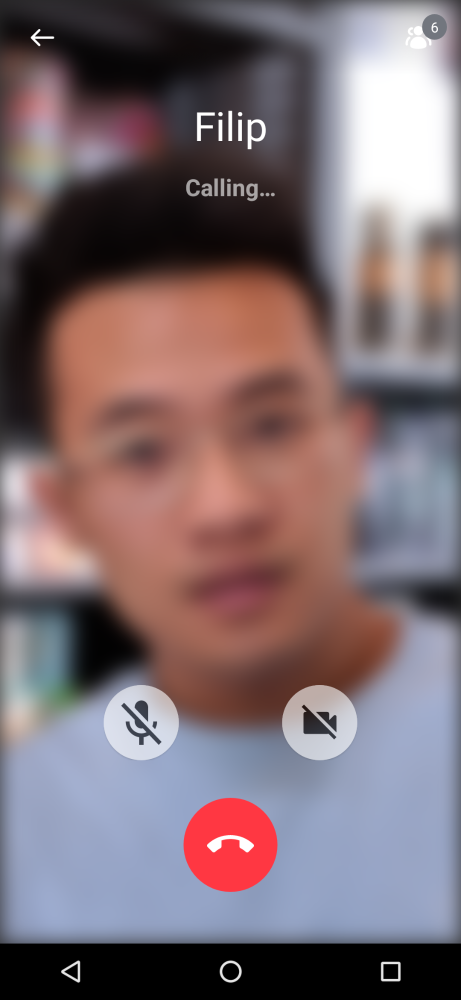
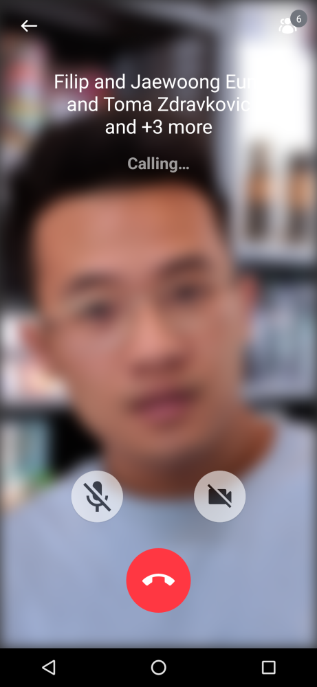

The Stream SDK provides basic incoming and outgoing call UI with the [RingingCallContent](../04-ui-components/04-call/04-ringing-call.mdx) component. We can break it down into:

- `CallBackground`: The `CallBackground` component is a versatile component designed to wrap the content of an incoming or outgoing call and its participants.
- `headerContent`: Content shown for the call header, which is built with `CallAppBar`.
- `detailsContent`: Content shown for call details, such as call participant information.
- `controlsContent`: Content shown for controlling call, such as accepting a call or declining a call.

Each component also can be used independently, so you can build your own incoming and outgoing call screens quite easy:

```kotlin
@Composable
fun MyIncomingCallScreen() {
    val participants by call.state.participants.collectAsState()
    val isCameraEnabled by call.camera.isEnabled.collectAsState()
    val isVideoType = true

    CallBackground(
        modifier = modifier,
        participants = participants,
        isVideoType = isVideoType,
        isIncoming = true
    ) {
        Column {
            CallAppBar(
                call = call,
                onBackPressed = { },
                onCallAction = { }
            )

            IncomingCallDetails( // or OutgoingCallDetails
                modifier = Modifier
                    .align(Alignment.CenterHorizontally)
                    .padding(top = topPadding),
                isVideoType = isVideoType,
                participants = participants,

            IncomingCallControls( // or OutgoingCallControls
                modifier = Modifier
                    .align(Alignment.BottomCenter)
                    .padding(bottom = VideoTheme.dimens.incomingCallOptionsBottomPadding),
                isVideoCall = isVideoType,
                isCameraEnabled = isCameraEnabled,
                onCallAction = onCallAction
            )
        }
    }
}
```

You can replace each component with your own component by your taste.

`CallBackground`, `IncomingCallDetails`, and `OutgoingCallDetails` component will show an incoming or outgoing call screen in different states depending on the number of participants and their information, such as if they have an avatar.

| One to one (Incoming)                                        | Group (Incoming)                                             | One to one (Outgoing)                                        | Group (Outgoing)                                             |
| ------------------------------------------------------------ | ------------------------------------------------------------ | ------------------------------------------------------------ | ------------------------------------------------------------ |
|  |  |  | 

## Ringing State

You can observe the ringing state and configure different screens depending on the state. You can simply observe the ringing state with the code below:

```kotlin
@Composable
fun MyRingingCallScreen() {
    val ringingStateHolder = call.state.ringingState.collectAsState(initial = RingingState.Idle)
    val ringingState = ringingStateHolder.value

    if (ringingState is RingingState.Incoming && !ringingState.acceptedByMe) {
        // Render your incoming call screen.
    } else if (ringingState is RingingState.Outgoing && !ringingState.acceptedByCallee) {
        // Render your outgoing call screen.
    } else if (ringingState is RingingState.RejectedByAll) {
        // Render a rejected call screen.
    } else if (ringingState is RingingState.TimeoutNoAnswer) {
        // Render a timeout no answer call screen.
    } else {
        // Ringing call is accepted. Render a call screen here or navigate to a call screen.
    }
}
```

So you'll be able to render your own composable or navigate to a different screen depending on the call state.

## Sounds

The SDK plays sounds for incoming and outgoing calls. Read [here](../06-advanced/01-ringing.mdx#sounds) for more details.