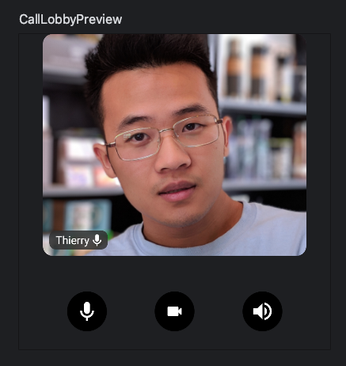
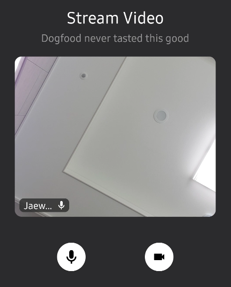
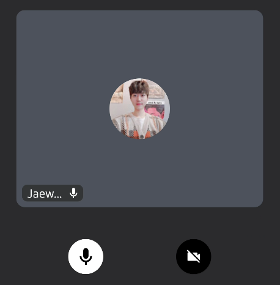
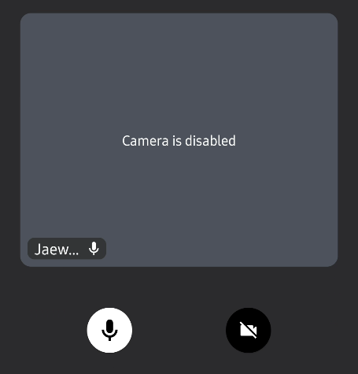

The call lobby represents the UI in a preview call that renders a local video track to pre-display a video before joining a call. It allows you to control the camera/microphone and permissions before joining a call. The call lobby consists of the components below :

- **onRenderedContent**: A video renderer, which renders a local video track before joining a call.
- **onDisabledContent**: Content is shown that a local camera is disabled. It displays user avatar by default.
- **lobbyControlsContent**: Content is shown that allows users to trigger different actions to control a preview call.
- **onCallAction**: Handler when the user triggers a Call Control Action.

Those components were built with our internal implementations, so you can implement the call lobby with the sample below:

```kotlin
val isCameraEnabled by call.camera.isEnabled.collectAsState()
val isMicrophoneEnabled by call.microphone.isEnabled.collectAsState()

CallLobby(
    call = call,
    modifier = Modifier.fillMaxWidth(),
    isCameraEnabled = isCameraEnabled,
    isMicrophoneEnabled = isMicrophoneEnabled,
)
```

After running your project, you'll see the result below:



### Control Actions

Similar to `CallContainer`, and `CallLobby` supports these main action handlers with the `onCallAction` lambda:

```kotlin
CallLobby(
    call = call,
    modifier = Modifier.fillMaxWidth(),
    isCameraEnabled = isCameraEnabled,
    isMicrophoneEnabled = isMicrophoneEnabled,
    onCallAction = { action ->
        when (action) {
            is ToggleMicrophone -> call.camera.setEnabled(callAction.isEnabled)
            is ToggleCamera -> call.microphone.setEnabled(callAction.isEnabled)
            else -> Unit
        }
    }
)
```

You can customize the control actions by implementing your own composable for the `lobbyControlsContent` like the code below:

```kotlin
CallLobby(
    call = call,
    modifier = Modifier.fillMaxWidth(),
    isCameraEnabled = isCameraEnabled,
    isMicrophoneEnabled = isMicrophoneEnabled,
    lobbyControlsContent = {
        ControlActions(
            call = call,
            actions = listOf(
                {
                    ToggleCameraAction(
                        isCameraEnabled = isCameraEnabled,
                        onCallAction = { }
                    )
                },
                {
                    ToggleMicrophoneAction(
                        isMicrophoneEnabled = isMicrophoneEnabled,
                        onCallAction = { }
                    )
                }
            )
        )
    },
  ..
)
```

Then you'll see the result below:



### Permission Requests

The call lobby needs to get permission to access the camera and microphone. `CallLobby` implements the permission request by default, so you don't need to do anything to request permission from your side. If you implement the `CallLobby` composable, it will ask you to grant camera and microphone permission like the image below:


You can also customize what permission you want to ask by passing a list of permission to the `permission` parameter like the example below:

```kotlin
CallLobby(
    permissions: VideoPermissionsState = rememberCallPermissionsState(
        call = call,
        permissions = listOf(
            android.Manifest.permission.CAMERA,
            android.Manifest.permission.RECORD_AUDIO,
            ..
      ),
    ),
    ..
)
```

If you don't want to let `CallLobby` request permissions and want to handle them manually from your side, you can just pass an empty list like the code below:

```kotlin
CallLobby(
    permissions: VideoPermissionsState = rememberCallPermissionsState(
            call = call,
            permissions = listOf()
    ),
    ..
)
```

### Preview For Disabled Camera

The `CallLobby` component already provides you to display a user avatar when the camera doesn't have permission or is disabled.



You can customize the preview component by implementing your own composable to the `onDisabledContent` composable parameter:

```kotlin
CallLobby(
    call = call,
    modifier = Modifier.fillMaxWidth(),
    onDisabledContent = {
        Box(modifier = Modifier.fillMaxSize()) {
            Text(
                modifier = Modifier.align(Alignment.Center),
                text = "Camera is disabled",
                color = VideoTheme.colors.textHighEmphasis
            )
        }
    },
  ..
)
```

After building the project, you'll see the result below:



### Customization

The `CallLobby` component has more options when it comes to customization. It exposes the following parameters that let you change its UI:

```kotlin
@Composable
public fun CallLobby(
    modifier: Modifier = Modifier,
    call: Call,
    user: User = StreamVideo.instance().user,
    labelPosition: Alignment = Alignment.BottomStart,
    isCameraEnabled: Boolean,
    isMicrophoneEnabled: Boolean,
    video: ParticipantState.Video,
    permissions: VideoPermissionsState,
    onRenderedContent: @Composable (video: ParticipantState.Video) -> Unit,
    onDisabledContent: @Composable () -> Unit,
    onCallAction: (CallAction) -> Unit,
    lobbyControlsContent: @Composable (call: Call) -> Unit
)
```

* `modifier`: The standard Jetpack Compose modifier used to style things like the component size, background, shape and similar.
* `call` The call includes states and will be rendered with participants.
* `user` A user to display their name and avatar image on the preview.
* `labelPosition` The position of the user audio state label.
* `video` A participant video to render on the preview renderer.
* `permissions` Android permissions that should be required to render a video call properly.
* `onRenderedContent` A video renderer, which renders a local video track before joining a call.
* `onDisabledContent` Content is shown that a local camera is disabled. It displays user avatar by default.
* `onCallAction` Handler when the user triggers a Call Control Action.
* `lobbyControlsContent` Content is shown that allows users to trigger different actions to control a preview call.
