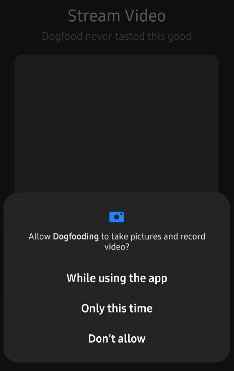

Rendering a call video and audio requires [Android Runtime Permission](https://developer.android.com/training/permissions/requesting), which is mandatory to access a camera and microphone. If you use `CallContainer`, `CallContent`, or `CallLobby`, they will request permissions for accessing a camera and microphone automatically like the one below:



If you want to request permissions without using those components, you can achieve it by using `rememberCallPermissionsState` very easily.

```kotlin
val permissionState = rememberCallPermissionsState(call = call)

Button(onClick = { permissionState.launchPermissionRequest() }) {
    Text(text = "Request permissions")
}

// or you can request permissions when display the screen.microphone
LaunchedEffect(Unit) {
    permissionState.launchPermissionRequest()
}
```

## Request Multiple Permissions

`rememberCallPermissionsState` is built with [accompanist](https://github.com/google/accompanist) under the hood, so it also provides similar functions. You can tweak the list of permissions that you want to request by giving the `permission` parameter.

```kotlin
val permissionState = rememberCallPermissionsState(
    call = call,
    permissions = listOf(
        android.Manifest.permission.CAMERA,
        android.Manifest.permission.RECORD_AUDIO,
        .. // more!
    )
)
```

You can also handle whether each permission was granted or not like the example below:

```kotlin
val permissionState = rememberCallPermissionsState(
    call = call,
    permissions = listOf(
        android.Manifest.permission.CAMERA,
        android.Manifest.permission.RECORD_AUDIO,
    )
) {
    if (it[android.Manifest.permission.CAMERA] == true) {
        call.camera.setEnabled(true)
    } else {
        // shows a toast or dialog
    }

    if (it[android.Manifest.permission.RECORD_AUDIO] == true) {
        call.microphone.setEnabled(true)
    } else {
        // shows a toast or dialog
    }
}
```

So you can execute some additional tasks if a user grants permission, or display a toast message or popup dialog if a user denies permissions.

## Request a Single Permission

You can also simply request a single permission for a camera and microphone like the example below:

```kotlin
// request a camera permission
val cameraPermissionState = rememberCameraPermissionsState(call = call)
cameraPermissionState.launchPermissionRequest()

// request a microphone permission
val microphonePermissionState = rememberMicrophonePermissionsState(call = call)
microphonePermissionState.launchPermissionRequest()
```