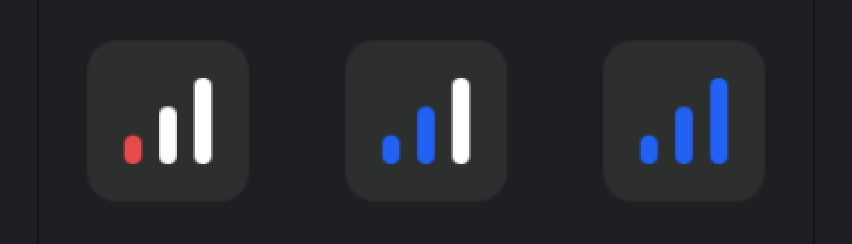

It's important to indicate to users when the connection quality isn't good.
Each participants (`ParticipantState`) includes the `connectionQuality` attribute.
In addition you can also monitor your own connection using `call.state.networkQuality`.

You can available the `NetworkQualityIndicator` composable component and it is integrated into video render components by default:



## Customization

Here's a small compose example to render a custom connection quality icon for each participant:

```kotlin
@Composable
fun NetworkQualityIndicator(
    modifier: Modifier,
    networkQuality: NetworkQuality
) {
    val color = lerp(Color.Red, Color.Green, networkQuality.quality)

    Canvas(modifier = modifier.size(16.dp)) {
        drawCircle(color)
    }
}
```

You can easily swap out the standard connection quality indicator with your own.

```kotlin
CallContainer(
    modifier = Modifier.background(color = VideoTheme.colors.appBackground),
    videoRenderer = { modifier, call, participant, style ->
        ParticipantVideo(
            modifier = modifier,
            call = call,
            participant = participant,
            style = style,
            connectionIndicatorContent = {
                NetworkQualityIndicator(
                    modifier = Modifier
                        .align(Alignment.BottomEnd)
                        .padding(8.dp),
                    networkQuality = it
                )
            }
        )
    },
 ..
)
```

Now, you will see the custom network quality indicator like the result below:


## Connection Unstable

In terms of better UX designs, you can display a simple message or snack bar to your users and let them know the network status is unstable.

```kotlin {9-25}
CallContainer(
    modifier = Modifier.background(color = VideoTheme.colors.appBackground),
    videoRenderer = { modifier, call, participant, style ->
        ParticipantVideo(
            modifier = modifier,
            call = call,
            participant = participant,
            style = style,
            connectionIndicatorContent = { networkQuality ->
                if (networkQuality is NetworkQuality.Poor) {
                    Snackbar(
                        modifier = Modifier
                            .padding(8.dp)
                            .fillMaxWidth()
                            .background(VideoTheme.colors.appBackground)
                            .align(Alignment.BottomStart),
                    ) {
                        Text(text = "Please check out your network status!")
                    }
                }

                NetworkQualityIndicator(
                    networkQuality = NetworkQuality.Poor(),
                    modifier = Modifier.align(Alignment.BottomEnd)
                )
            }
        ),
        ..,
)
```

Now, you will see the custom network quality snack bar like the result below:

