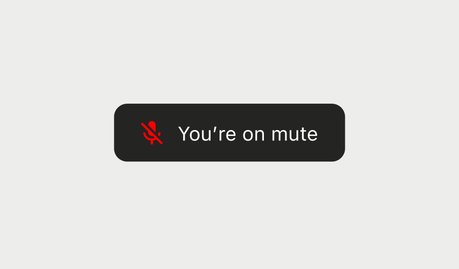

It's a UI best practice to show some visual feedback when the user is speaking while muted.
You can observe the state for this in `call.state.speakingWhileMuted`.

### Custom Snackbar

This example shows how to render a snackbar when the user is speaking while muted:

```kotlin
fun SpeakingWhileMutedWarning(call: Call) {
    val speakingWhileMuted by call.state.speakingWhileMuted.collectAsState()

    if (speakingWhileMuted) {
        Snackbar {
            Text(text = "You're talking while muting the microphone!")
        }
    }
}
```

After building the code above, you'll see the snackbar like the result below:

