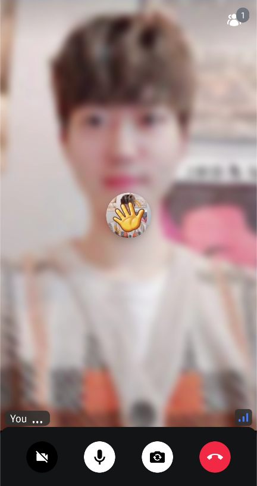

Reactions are a great way to communicate between users when you're limited speakers or even if the users are in mute mode.

You can send an emoji to the call with the code below:

```kotlin
scope.launch {
    call.sendReaction(type = "default", emoji = ":raise-hand:")
}
```

Then you'll see the emoji animation like the image:



### ReactionMapper

Stream SDK provides the default reaction mapper to display proper emojis. It basically handles a couple of default emojis, but you can customize those emoji maps by building your own mapper:

```kotlin
val reactionMapper = ReactionMapper { emojiCode ->
    when (emojiCode) {
        ":fireworks:", ":tada:" -> "\uD83C\uDF89"
        ":hello:" -> "\uD83D\uDC4B"
        ":raise-hand:" -> "✋"
        ":like:" -> "\uD83D\uDC4D"
        ":hate:" -> "\uD83D\uDC4E"
        ":smile:" -> "\uD83D\uDE04"
        ":heart:" -> "❤️"
        else -> emojiCode
    }
}

VideoTheme(
    reactionMapper = reactionMapper,
    ..
) {
   CallContent(..)
}
```

### Customize Reaction Styles

You can simply customize the styles of reaction by changing the `VideoRendererStyle` like the example below:

```kotlin
CallContent(
   style = RegularVideoRendererStyle(reactionDuration = 650, reactionPosition = Alignment.Center),
   ..
)

or

ParticipantsGrid(
   style = RegularVideoRendererStyle(reactionDuration = 650, reactionPosition = Alignment.Center),
   ..
)
```

### Customize Reaction Content

Stream SDK provides some default animation for reactions with the [ParticipantVideo](../04-ui-component/05-participants/01-participant-video.mdx) component, and you can fully-customize the reaction content with yours.

Let's build a sample reaction content. First, you need to build a Composable function that observes and handles reactions like the one below:

```kotlin
@Composable
fun BoxScope.MyReactionContent(
    participant: ParticipantState
) {
    val reactions by participant.reactions.collectAsStateWithLifecycle()
    val reaction = reactions.lastOrNull { it.createdAt + 3000 > System.currentTimeMillis() }
    var currentReaction: Reaction? by remember { mutableStateOf(null) }
    var reactionState: ReactionState by remember { mutableStateOf(ReactionState.Nothing) }

    LaunchedEffect(key1 = reaction) {
        if (reactionState == ReactionState.Nothing) {
            currentReaction?.let { participant.consumeReaction(it) }
            currentReaction = reaction

            // deliberately execute this instead of animation finish listener to remove animation on the screen.
            if (reaction != null) {
                reactionState = ReactionState.Running
                delay(style.reactionDuration * 2 - 50L)
                participant.consumeReaction(reaction)
                currentReaction = null
                reactionState = ReactionState.Nothing
            }
        } else {
            if (currentReaction != null) {
                participant.consumeReaction(currentReaction!!)
                reactionState = ReactionState.Nothing
                currentReaction = null
                delay(style.reactionDuration * 2 - 50L)
            }
        }
    }

    val size: Dp by animateDpAsState(
        targetValue = if (currentReaction != null) {
            VideoTheme.dimens.reactionSize
        } else {
            0.dp
        },
        animationSpec = repeatable(
            iterations = 2,
            animation = tween(
                durationMillis = style.reactionDuration,
                easing = LinearOutSlowInEasing
            ),
            repeatMode = RepeatMode.Reverse
        ),
        label = "reaction"
    )

    val emojiCode = currentReaction?.response?.emojiCode
    if (currentReaction != null && emojiCode != null) {
        val emojiMapper = VideoTheme.reactionMapper
        val emojiText = emojiMapper.map(emojiCode)
        Text(
            text = emojiText,
            modifier = Modifier.align(style.reactionPosition),
            fontSize = size.value.sp
        )
    }
}
```

Next, you can replace the default reaction content with yours by giving it to the `ParticipantVideo` component:

```kotlin
ParticipantVideo(
    reactionContent = { participant ->
         MyReactionContent(participant = participant)
    },
    ..
)
```

If you use `CallContent`, you can replace the video renderer like the code below:

```kotlin
CallContent(
    videoRenderer = { modifier, call, participant, style ->
        ParticipantVideo(
            modifier = modifier,
            call = call,
            participant = participant,
            style = style,
            reactionContent = { participant ->
                 MyReactionContent(participant = participant)
            },
        )
    },
)
```

So with the above ways, you can customize everything about reactions with your creative styles. 😎