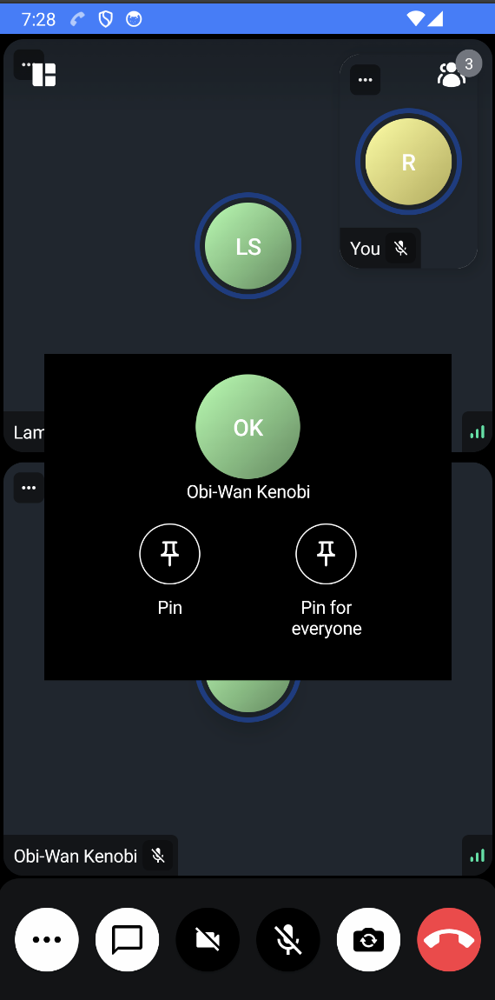
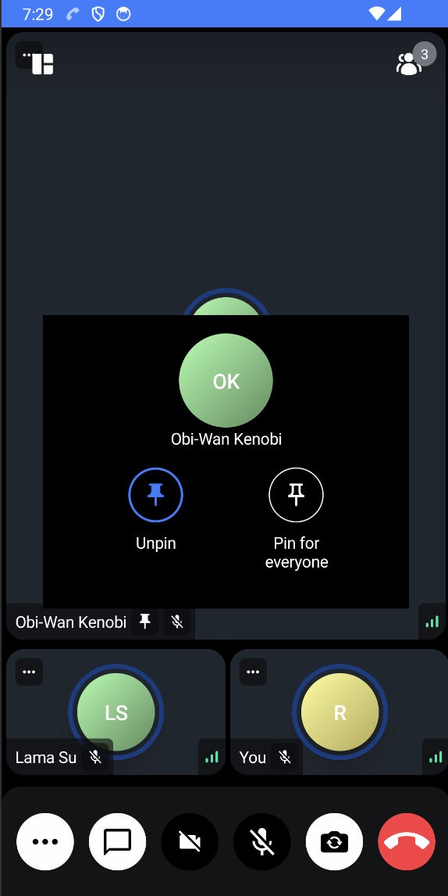

The StreamVideo SDK has support for pinning users, both locally for the current user, and remotely for everyone in the call.
Every user can pin as many participants on the call as they want, and those users will be shown first in the list of participants for that user. Pinning someone for everyone in the call requires the `pinForEveryone` capability.
By default, the pinned users appear first on the participants array. The ones which are pinned remotely appear before the local ones. If there are several remotely pinned users, they are sorted by the pinning date (the most recent pins appear first). You can change this sorting behaviour with your own implementation.

### Local pins
In order to pin a user locally you can use the following API.

```kotlin
call.state.pin(userId, sessionId)
```
Where the `userId` and `sessionId` are the session and id of the user you want to pin.

To unpin the user you can call
```kotlin
call.state.unpin(sessionId)
```
Using the same `sessionId` that was passed in the previous `pin()` method. Note that in this API you don't need the user Id.

## Server pins

To pin a participant for everybody in a call you can create a server side pin. 
The API for this is exposed via the `call` object rather than the `state`.

```kotlin
call.pinForEveryone(sessionId, userId)
```
Same as for local pins, `sessionId` and `userId` are used.

To do the opposite (i.e. unpin) you can:
```kotlin
call.unpinForEveryone(sessionId, userId)
```
Unlike local pin the user Id is required here as well.
For server pins you also need to check capability for the user doing the action via the following API. If the capability is not there, the request for server pin will fail.
```kotlin
call.hasCapability(OwnCapability.PinForEveryone)
```

## Default UI
Currently the participant pinning can happen via the default UI from the SDK.


Or if the user is already pinned



You can customize this UI and all the other participant actions by supplying a composable into the `ParticipantVideo` component.

```kotlin
val myActionsContent = @Composable { actions, call, participant ->
    CustomParticipantActions(
        Modifier
            .align(TopStart)
            .padding(8.dp),
        actions,
        call,
        participant,
    )
}


ParticipantVideo(
    actionsContent = myActionsContent
)
```
