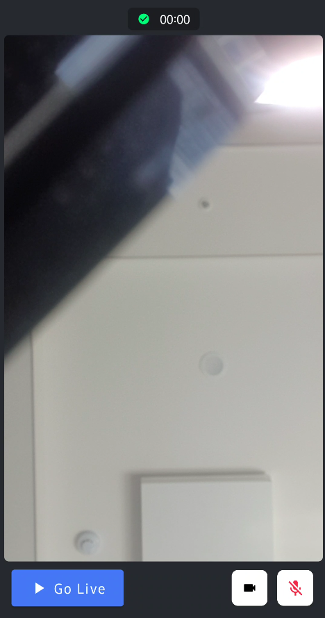
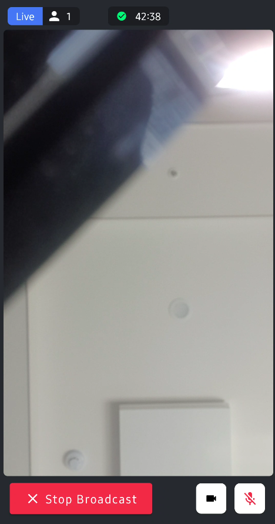
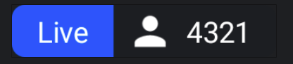
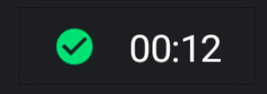

This cookbook tutorial walks you through how to render the UI for watching a livestream on Android.

:::note
n this cookbook tutorial, we will assume that you already know how to join a livestream call. If you haven't familiarized yourself with the [Livestream Tutorial](../02-tutorials/03-livestream.mdx) yet, we highly recommend doing so before proceeding with this cookbook.
:::

When you build a livestreaming UI, there are a few things to keep in mind:

* UI for when the video isn't loaded yet
* A message to show when the livestream didn't start yet
* What to show when the livestream stopped
* How to indicate when there are connection problems
* Muting the volume
* Number of participants
* Duration of the call

In this cookbook tutorial, you'll learn how to build the result below at the end:

| On Backstage | On Live |
| --- | --- |
|  |  |

### Rendering Livestreaming

First and foremost, rendering the livestreaming video is the key feature and the most crucial part of the screen.

To accomplish this, you can easily render your livestreaming video using the following simple sample code:

```kotlin
val userToken = "REPLACE_WITH_TOKEN"
val userId = "REPLACE_WITH_USER_ID"
val callId = "REPLACE_WITH_CALL_ID"

// step1 - create a user.
val user = User(
    id = userId, // any string
    name = "Tutorial", // name and image are used in the UI
    role = "admin"
)

// step2 - initialize StreamVideo. For a production app we recommend adding the client to your Application class or di module.
val client = StreamVideoBuilder(
    context = applicationContext,
    apiKey = "mmhfdzb5evj2", // demo API key
    geo = GEO.GlobalEdgeNetwork,
    user = user,
    token = userToken,
).build()

// step3 - join a call, which type is `default` and id is `123`.
val call = client.call("livestream", callId)
lifecycleScope.launch {
    // join the call
    val result = call.join(create = true)
    result.onError {
        Toast.makeText(applicationContext, "uh oh $it", Toast.LENGTH_SHORT).show()
    }
}

setContent {
    // request the Android runtime permissions for the camera and microphone
    LaunchCallPermissions(call = call)

    // step4 - apply VideoTheme
    VideoTheme {
        val me by call.state.me.collectAsState()
        val video = me?.video?.collectAsState()?.value

        VideoRenderer(
            modifier = Modifier
                .fillMaxSize()
                .clip(RoundedCornerShape(6.dp)),
            call = call,
            video = video,
            videoFallbackContent = {
                Text(text = "Video rendering failed")
            }
        )
    }
}
```

If you run the above example, you'll see the very basic video streaming screen below:


### Implement Live Participants Label

Now you need to build labels that display the count of participants in your livestreaming session and indicate the streaming time.

You can easily implement the live label using the following approach:

```kotlin
@Composable
fun LiveLabel(
    modifier: Modifier,
    liveCount: Int
) {
    Row(modifier = modifier.clip(RoundedCornerShape(6.dp))) {
        Text(
            modifier = Modifier
                .background(VideoTheme.colors.primaryAccent)
                .padding(vertical = 3.dp, horizontal = 12.dp),
            text = "Live",
            color = Color.White
        )

        Row(
            modifier = Modifier.background(Color(0xFF1C1E22)),
            verticalAlignment = Alignment.CenterVertically
        ) {
            Icon(
                modifier = Modifier
                    .padding(horizontal = 6.dp)
                    .size(22.dp),
                imageVector = Icons.Default.Person,
                tint = Color.White,
                contentDescription = null
            )

            Text(
                modifier = Modifier.padding(end = 12.dp, top = 3.dp, bottom = 3.dp),
                text = liveCount.toString(),
                color = Color.White
            )
        }
    }
}
```

Upon building a preview for the `LiveLabel` Composable, you will observe the following result:



### Implement Live Time Label

Next, you need to implement the live time label, which will display the duration of the livestream once it starts.

You can simply implement the live time label like so:

```kotlin
@Composable
fun TimeLabel(
    modifier: Modifier = Modifier,
    sessionTime: Long
) {
    val time by remember(sessionTime) {
        val date = Date(sessionTime)
        val format = SimpleDateFormat("mm:ss", Locale.US)
        mutableStateOf(format.format(date))
    }

    Row(
        modifier = modifier
            .background(Color(0xFF1C1E22), RoundedCornerShape(6.dp)),
        verticalAlignment = Alignment.CenterVertically
    ) {
        Icon(
            modifier = Modifier
                .size(28.dp)
                .padding(start = 12.dp),
            imageVector = Icons.Default.CheckCircle,
            tint = VideoTheme.colors.infoAccent,
            contentDescription = null
        )

        Text(
            modifier = Modifier.padding(horizontal = 12.dp),
            text = time,
            color = Color.White
        )
    }
}
```

If you build a preview for `LiveLabel` Composable, you'll see the result below:



### Connect implementations With Call State

Now, let's connect those implementations with the call state and put them all with `Scaffold`, which consists of `TopBar`, `BottomBar`, and `content`.

```kotlin
VideoTheme {
    val participantCount by call.state.participantCounts.collectAsState()
    val connection by call.state.connection.collectAsState()
    val backstage by call.state.backstage.collectAsState()
    val me by call.state.me.collectAsState()
    val video = me?.video?.collectAsState()?.value
    val sessionTime by call.state.liveDurationInMs.collectAsState()

    Scaffold(
        modifier = Modifier
            .fillMaxSize()
            .background(Color(0xFF272A30))
            .padding(6.dp),
        contentColor = Color(0xFF272A30),
        backgroundColor = Color(0xFF272A30),
        topBar = {
            if (connection == RealtimeConnection.Connected) {
                Box(
                    modifier = Modifier
                        .fillMaxWidth()
                        .padding(6.dp)
                ) {
                    if (!backstage) {
                        LiveLabel(
                            modifier = Modifier.align(Alignment.CenterStart),
                            liveCount = participantCount?.total ?: 0
                        )
                    }

                    TimeLabel(
                        modifier = Modifier.align(Alignment.Center),
                        sessionTime = sessionTime ?: 0
                    )
                }
            }
        }
    ) {
        VideoRenderer(
            modifier = Modifier
                .fillMaxSize()
                .padding(it)
                .clip(RoundedCornerShape(6.dp)),
            call = call,
            video = video,
            videoFallbackContent = {
                Text(text = "Video rendering failed")
            }
        )
    }
}
```

As demonstrated in the example above, you can observe several state declarations representing the call state.:

- `participantCount`: A model that contains information about participant counts.
- `connection`: Indicates the connection state of a call.
- `backstage`: Whether the call is on the backstage or not.
- `me`: A video track, which renders a local video stream.
- `video`: A local video track.
- `sessionTime`: Indicates the time duration since your call goes to live.

### Implement Live Button

Let's proceed with building a live button that enables you to start/stop broadcasting your call and control your physical device, including the camera and microphone.

You can implement the live button like so:

```kotlin
@Composable
fun LiveButton(
    modifier: Modifier,
    call: Call,
    isBackstage: Boolean,
    onClick: () -> Unit
) {
    Box(modifier = Modifier.fillMaxWidth()) {
        Button(
            modifier = modifier,
            colors = if (isBackstage) {
                ButtonDefaults.buttonColors(
                    backgroundColor = VideoTheme.colors.primaryAccent,
                    contentColor = VideoTheme.colors.primaryAccent
                )
            } else {
                ButtonDefaults.buttonColors(
                    backgroundColor = VideoTheme.colors.errorAccent,
                    contentColor = VideoTheme.colors.errorAccent
                )
            },
            onClick = onClick
        ) {
            Icon(
                modifier = Modifier.padding(vertical = 3.dp, horizontal = 6.dp),
                imageVector = if (isBackstage) {
                    Icons.Default.PlayArrow
                } else {
                    Icons.Default.Close
                },
                tint = Color.White,
                contentDescription = null
            )

            Text(
                modifier = Modifier.padding(end = 6.dp),
                text = if (isBackstage) "Go Live" else "Stop Broadcast",
                fontWeight = FontWeight.Bold,
                fontSize = 16.sp,
                color = Color.White
            )
        }

        val isCameraEnabled by call.camera.isEnabled.collectAsState()
        val isMicrophoneEnabled by call.microphone.isEnabled.collectAsState()

        Row(modifier = Modifier.align(Alignment.CenterEnd)) {
            ToggleCameraAction(
                modifier = Modifier.size(45.dp),
                isCameraEnabled = isCameraEnabled,
                enabledColor = VideoTheme.colors.callActionIconEnabledBackground,
                disabledColor = VideoTheme.colors.callActionIconEnabledBackground,
                disabledIconTint = VideoTheme.colors.errorAccent,
                shape = RoundedCornerShape(8.dp),
                onCallAction = { callAction -> call.camera.setEnabled(callAction.isEnabled) }
            )

            ToggleMicrophoneAction(
                modifier = Modifier
                    .padding(horizontal = 12.dp)
                    .size(45.dp),
                isMicrophoneEnabled = isMicrophoneEnabled,
                enabledColor = VideoTheme.colors.callActionIconEnabledBackground,
                disabledColor = VideoTheme.colors.callActionIconEnabledBackground,
                disabledIconTint = VideoTheme.colors.errorAccent,
                shape = RoundedCornerShape(8.dp),
                onCallAction = { callAction -> call.microphone.setEnabled(callAction.isEnabled) }
            )
        }
    }
}
```

Now, let's complete the `Scaffold` with the new `LiveButton` Composable.

### Complete The Live Screen

Now, everything is ready to put together. You can complete the `Scaffold` with the new `LiveButton` Composable like so:

```kotlin
Scaffold(
  ..,
  bottomBar = {
      LiveButton(
          modifier = Modifier.padding(9.dp),
          call = call,
          isBackstage = backstage
      ) {
          lifecycleScope.launch {
              if (backstage) call.goLive() else call.stopLive()
          }
      }
  }
 ) {
   ..
 }
```

Once you've completed building your project, you'll witness the final result as depicted below:


By simply clicking the **Go Live** button, you can begin broadcasting your stream.

In this cookbook tutorial, you have learned how to create an advanced live streaming screen. If you wish to refer to the code, feel free to explore the [GitHub Repository](https://github.com/GetStream/stream-video-android/tree/develop/tutorials/tutorial-livestream).