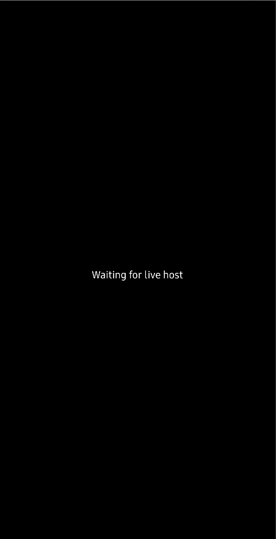
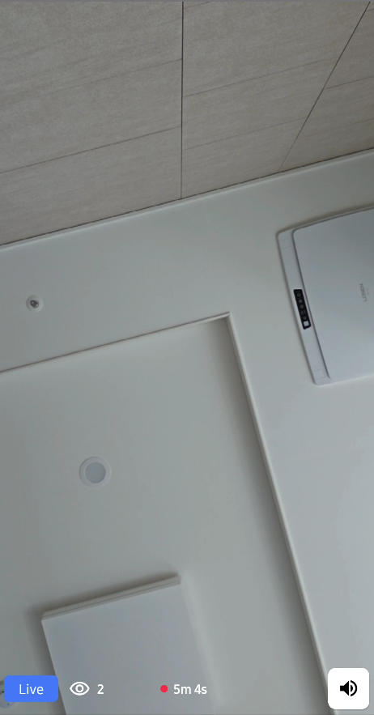
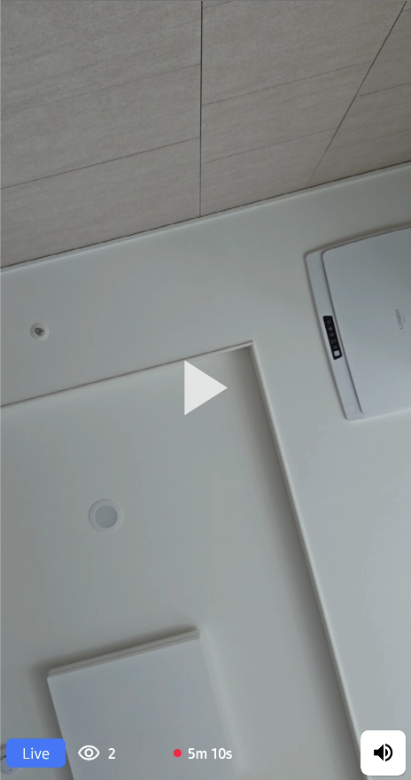

This cookbook tutorial walks you through how to build an advanced UIs for watching a livestream on Android.

:::note
We will assume that you already know how to join a livestream call. If you haven't familiarized yourself with the [Livestream Tutorial](../02-tutorials/03-livestream.mdx) yet, we highly recommend doing so before proceeding with this cookbook.
:::

In this cookbook tutorial, you'll learn how to build the result below at the end:

| On Backstage | On Live |
| --- | --- |
|  |  |

### Watching Livestreaming

The Stream Compose SDK offers a pre-built UI component, `LivestreamPlayer`, designed to simplify the creation of a livestream viewing screen. This component includes a video renderer, displays information such as the number of participants and call duration, and provides controls for pausing and resuming the livestream.

You can use the `LivestreamPlayer` like the sample below:

```kotlin
val call = client.call("livestream", callId)
lifecycleScope.launch {
    // join the call
    val result = call.join(create = true)
    result.onError {
        Toast.makeText(applicationContext, "uh oh $it", Toast.LENGTH_SHORT).show()
    }
}

setContent {
    LivestreamPlayer(call = call)
}
```

If you run the above example, you'll see the screen below:


As indicated in the message above, it appears that the host hasn't initiated the livestream.

Now, if you run the hosting a livestream sample and start a broadcasting following the [Livestream Tutorial](../02-tutorials/03-livestream.mdx), you'll see the livestreaming screen below:


### LivestreamPlayer

The `LivestreamPlayer` component offers streamlined customization options for each element:

```kotlin
LivestreamPlayer(
    call = call,
    enablePausing = true,
    onPausedPlayer = { isPaused -> Log.d("livestream", "paused: $isPaused") },
    backstageContent = {
        Text(
            modifier = Modifier.align(Alignment.Center),
            text = "Waiting for live host",
        )
    },
    rendererContent = {
        val livestream by call.state.livestream.collectAsState()

        VideoRenderer(
            modifier = Modifier.fillMaxSize(),
            call = call,
            video = livestream,
        )
    },
    overlayContent = {
        val totalParticipants by call.state.totalParticipants.collectAsState()
        val duration by call.state.duration.collectAsState()

        Row(
            modifier = Modifier.align(Alignment.Center),
            verticalAlignment = Alignment.CenterVertically,
        ) {
            Text(text = totalParticipants.toString())

            Text(text = (duration ?: 0).toString())
        }
    }
)
```

As you can observe in the example above, you have the flexibility to extensively customize every element of the `LivestreamPlayer`. Each element serves a distinct purpose:

* `enablePausing`: Enables pausing or resuming the livestream video.
* `onPausedPlayer`: Listen to pause or resume the livestream video.
* `backstageContent`: Content shown when the host has not yet started the live stream.
* `rendererContent`: The rendered stream originating from the host.
* `overlayContent`: The default content is displayed to indicate participant counts, live stream duration, and device settings controls. You can overlay anything that you want by customizing this Composable parameter.

You can utilize each element depending on your situations and requirements.

`LivestreamPlayer` also provides pausing/resuming the livestream video by clicking on the video renderer.

If you click on the video renderer, it will pause or resume like the image below:



### Build Your Own LivestreamPlayer

You can also create your own custom livestream player without relying on Stream's pre-built UI component.

The key logic to consider includes:

* UI for when the video isn't loaded yet
* A message to show when the livestream didn't start yet
* What to show when the livestream stopped
* How to indicate when there are connection problems
* Muting the volume
* Number of participants
* Duration of the call

The `call.state` provides the means to monitor whether the livestream is in the background, the count of participants, and more. You can leverage this information to construct your own custom livestream player.

```kotlin
val backstage: Boolean by call.state.backstage.collectAsState()
val livestream: ParticipantState.Video? by call.state.livestream.collectAsState()
val totalParticipants: ParticipantCount? by call.state.totalParticipants.collectAsState()
val duration: kotlin.time.Duration? by call.state.duration.collectAsState()
```

Then now you can implement a your livestream player like the example below:

```kotlin
if (backstage) {
    Text(text = "Waiting for live host")
} else {
    VideoRenderer(
        modifier = Modifier.fillMaxSize(),
        call = call,
        video = livestream,
    )

    Row(
        modifier = Modifier.align(Alignment.Center),
        verticalAlignment = Alignment.CenterVertically,
    ) {
        Text(text = totalParticipants.toString())

        Text(text = (duration ?: 0).toString())
    }
}
```

In this cookbook tutorial, you have learned how to create an advanced live streaming screen. If you wish to refer to the code, feel free to explore the [GitHub Repository](https://github.com/GetStream/stream-video-android/tree/develop/tutorials/tutorial-livestream).