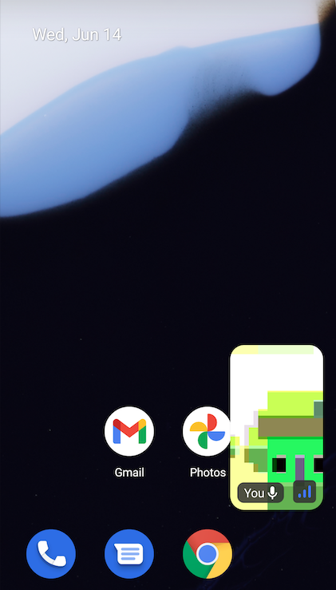

Picture in picture (PIP) keeps the call running and visible while you navigate to other apps.

### Enable Picture-in-Picture

The `CallContent` UI component allows you to specify the PIP layout.

```kotlin
// default
CallContent(
    call = call,
    enableInPictureInPicture = true
)
```

You can either specify your own or use the default. Here's a tiny custom PIP content example:

```kotlin
CallContent(
    call = call,
    pictureInPictureContent: { call ->
        val otherParticipant by call.state.sortedParticipants.collectAsState()

        VideoRenderer(
            modifier = Modifier.aspectRatio(ScreenShareAspectRatio, false),
            video = otherParticipant.video,
        )
    }
)
```

### AndroidManifest Changes

If you want to enable PIP mode for your Activity, you should follow the guide below, which is only applicable when you're writing your own activity.

First, start by enabling support for PIP in your `AndroidManifest.xml`:

```xml
<activity android:name="VideoActivity"
    android:supportsPictureInPicture="true"
    android:configChanges="screenSize|smallestScreenSize|screenLayout|orientation"
    ..
 />
```

Now, you've set up all required properties to enable picture-in-picture mode.

After running the code above and pressing the back or home button, you'll see the call will be still alive in the background like the one below:

