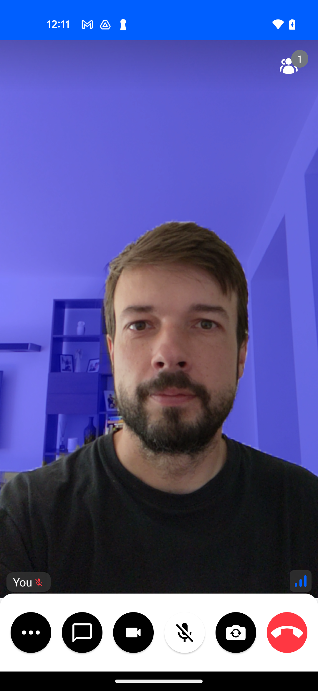

## Video Filters

Some calling apps allow filters to be applied to the current user's video, such as blurring the background, adding AR elements (glasses, moustaches, etc) or applying image filters (such as sepia, bloom etc). StreamVideo's Android SDK has support for injecting your custom filter into the calling experience.

How does this work? You can inject a filter through `Call.videoFilter`, you will receive each frame of the user's local video as `Bitmap`, allowing you to apply the filters (by mutating the `Bitmap`). This way you have complete freedom over the processing pipeline.

## Adding a Video Filter

Create a `BitmapVideoFilter` or `RawVideoFilter` instance in your project. Here is how the abstract classes are defined:

```kotlin
abstract class BitmapVideoFilter : VideoFilter() {
    fun filter(bitmap: Bitmap)
}

abstract class RawVideoFilter : VideoFilter() {
    abstract fun filter(videoFrame: VideoFrame, surfaceTextureHelper: SurfaceTextureHelper): VideoFrame
}
```
The `BitmapVideoFilter` is a simpler filter that gives you a `Bitmap` which you can then manipulate directly. But it's less performant than using the `RawVideoFilter` which gives you direct access to `VideoFrame` from WebRTC and there is no overhead compared to `BitmapVideoFilter` (like YUV <-> ARGB conversions).

And then set the video filter into `Call.videoFilter`.

We can create and set a simple black and white filter like this:
```kotlin
call.videoFilter = object: BitmapVideoFilter() {
    override fun filter(bitmap: Bitmap) {
        val c = Canvas(bitmap)
        val paint = Paint()
        val cm = ColorMatrix()
        cm.setSaturation(0f)
        val f = ColorMatrixColorFilter(cm)
        paint.colorFilter = f
        c.drawBitmap(bitmap, 0f, 0f, paint)
    }
}
```

:::note
You need to manipulate the original bitmap instance to apply the filters. You can of course create a new bitmap in the process, but you need to then draw it on the `bitmap` instance you get in the `filter` callback
:::

## Adding AI Filters

In some cases, you might also want to apply AI filters. That can be an addition to the user's face (glasses, moustaches, etc), or an ML filter. In this section this use-case will be covered. Specifically, you will use the [Selfie Segmentation](https://developers.google.com/ml-kit/vision/selfie-segmentation/android) from Google's ML kit to change the background behind you.

First include the necessary dependency (check for latest version [here](https://developers.google.com/ml-kit/vision/selfie-segmentation/android#before_you_begin)

```gradle
dependencies {
  implementation 'com.google.mlkit:segmentation-selfie:16.0.0-beta4'
}
```

Create a class that will hold your custom filter. The initialisation of the `Segmentation` class is done according to the [official docs](https://developers.google.com/ml-kit/vision/selfie-segmentation/android#enable_raw_size_mask).

```kotlin
class SelfieSegmentation {

    private val options =
        SelfieSegmenterOptions.Builder()
            .setDetectorMode(SelfieSegmenterOptions.STREAM_MODE)
            .enableRawSizeMask()
            .build()
    private val segmenter = Segmentation.getClient(options)

    fun applyFilter(bitmap: Bitmap) {
        // Send the bitmap into ML Kit for processing
        val mlImage = InputImage.fromBitmap(bitmap, 0)
        val task = segmenter.process(mlImage)
        // Wait for result synchronously on same thread
        val mask = Tasks.await(task)

        val isRawSizeMaskEnabled =  mask.width != bitmap.width || mask.height != bitmap.height
        val scaleX = bitmap.width * 1f / mask.width
        val scaleY = bitmap.height * 1f / mask.height

        // Create a bitmap mask to cover the background
        val maskBitmap = Bitmap.createBitmap(
            maskColorsFromByteBuffer(mask), mask.width, mask.height, Bitmap.Config.ARGB_8888
        )
        // Create a canvas from the frame bitmap
        val canvas = Canvas(bitmap)
        val matrix = Matrix()
        if (isRawSizeMaskEnabled) {
            matrix.preScale(scaleX, scaleY)
        }
        // And now draw the bitmap mask onto the original bitmap
        canvas.drawBitmap(maskBitmap, matrix, null)

        maskBitmap.recycle()
    }

    private fun maskColorsFromByteBuffer(mask: SegmentationMask): IntArray {
        val colors = IntArray(mask.width * mask.height)
        for (i in 0 until mask.width * mask.height) {
            val backgroundLikelihood = 1 - mask.buffer.float
            if (backgroundLikelihood > 0.9) {
                colors[i] = Color.argb(128, 0, 0, 255)
            } else if (backgroundLikelihood > 0.2) {
                val alpha = (182.9 * backgroundLikelihood - 36.6 + 0.5).toInt()
                colors[i] = Color.argb(alpha, 0, 0, 255)
            }
        }
        return colors
    }
}
```

And now set the custom filter into our SDK:

```kotlin
call.videoFilter = object: BitmapVideoFilter() {

val selfieFilter = SelfieSegmentation()

    override fun filter(bitmap: Bitmap) {
        selfieFilter.applyFilter(bitmap)
    }
}
```

The result:



## Audio Filters

The StreamVideo SDK also supports custom audio processing of the local track. This opens up possibilities for custom echo filtering, voice changing or other audio effects.

If you want to have custom audio processing, you need to provide your own implementation of the `AudioFilter` interface to `Call.audioFilter`.

The `AudioFilter` is defined like this:

```kotlin
interface AudioFilter {
    /**
     * Invoked after an audio sample is recorded. Can be used to manipulate
     * the ByteBuffer before it's fed into WebRTC. Currently the audio in the
     * ByteBuffer is always PCM 16bit and the buffer sample size is ~10ms.
     *
     * @param audioFormat format in android.media.AudioFormat
     */
    fun filter(audioFormat: Int, channelCount: Int, sampleRate: Int, sampleData: ByteBuffer)
}
```

In the following example, we will build a simple audio filter that gives the user's voice a robotic touch.

```kotlin
// We assume that you already have a call instance (call is started)
// Create a simple filter (pitch modification) and assign it to the call

call.audioFilter = object: AudioFilter {

    override fun filter(audioFormat: Int, channelCount: Int, sampleRate: Int, sampleData: ByteBuffer) {
        // You can modify the pitch factor to achieve a bit different effect
        val pitchShiftFactor = 0.8f
        val inputBuffer = audioBuffer.duplicate()
        inputBuffer.order(ByteOrder.LITTLE_ENDIAN) // Set byte order for correct handling of PCM data

        val numSamples = inputBuffer.remaining() / 2 // Assuming 16-bit PCM audio

        val outputBuffer = ByteBuffer.allocate(inputBuffer.capacity())
        outputBuffer.order(ByteOrder.LITTLE_ENDIAN)

        for (channel in 0 until numChannels) {
            val channelBuffer = ShortArray(numSamples)
            inputBuffer.asShortBuffer().get(channelBuffer)

            for (i in 0 until numSamples) {
                val originalIndex = (i * pitchShiftFactor).toInt()

                if (originalIndex >= 0 && originalIndex < numSamples) {
                    outputBuffer.putShort(channelBuffer[originalIndex])
                } else {
                    // Fill with silence if the index is out of bounds
                    outputBuffer.putShort(0)
                }
            }
        }

        outputBuffer.flip()
        audioBuffer.clear()
        audioBuffer.put(outputBuffer)
        audioBuffer.flip()
    }
}
```
This is a simple algorithm that just does shifting of the indexes. For a more complex one, you can also use some voice processing library. The important part is that you update the `channelBuffer` with the filtered values.