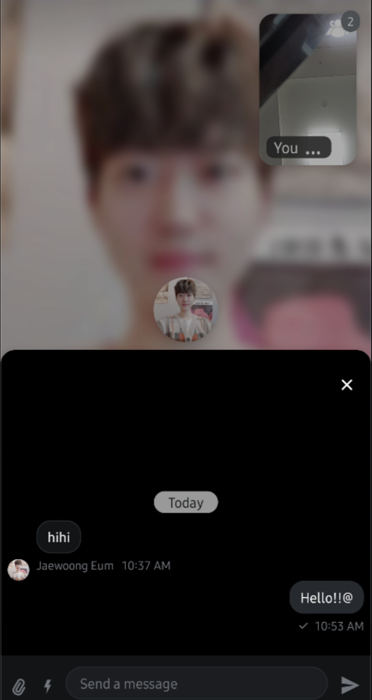
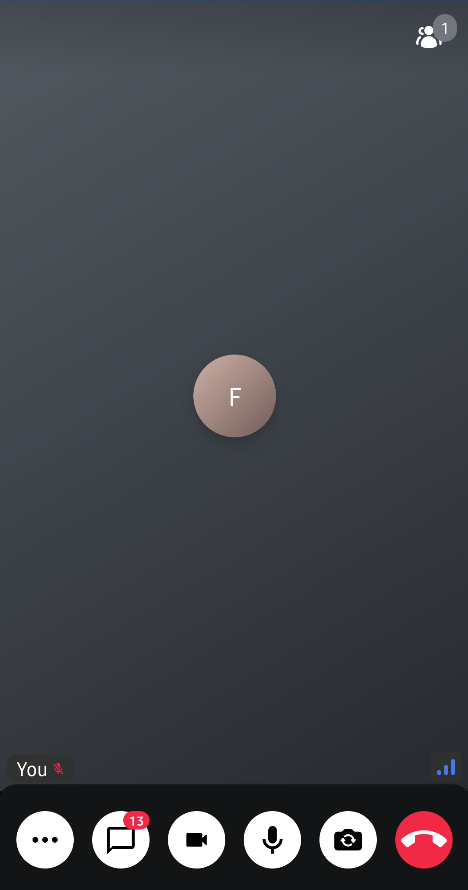

## Building Video Apps With Chat Support

One of the most common video app use cases is having a chat feature in your app that allows users to engage in text communication along with the video and audio call. This direct integration allows for simple transition between text and images to more complex media.

Stream supports this use case, out-of-the-box. In this guide, you'll walk through all the steps required to integrate our Video and Chat Android SDKs into a cohesive whole. You'll cover the following:

* Adding Stream dependencies.
* Creating Stream clients.
* Authenticating Chat and Video users.
* Building custom Call attachments and "Start Call" UI.

By the end of this guide, your app will look like this:



You'll have the ability to create messaging conversations, in which you can start send text messages & attachments in the audio/video call.

Let's see how to implement this.

## Creating the project

The easiest way to get a project working is using one of our [Dogfooding App](https://github.com/GetStream/stream-video-android/tree/develop/dogfooding). Open the `dogfooding` project in Android studio.

Let the project sync. It should have all the dependencies required for you to finish this guide. Some of the notable dependencies are the following:

```groovy
dependencies {
    // Stream Video Compose SDK
    implementation("io.getstream:stream-video-android-compose:0.3.4")
    
    // Stream Chat
    implementation(libs.stream.chat.compose)
    implementation(libs.stream.chat.offline)
    implementation(libs.stream.chat.state)
    implementation(libs.stream.chat.ui.utils)
}
```

You'll be integrating two SDKs - Video and Chat. There is only one Video dependency right now, `stream-video-android-compose`, used to gain access to Jetpack Compose components and the low level client of the Video project.

For chat, you have a few dependencies:
* `stream-chat-compose`: Similar to Video, gives access to Jetpack Components for Chat.
* `stream-chat-offline`: Used to integrate offline support in Chat.
* `stream-chat-state`: Used to gain access to various state and its plugins for Chat.
* `stream-chat-ui-utils`: A collection of helper functionalities to render custom UI or format data.

The pre-baked code in the `dogfooding` project contains all the logic that is not related to Stream, so that you can focus solely on integrating our two SDKs. We recommend exploring the project to learn how to navigate it and what each part of the predefined code does. Some of the notable functionality in the starter kit contains:

* Application class as an entry point for initializing our SDK.
* Login screen and authentication features, with Chat and Video tokens prepared.
* Lobby and call screens.

Now that you have an overview of the starter project, let's start integrating the SDKs.

## Integrating the Chat SDK

The first step of integrating our [Stream Chat SDK](https://getstream.io/chat/docs/sdk/android/basics/getting-started/) is initializing the `ChatClient`. You'll do that in the `Application` class, as it's recommended to initialize the client as soon as your app is launched. On top of that, you'll have to log in a user, to fetch their information and conversations.

### Creating the Client

Open the `App` file and replace the `chatClient` initialization with the following:

```kotlin
fun initializeStreamChat(
    user: User,
    token: String,
) {
    val offlinePlugin = StreamOfflinePluginFactory(this) // 1
    val statePluginFactory = StreamStatePluginFactory( // 2
        config = StatePluginConfig(
            backgroundSyncEnabled = true,
            userPresence = true,
        ),
        appContext = this
    )

    val logLevel = if (BuildConfig.DEBUG) ChatLogLevel.ALL else ChatLogLevel.NOTHING
    val chatClient = ChatClient.Builder(API_KEY, this) // 3
        .withPlugins(offlinePlugin, statePluginFactory)
        .logLevel(logLevel)
        .build()

    val chatUser = io.getstream.chat.android.client.models.User( // 4
        id = user.id,
        name = user.name,
        image = user.image
    )

    chatClient.connectUser( // 5
        user = chatUser,
        token = token
    ).enqueue()
}
```

There are a few parts to this initialization:

1. You create the `StreamOfflinePluginFactory` that's used to provide offline support to the `ChatClient`. This helps users browse cached channels and messages, even if their network connection is missing.
2. Following that, you set up a `StreamStatePluginFactory` which builds on top of the offline support, to provide background data sync as well as user online presence data. This is used to enrich the UI with online indicators.
3. To help you debug, you can provide a `ChatLogLevel`, which will print information about the API calls and data in the SDK.
4. Once you're ready, you initialize the `ChatClient`. You pass in the `API_KEY`, the `Context` and the rest of the components. You can pass in the key for your environment, but in this example we'll use a predefined environment instead.

With this client initialization, you can proceed to log in as a user when you login into the signing page.

:::note
There are a few things that you should make sure of, you should use the same `API Key`, `User Id`, and `Token` when you initialize the Video and Chat SDKs.
:::

### Implementing ChatDialog

Now that you're going to implement a `ChatDialog` Composable, which displays the chat messages over the Video call screen.

```kotlin
@Composable
internal fun ChatDialog(
    call: Call,
    state: ModalBottomSheetState,
    content: @Composable () -> Unit,
    updateUnreadCount: (Int) -> Unit,
    onDismissed: () -> Unit
) {
    val context = LocalContext.current
    val factory = MessagesViewModelFactory(
        context = context,
        channelId = "videocall:${call.id}",
    )

    var messageListViewModel by remember { mutableStateOf<MessageListViewModel?>(null) }
    val unreadMessageCounts: Int? =
        messageListViewModel?.currentMessagesState?.messageItems?.filterIsInstance<MessageItemState>()
            ?.filter { !it.isMessageRead }?.size

    LaunchedEffect(key1 = call) {
        messageListViewModel = factory.create(MessageListViewModel::class.java)
    }

    var composerViewModel by remember { mutableStateOf<MessageComposerViewModel?>(null) }
    LaunchedEffect(key1 = call) {
        composerViewModel = factory.create(MessageComposerViewModel::class.java)
    }

    LaunchedEffect(key1 = unreadMessageCounts) {
        updateUnreadCount.invoke(unreadMessageCounts ?: 0)
    }

    ChatTheme {
        ModalBottomSheetLayout(
            modifier = Modifier
                .fillMaxWidth(),
            sheetShape = RoundedCornerShape(topStart = 16.dp, topEnd = 16.dp),
            sheetState = state,
            sheetContent = {
                Scaffold(
                    modifier = Modifier
                        .fillMaxWidth()
                        .height(400.dp),
                    backgroundColor = ChatTheme.colors.appBackground,
                    contentColor = ChatTheme.colors.appBackground,
                    topBar = {
                        Box(
                            modifier = Modifier
                                .fillMaxWidth()
                                .padding(top = 32.dp)
                        ) {
                            Icon(
                                modifier = Modifier
                                    .align(Alignment.TopEnd)
                                    .padding(end = 21.dp)
                                    .clickable { onDismissed.invoke() },
                                tint = ChatTheme.colors.textHighEmphasis,
                                painter = painterResource(id = io.getstream.video.android.ui.common.R.drawable.stream_video_ic_close),
                                contentDescription = null
                            )
                        }
                    },
                    bottomBar = {
                        if (composerViewModel != null) {
                            MessageComposer(
                                modifier = Modifier
                                    .fillMaxWidth()
                                    .wrapContentHeight(),
                                viewModel = composerViewModel!!,
                                onCommandsClick = { composerViewModel!!.toggleCommandsVisibility() },
                                onCancelAction = {
                                    messageListViewModel?.dismissAllMessageActions()
                                    composerViewModel!!.dismissMessageActions()
                                }
                            )
                        }
                    }
                ) {
                    if (messageListViewModel != null) {
                        val currentState = messageListViewModel!!.currentMessagesState
                        MessageList(
                            modifier = Modifier
                                .fillMaxSize()
                                .background(ChatTheme.colors.appBackground)
                                .padding(it),
                            viewModel = messageListViewModel!!,
                            messagesLazyListState = rememberMessageListState(parentMessageId = currentState.parentMessageId),
                        )
                    }
                }
            },
            content = content
        )
    }
}
```

The block of code here is mostly straightforward, as you're just composing a `MessageList`, with some custom UI. Let's go over it:

1. You initialize the `ChatTheme` for the messaging UI.
2. You add a `topBar` to the `Scaffold` using `Box`
3. For the `bottomBar` you set the `MessageComposer`.
4. Finally, for the main `content` you set the `MessageList`, with no special customization.

You have a full integration of chat features in your video app now. You can see the messages with the give video call id. Now, let's display the chat dialog by creating a custom control action.

### Displaying the ChatDialog

So we've implemented the `ChatDialog` Composable function, and now you need to display the dialog by clicking an action button. Let's add an action button that shows the chat dialog on the `CallScreen`:

```kotlin
val isCameraEnabled by call.camera.isEnabled.collectAsState()
val isMicrophoneEnabled by call.microphone.isEnabled.collectAsState()
val speakingWhileMuted by call.state.speakingWhileMuted.collectAsState()
var isShowingSettingMenu by remember { mutableStateOf(false) }
var isShowingAvailableDeviceMenu by remember { mutableStateOf(false) }
var unreadCount by remember { mutableStateOf(0) }

val chatState = rememberModalBottomSheetState(ModalBottomSheetValue.Hidden)
val scope = rememberCoroutineScope()

VideoTheme {
    ChatDialog(
        state = chatState,
        call = call,
        content = {
            CallContent(
                modifier = Modifier.background(color = VideoTheme.colors.appBackground),
                call = call,
                enableInPictureInPicture = true,
                onBackPressed = {
                    if (chatState.currentValue == ModalBottomSheetValue.HalfExpanded) {
                        scope.launch { chatState.hide() }
                    } else {
                        onLeaveCall.invoke()
                    }
                },
                controlsContent = {
                    ControlActions(
                        call = call,
                        actions = listOf(
                            {
                                SettingsAction(
                                    modifier = Modifier.size(VideoTheme.dimens.controlActionsButtonSize),
                                    onCallAction = { isShowingSettingMenu = true }
                                )
                            },
                            {
                                Box(modifier = Modifier.size(VideoTheme.dimens.controlActionsButtonSize)) {
                                    ChatDialogAction(
                                        modifier = Modifier.size(VideoTheme.dimens.controlActionsButtonSize),
                                        onCallAction = { scope.launch { chatState.show() } }
                                    )

                                    if (unreadCount > 0) {
                                        Badge(
                                            modifier = Modifier.align(Alignment.TopEnd),
                                            backgroundColor = VideoTheme.colors.errorAccent,
                                            contentColor = VideoTheme.colors.errorAccent,
                                        ) {
                                            Text(
                                                text = unreadCount.toString(),
                                                color = VideoTheme.colors.textHighEmphasis,
                                                fontWeight = FontWeight.Bold
                                            )
                                        }
                                    }
                                }
                            },
                            {
                                ToggleCameraAction(
                                    modifier = Modifier.size(VideoTheme.dimens.controlActionsButtonSize),
                                    isCameraEnabled = isCameraEnabled,
                                    onCallAction = { call.camera.setEnabled(it.isEnabled) }
                                )
                            },
                            {
                                ToggleMicrophoneAction(
                                    modifier = Modifier.size(VideoTheme.dimens.controlActionsButtonSize),
                                    isMicrophoneEnabled = isMicrophoneEnabled,
                                    onCallAction = { call.microphone.setEnabled(it.isEnabled) }
                                )
                            },
                            {
                                FlipCameraAction(
                                    modifier = Modifier.size(VideoTheme.dimens.controlActionsButtonSize),
                                    onCallAction = { call.camera.flip() }
                                )
                            },
                            {
                                CancelCallAction(
                                    modifier = Modifier.size(VideoTheme.dimens.controlActionsButtonSize),
                                    onCallAction = { onLeaveCall.invoke() }
                                )
                            },
                        ),
                    )
                }
            )
        },
        updateUnreadCount = { unreadCount = it },
        onDismissed = { scope.launch { chatState.hide() } }
    )
}
```

As you can see in the code above, the `CallContent` implements a custom `controlsContent`, which includes action buttons, such as settings, toggling the camera/microphone, and displaying a chat dialog. If you join a call, you'll see the call screen like the one below:



If you click the "chat" action button, you'll see the chat dialog below:

