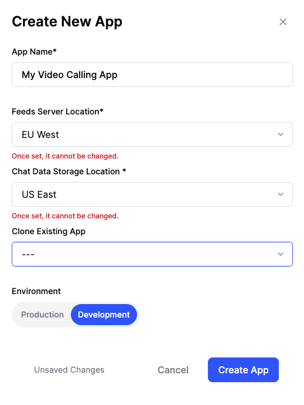
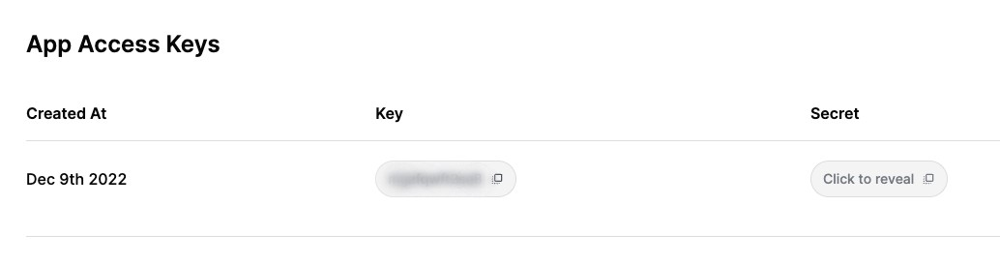

The Stream API Key is a critical credential that empowers you to construct your own Chat/Video features for your services. To obtain the Stream API Key, you can follow the steps outlined below:

1. Go to the **[Stream login page](https://getstream.io/try-for-free)**.

2. If you have a GitHub account, **simply click the "Continue with GitHub" button**, and you'll be able to complete the registration in just a matter of seconds. This process takes around 30 seconds and doesn't require you to complete any forms.

3. **Go to the [Dashboard](https://dashboard.getstream.io) and click the Create App** button like the below.

4. Fill in the blanks like the below and click the **Create App** button.

5. You will find the **Key** displayed as shown in the image below; make sure to take note of it for future reference.

Your Stream account setup is completed! Now, build your own video calling, audio room, and livestream application 🚀