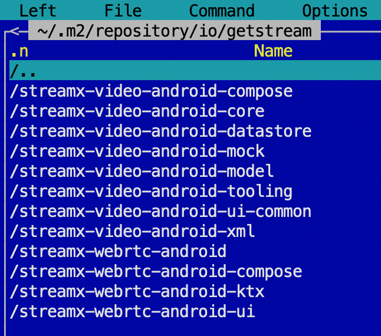

# Repackaging of the Video SDK

Make sure you have `maven` and `python3` installed:
```bash
brew install maven
brew install python3
```

Launch repackage script:
```bash
./repackage.sh --repackaged_webrtc <path_to_webrtc_aar> --webrtc_android <path_to_webrtc-android_repo>
```

When script completes, the usage of the new dependencies can be found in dogfooding's `build.gradle.kts`:
```
// Stream Video SDK
implementation("io.getstream:streamx-video-android-compose:${Configuration.versionName}")
implementation("io.getstream:streamx-video-android-xml:${Configuration.versionName}")
implementation("io.getstream:streamx-video-android-tooling:${Configuration.versionName}")
implementation("io.getstream:streamx-video-android-datastore:${Configuration.versionName}")
compileOnly("io.getstream:streamx-video-android-mock:${Configuration.versionName}")
```

The repackaged modules are stored in:
```
~/.m2/repository/io/getstream/streamx-<module-name>
```

> **Note**
> `streamx` prefix means that it is a repackaged module and it's stored on your machine locally only.

